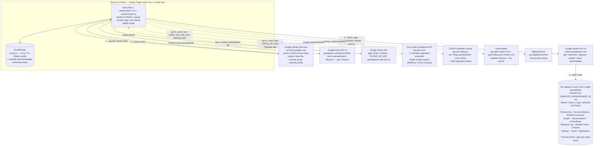
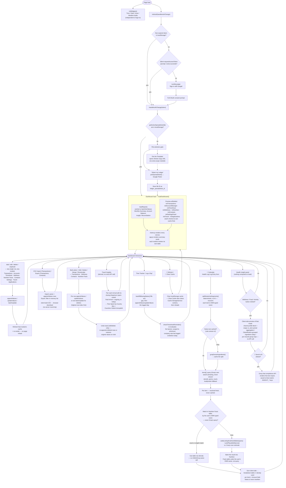

# Ledger

A private, serverless personal life dashboard — health, finances, time tracking, travel, applications, and contacts in one place.

- Reads and writes **directly to a Google Sheet you own**. No backend, no database, no third-party data store.
- Public on GitHub Pages, usable by anyone with a Google account.
- Each user clones their own copy of the template; the app only ever touches that copy.
- Scoped via Google Drive's per-file `drive.file` permission — data is visible only to the account owning that sheet.

## Table of Contents

- [Overview](#overview)
- [Features](#features)
- [Architecture](#architecture)
  - [System Diagram](#system-diagram)
  - [System Flowchart](#system-flowchart)
  - [Frontend Module Map](#frontend-module-map)
  - [Data Flow](#data-flow)
- [Data Model](#data-model)
- [Health Formula Reference](#health-formula-reference)
- [Tech Stack](#tech-stack)
- [Project Structure](#project-structure)
- [Getting Started](#getting-started)
- [Deployment](#deployment)
- [Configuration Reference](#configuration-reference)
- [Caching Strategy](#caching-strategy)
- [Security & Privacy](#security--privacy)
- [License](#license)

---

## Overview

- Single-page app; authenticates with the user's own Google account.
- Reads/writes a private "Ledger" spreadsheet via Sheets API v4.
- All aggregation, charting, filtering, sorting and CRUD runs client-side in vanilla JS.
- No build step, no server component to deploy or maintain.

---

## Features

### Dashboard widgets

- Four self-contained "bulb" cards above each panel group; work before sign-in.
- **Time** — local `HH:mm:ss` plus a second, independently configurable reference clock.
- **Date** — Gregorian ✝️, Shamsi 🌞 and Ghamari 🌜 in one aligned day/month/year grid, via `Intl`.
- **Azan** — Sobh/Zohr/Maghreb/Midnight, computed client-side (Shia "Tehran" method).
- **Weather** — current conditions plus a 3-day forecast.
- Location resolution order: manual override → browser geolocation → `WIDGET_DEFAULT_CITY` → Waterloo/Isfahan fallback.
- Powered by free key-less APIs (Open-Meteo, BigDataCloud), cached with their own TTLs.

### Layout and interaction

- Responsive breakpoint ladder (950/820/800/640/420px); no separate mobile view.
- Every form field has a 16px floor so mobile browsers never auto-zoom on focus.
- Modals are full-width on phones; cards cap at a fixed column width on wide screens.
- **Collapsible panels** — collapsed by default; collapsed content gets `inert`, so it leaves the a11y tree, tab order and find-in-page.
- **Panel groups** — Health, Finances, Other; each nav link expands its whole group.
- **Keyboard shortcuts** — `/` search, `n` add transaction, `Esc` close modal, `?` help. Ignored while typing.
- **Accessibility** — `role="dialog"`/`aria-modal` on modals, focus trap, focus restore, keyboard-operable headers, visible focus rings.
- **Dark mode** — floating 🌙/☀️ toggle, persisted.
- **Privacy mode** — floating 🙈/👁️ masks amounts, health figures, contact details and Settings values.

### Button roles

- **Blue** — add or save (Add/Log buttons, Save, Save & Add Another, 💾 bank).
- **Amber** — spends an AI call (Send to AI, 🧮 Calculate, 🧮 Recalculate Selected).
- **Red** — destructive, text labels only (the export filter's remove).
- **Default** — everything else, including all emoji buttons (❌ close, 🗑️ delete) — an emoji on a dark fill is hard to read.
- Slow actions append `…` to the label and block re-clicks until they settle: all form saves, bulk merge/delete, every row delete, and the AI/USDA calls.

### Finances

- **Summary cards** — Net Worth, Monthly Cash Flow, Monthly Income, Monthly Expenditure.
  - Income and Expenditure also show the average of the **previous 3 months**, separated by `/`.
  - The current month is excluded from its own benchmark; a tooltip names the months averaged.
- **Spending by Category** — grouped bars over four periods (Last Month, Quarter ÷3, Year ÷12, Lifelong ÷ months), plus four donuts.
- **Spending Breakdown by Type** — per-category donuts driven by a free-text `Description` prefix convention, built dynamically from `Insight`.
- **Historical Trends** — Category Expenditure Trend (stacked), Revenue vs. Expenditure (stepped area), Cumulative Net Worth (line).
- **Transaction Log** — searchable, filterable, sortable, paginated; add/edit/delete/duplicate.
  - Payee/Description/Category autocomplete from history; new categories can be typed inline.
  - Amount accepts arithmetic (`=-9.97-1.30`, `-32/2`), rounded to the cent.
  - Advanced Filters: date range plus an AND/OR field-filter builder; Export CSV writes exactly what's filtered.
- **Bulk transaction ops** — select rows for ✏️ Edit Selected (only filled fields applied) or 🗑️ Delete Selected (one `batchUpdate`, highest row first).
- **Undo** — toast after bulk edit/delete; deletes re-append, edits write original values back in place.
- **Portfolio** — 3-ring nested allocation donut (type → institution → account), then the Account Summary table with reconciliation status.

### Time Tracker

- **Log a Day** modal — Company, Start/End, Break, optional Task; live duration preview.
- Company autocompletes and defaults to the most recently logged one.
- Reminder banner on an unlogged weekday, scoped to your current company; opt-in OS notification fires once per day.
- **Work Analytics** — Arrival, Departure and Hours Worked histograms with normal-curve overlays, plus Daily Hours Average by period.
- **Overtime summary** — net time beyond an 8h/day pace, broken out Total/Year/Month/Week.
- **Work Log** table — date range, sortable, computed Duration, inline edit, paginated.

### Health — Today at a glance

- Four tiles: **Max/Min Calory Intake**, **Activity**, **Protein**, **Sleep**.
- Each reads `actual / target unit`, green on the right side of the figure, red otherwise, grey when nothing's logged.
- Activity also restates its target in kcal — `— / 100 min = 394 kcal` — from the same `activityTargetKcal` the calorie bound uses.
- The Calories heading carries which bound it is, since the number alone can't say it.
- Protein is a **band**, so its tile reads as a range (`53 / 112~154 g`).

### Health — Health Indicators

- All charts share one height and one plot-area width, so their date labels line up down the page.
- **State Trend & Forecast** — body mass history, smoothed trend, and a projection toward goal; optional BMI twin axis.
  - Progress meters above the chart: distance covered and time elapsed, side by side.
  - Plateau alert when the smoothed trend has held flat.
  - The status line under the chart speaks only when there is **no** forecast to draw — goal reached, no net change, trending away, or levelling off short of goal. A forecast that renders says nothing, since the meters and the curve already do.
- **Body Mass** — one bar per reading, scored by direction of travel; left axis restates it as stored fat energy.
- **Calorie Balance** — intake minus BMR minus activity, scored against the *planned* deficit; grams-of-fat twin axis.
- **Caloric Intake** — per-day bars with a per-day bound drawn as a cap on each bar, not one shared line.
- **Physical Activity** — stacked minutes per Description, plus a calories-burned dot series.
- **Protein Intake** — bars against a shaded target band; over the top end is a ceiling, not extra credit.
- **Rest & Recovery** — floating bars spanning bed→wake on a clock-time axis, coloured by adherence.
- All six carry a **violet dashed segment per week**, so a week that quietly drifted past its bound is visible next to the per-day mark.
  - Violet, the app's existing "not a score" colour — deliberately neither the green/red/grey of a scored bar nor the near-black/near-white of a goal cap.
  - Buckets are counted **back from today**, so the most recent seven days are always one whole week and only the oldest bucket can come up short.
  - Built from days that were actually **logged**; a week with nothing logged draws nothing.
  - **Flat** on five of them — the week's average. Rest & Recovery carries two, average bedtime and average wake time. Physical Activity averages the *calories burned*, not the minutes, since that's the axis Planned Burn lives on.
  - **Sloped** on Body Mass alone: a bar there is an absolute level, not a per-day quantity, so a flat mean says nothing. Each week is a least-squares fit through its own readings, extended to both week edges so slopes compare directly. A week with one weigh-in shows a dot — no slope is measurable from it.
  - Every one of these charts adds the figure to its tooltip as well; Body Mass quotes the slope as `kg/week`.

### Health — Health Insight (AI)

- One panel, three modes: **Wellness**, **Food**, **Activity**.
- **Nothing is computed until a mode button is clicked** — page load does no aggregation at all.
- Clicking a mode shows a preview of exactly what would be sent; 🚀 Send to AI sends that same data.
- All modes prepend the same age/sex/height/body mass/BMI profile block, shown on screen.
- **No line repeats the date range.** Every figure in a mode covers the same window, so it's stated once by the panel's own status line rather than eight times inside the prompt. The `[only N/M days logged]` marker carries the window length wherever coverage is partial.
- **Wellness** — selected range vs. the equal-length preceding period.
- **Food** — ingredients **grouped by Classification**, each group carrying its own ingredient count and calorie/protein totals.
  - Groups are ordered by calories; `Unclassified` always sinks to the bottom and is flagged to the model as not a food group.
  - The preview table groups identically.
- **Activity** — rep volume vs. the previous period, a routine-activity summary, and a per-muscle-group breakdown sorted most-neglected-first.
  - Each muscle group carries **the exercises that built it** — every movement logged against it in range and its total reps, heaviest first. The model is told these are the movements the user actually has access to, so recommendations name them instead of inventing lifts.
  - Non-resistance types (a walk, a swim) are **summarised, not listed per day** — one row each with days logged and the range/average of minutes, kcal and steps. Repeating a daily walk for every date buried the sessions that differ.
  - The split is by content, not by name: a type is routine when nothing logged under it carries reps.
  - Minutes are **net active time**, not session wall-clock. The system prompt says so explicitly and tells the model to judge training by rep volume and muscle coverage — an 8-minute resistance session is a real one, and "spend more minutes" is never the advice.
- Reports render as plain text without `innerHTML` (untrusted model output) and persist per mode.

### Health — Protein Source Rotation

- One horizontal bar per ingredient carrying a Protein % on its Nutrition Facts row.
- Bar is actual protein eaten in range; a red tick marks its live target.
- **Grouped by Classification** — one hue per group, lightness stepped within it, so a group reads as a block and its members stay distinct.
- Groups ordered by combined remaining gap; within a group, most-left-to-eat first. `Unclassified` last.
- A legend below shows one swatch per classification.
- Beside the bars, a two-ring donut splits the same sources by share eaten: outer 4 weeks, inner last week.

### Health — Activity Plan

- Push/Pull/Legs/Dumbbell/Bodyweight strength tables plus NEAT and Cardio, each row a "Done" checkbox.
- **Rows already in today's log are ticked and tinted**, read from the sheet — so the marks survive a reload and clear at the date rollover.
- **Log a Workout sends only what's newly ticked**, and extends today's entry instead of opening a second row.
  - The button reads "Add to Today's Workout" once something is already logged.
  - Free text already in the note is preserved; the description re-derives from everything in the session.
- Duration counts active time only — rest, warm-up and transitions are excluded.
- Opens the Health Log modal pre-filled, then runs 🧮 Calculate; nothing is written until you Save.

### Health — Health Log

- Filterable/sortable table (search, date range, category filter), paginated; add/edit/delete/duplicate.
- A thicker top border marks each date change, so day boundaries read at a glance.
- Category-aware form: pre-fills the unit and offers Description suggestions from your own history.
- **🧮 Calculate** — type a freeform ingredient list into Notes instead of a number.
  - Each item is matched against **your own Nutrition Facts first**, by the name *you typed* — never the AI's rephrasing.
  - A miss falls back to USDA FoodData Central, then to the model's own estimate.
  - A fallback result gets a **＋ Save** button rather than being banked silently.
  - Totals are always summed client-side.
- Bulk actions: ✏️ Edit Selected, 🧮 Recalculate Selected, 🔗 Merge Selected.

### Health — Nutrition Facts

- Searchable, sortable ingredient table backed by its own sheet tab.
- **Classification** is the first column — a free-text grouping (Dairy, Poultry, Grain).
  - The Add/Edit form offers a datalist of classifications already in use, so the column doesn't fragment.
  - Search matches classification **and** name, so typing `dairy` pulls up the whole group.
  - Left blank by Calculate's auto-bank — the app has no basis for guessing one.
- **🔍 Look up in USDA** button beside Save fills Amount/Calories/Protein from FoodData Central.
  - Lists **every candidate** rather than taking the top one — Calculate can sanity-check a result against an AI estimate and this can't, and USDA ranks "Oil, soybean" above the bean.
  - Applies the top match so the common case is one click; click another to switch.
  - Leaves Name as typed and never sets Verified — a database figure isn't a checked label.
- 🔗 Merge Selected consolidates near-duplicates; matching is exact-text, never fuzzy.

### Other

- **Travel** — sortable Travel Log plus Time Spent by Country flag tiles and a Countries Visited choropleth.
- **Applications** — immigration/visa applications as expandable cards, grouped Ongoing/Closed.
- **Contacts** — searchable, paginated list; bulk export (Google/Outlook CSV), delete and merge.
- **Settings** — Key/Value/Notes table for the `Settings` tab, applied to live widgets without a reload.
- **Local caching** — 5-minute `localStorage` cache; manual refresh and clear-cache controls.

### Chart conventions

- Category colours are spread evenly around the wheel, ordered by absolute spend.
- Every dollar axis formats ticks as currency; hours/percentage axes stay plain numbers.
- Green means met, red missed, **grey means not scored either way**.

---

## Architecture

### System Diagram

- Static site talking directly to Google's APIs from the browser.
- No application server in the request path, ever.


<sub>Simplified high-level view of the core OAuth + Sheets flow — see the detailed diagram below for the full set of integrations.</sub>



- Every Sheets call carries the user's own OAuth token, scoped by `drive.file` to the one spreadsheet they picked.
- `config.js` values (Client ID, template ID, Picker key) are visible to everyone and are **not** secrets.
- Groq/USDA are opt-in and see only typed ingredient text or the aggregated Insight summary.
- Open-Meteo/BigDataCloud are key-less and see only coordinates or a typed city name.

### System Flowchart

Where the diagram above shows *who the browser talks to*, this shows *what happens, in order*. Every branch is a real code path.



### Frontend Module Map

Classic `<script>` tags, no bundler, loaded in this order, one shared global scope.

| # | Module | Responsibility |
|---|---|---|
| 1 | `config.js` | `CONFIG`: Client ID, template spreadsheet ID, Picker API key, sheet tab names |
| 2 | `auth.js` | Google sign-in/out, token persistence, silent refresh, profile lookup |
| 3 | `drive.js` | Template copy link, Google Picker, active spreadsheet ID storage |
| 4 | `sheets.js` | Sheets API v4 wrapper; `USER_ENTERED` by default, `RAW` for Settings writes |
| 5 | `cache.js` | `localStorage` cache with per-call TTL, hard refresh, numeric-expression evaluator |
| 6 | `ui-helpers.js` | Shared table/modal helpers: sheet-ID lookup, confirm-delete, field errors, row buttons, sortable headers, pager, **busy-button + form-submit wiring** |
| 7 | `groq.js` | Groq chat client; tolerant JSON parsing; never rewrites the user's own Notes |
| 8 | `usda.js` | USDA FoodData Central client; returns several candidates, not just the top hit |
| 9 | `nutrition.js` | Nutrition Facts table, Classification column + datalist, USDA lookup button, merge, `findNutritionEntry` |
| 10 | `calorie-estimator.js` | 🧮 Calculate for food: deterministic split, table-first lookup, USDA fallback, breakdown table |
| 11 | `widgets.js` | The 4 dashboard bulbs; geolocation, prayer times, calendars, weather |
| 12 | `charts.js` | Every Chart.js renderer, plus the shared health/target formulas |
| 13 | `transactions.js` | Transaction Log: filters, sorting, pagination, CRUD, bulk edit/delete |
| 14 | `accounts.js` | Account Summary: balances, CRUD |
| 15 | `timesheet.js` | Work Log, holiday/missed detection, analytics data, reminder banner |
| 16 | `csv.js` | CSV import, advanced filter engine, download helper |
| 17 | `wellness.js` | Health Log table and form, `Breakdown` column, bulk Edit/Recalculate/Merge |
| 18 | `strength-plan.js` | Activity Plan tables, logged-today ticks, incremental Log a Workout |
| 19 | `activity-estimator.js` | Workout note parsing, active-seconds and MET-based burn |
| 20 | `contacts.js` | Contact List, CRUD, bulk export/delete/merge |
| 21 | `settings-panel.js` | Settings table CRUD, plus `saveSettingValues` for computed results |
| 22 | `travel.js` | Travel Log CRUD; feeds country-days and the choropleth |
| 23 | `applications.js` | Parses header+status-update rows into Ongoing/Closed cards |
| 24 | `insight.js` | Shared profile/aggregation/render helpers, plus the Wellness mode |
| 25 | `food-insight.js` | Food mode: per-ingredient rollup **grouped by Classification** |
| 26 | `activity-insight.js` | Activity mode: consistency, rep volume, per-muscle-group breakdown |
| 27 | `insight-panel.js` | The panel itself: mode table, load buttons, Groq call, per-mode save/restore |
| 28 | `protein-rotation.js` | Protein Source Rotation bars + donut, grouped and coloured by Classification |
| 29 | `formula-playground.js` | Health Formula Playground modal: live term-by-term substitution |
| 30 | `landing-graph.js` | Pre-login feature mind-maps (presentational only) |
| 31 | `gate.js` | Pre-login flow: sign-in gate, file gate, auth-state transitions |
| 32 | `app.js` | Orchestration, report aggregation, nav, panels, dark/privacy mode, shortcuts |

### Data Flow

**Widgets** (independent of sign-in)

1. `initWidgets()` runs unconditionally on `window.load`.
2. `applySettingsToWidgets()` later lets Settings override defaults, without overriding a manual pick.

**Sign-in**

1. `initAuth(handleAuthChange)`.
2. Non-expired token in `localStorage` is used; else a silent `prompt: 'none'` attempt; else the consent button.
3. On success, an already-selected spreadsheet loads the dashboard; otherwise the file gate shows.

**File selection** (first run, or after sign-out)

1. "Get the Template" opens Sheets' own `/copy` URL — no extra scope.
2. "Select my Ledger" opens the Picker; picking the file is what grants `drive.file` access to it.

**Dashboard load**

1. `loadReport()` — cache or one `batchGetValues` for Monthly Summary, Account Balance, Insight, Reconciliation.
2. Entity modules init concurrently via `Promise.allSettled`, each checking its own cache.
3. `charts.js` renders canvases; `app.js` renders summary cards; each module renders its table.

**Writes**

1. UI calls `appendValues` / `updateValues` / `batchUpdate` directly.
2. Only the affected cache entry is refreshed — no page reload.
3. The clicked button shows `…` and blocks re-clicks until the write settles.

**Health Insight**

1. Nothing is computed on load.
2. A mode click gathers that mode's data, renders the preview, restores that mode's saved report.
3. 🚀 Send to AI sends the data already on screen, then saves the report to `Settings`.

**Manual refresh**

- 🔄 Refresh clears the cache and re-fetches.
- 🧹 Clear Cache also purges Cache Storage and service workers, then reloads.

---

## Data Model

One Google Sheet per user, cloned from the template, with these tabs.

### `Transactions`

| Column | Type | Notes |
|---|---|---|
| A — Date | Date | ISO format |
| B — Account | Text | Must match a name in `Account Balance` column A |
| C — Payee | Text | Merchant / person / institution |
| D — Category | Text | Must match a category in `Insight` column A |
| E — Description | Text | Optional detail; its `Type - ` prefix drives the Type donuts |
| F — Amount | Number | Positive = income, negative = expense — the sign alone defines the type |

### `Account Balance`

| Cell/Column | Type | Notes |
|---|---|---|
| D1 | Number (formula) | Net Worth, e.g. `=ROUND(SUM(D3:D100),2)` |
| Row 2 | Header | `Account \| Institute \| Type \| Balance` |
| A3:A | Text | Account name — also the dropdown source for `Transactions` |
| B3:B | Text | Institution |
| C3:C | Text | `Cash`, `Chequing`, `Saving`, `Credit`, `Investment`, `Person`, `Other`, … |
| D3:D | Number | Balance |

### `Monthly Summary` (formula-driven)

`SUMIFS` against `Transactions`; row 1 is the header.

| Column | Contents |
|---|---|
| A | Month label |
| B | Income |
| C | Expenses |
| D onward | One column per category in `Insight` column A, matched by header name |
| Second-to-last | Saved (income − expenses) |
| Last | Cumulative savings |

- Category columns are matched by name; `Income`/`Expenses` are excluded even if `Insight` lists them.
- `Saved`/`Cumulative` are always the last two columns, so inserting a category doesn't break them.
- The summary cards' quarter average is the mean of the **3 rows before** the active month.

### `Insight` (formula-driven)

- Per-category, per-`Type` spend for the Type donuts. Data starts at row 2.
- Columns: Category, Type, Last Month, Last Quarter, Last Year, Lifelong.
- `Type` is a free-text prefix on `Transactions.Description`, not a column.
- Column A is the source of the app-wide category list; the form isn't limited to it.
- A blank `Type` row holds the category's overall total (the "Untyped" remainder).

### `eTimeSheet`

- One row per logged day: Company, Date, Day, Start, End, Break, Duration, Task.
- A weekday with a Task note but no times is a holiday; one with neither is a missed entry.

### `Wellness Log`

| Column | Type | Notes |
|---|---|---|
| A — Date | Date | ISO. **Blank marks a reusable pattern row** — excluded from charts, always sorted to the top |
| B — Time | Text | `HH:MM`, optional |
| C — Category | Text | `Sleep`, `Weight`, `Calories`, `Activity`, or composite `Calories; Protein` / `Activity; Calories` |
| D — Description | Text | e.g. "Lunch", "Run" |
| E — Amount | Number or pair | `"320; 10"` for kcal;protein, `"20; 10"` for min;kcal, `"23:30/07:00"` for bed/wake |
| F — Unit | Text | Auto-filled per category |
| G — Notes | Text | Free text; the standardized ingredient/workout lines live here |
| H — Breakdown | Text (JSON) | Optional. Calculate's per-item breakdown, so Edit restores it without re-running Groq/USDA |

- `Weight` is stored under that name but displayed everywhere as **Body Mass** — a display-layer rename only, so no logged row is orphaned.
- Columns G and H are not in the template by default; add the headers to enable them.

### `Nutrition Facts`

One row per ingredient. Data starts at row 2. Not in the template by default — add the tab and header row.

| Column | Type | Notes |
|---|---|---|
| A — Classification | Text | Free-text grouping (`Dairy`, `Poultry`, `Grain`). Drives the Food insight grouping and Protein Source Rotation colours. Left blank by Calculate's auto-bank |
| B — Name | Text | Matched case-insensitively against the text *you typed*, never the AI's rephrasing |
| C — Amount | Text | Needs a gram figure (`100g`, `1 scoop (32g)`) to scale by weight, or a leading count (`1 rice cake`) to scale by count |
| D — Calories | Number | kcal for the stated Amount |
| E — Protein | Number | grams for the stated Amount |
| F — Verified | Text | `1` = you checked it against a real label. Only ever set by hand — never by Calculate or the USDA lookup |
| G — Protein % | Number | Blank excludes the ingredient from Protein Source Rotation; a number is its % share of your protein target |

- **Protein/100kcal** is computed client-side for display and sorting only; never stored.
- Rows are added three ways: manually, via the breakdown's ＋ Save button, or auto-banked by Recalculate Selected.
- Lookup tries exact match, then folds a trailing "s" off both sides, before reporting a miss.

### `Contacts`

- One row per contact, columns A–U: names, prefix, tags, birthday, 3 phones, 2 emails, address, links, note.
- Not in the template by default; `scripts/merge_contacts.py` builds a deduplicated starting point.

### `Travel`

- One row per movement: Country/City, Port, Type (Arrival/Departure), Via, Date, Time, Reason, Detail.
- Arrivals are paired with their closing Departure; an open-ended final Arrival counts up to today.

### `Applications`

- Columns A–E: Delay, Date, Action, Type, App Number.
- A row with both Type and App Number starts an application; following rows are its status updates.
- New applications are inserted at row 2 so the sheet's footer formulas shift down intact.

### `Settings` (optional, user-managed)

- Columns A/B/C — Key, Value, Notes. Notes is never read by the app.
- Missing tab or row falls back to hardcoded defaults.
- Written with `RAW` so a computed value round-trips byte-for-byte.

### `Reconciliation` (formula-driven)

- `B5` holds the gap between recorded balances and transaction history.
- Non-zero means a balance is wrong or a transaction is missing.

---

## Health Formula Reference

- Every formula the Health section computes, with the file it lives in.
- Population constants are literature values, not personal parameters.
- None of them is read from `Settings` unless noted.

### Population constants

| Constant | Value | Where |
|---|---|---|
| `GENERIC_KCAL_PER_KG_FAT` | `7700` kcal/kg adipose | `charts.js` |
| `MET_ML_O2_PER_KG_MIN_DEFAULT` / `ML_O2_PER_KCAL` | `3.5` / `200` (ACSM). Numerator overridable via `KCAL_PER_MET_KG_MIN` | `charts.js` |
| `GENERIC_KCAL_PER_ACTIVE_MIN` | `5` kcal/min — last resort with no body mass on file | `charts.js` |
| `WORKOUT_REP_SEC` | `3` s per rep | `strength-plan.js` |
| steps → minutes | `100` steps/min | `charts.js` |
| `ACTIVITY_MET_FALLBACK` / `EXERCISE_MET_DEFAULT` | `3.5` | `charts.js`, `activity-estimator.js` |
| `WEIGHT_TREND_WINDOW_SIZE` | `5` logged points | `charts.js` |
| `PLATEAU_WINDOW_DAYS` / `PLATEAU_THRESHOLD_KG` | `10` days / `0.3` kg | `charts.js` |

### Scoring thresholds

| Threshold | Value | Effect |
|---|---|---|
| `CALORIE_BOUND_NEAR_FRACTION` | `5 %` | Past the bound by ≤5 % is grey, beyond is red |
| `ACTIVITY_NEAR_TARGET_FRACTION` | `5 %` | Short of the implied burn by ≤5 % is grey |
| `WEIGHT_STALL_RED_AFTER_DAYS` | `2` days | A flat reading is grey until the plateau holds this long. Holding *at* goal stays green |
| Protein over-band | — | Above the top end is grey, not red. Below the floor stays red |
| Calorie Balance vs. plan | — | At/beyond plan green, short but right side of zero grey, wrong side red |

### Body

```
BMI                = weightKg / (heightCm/100)²
age                = years since BIRTH_DATE (−1 before this year's birthday)
bodyFat%           = 1.20·BMI + 0.23·age − 10.8·(sex==male ? 1 : 0) − 5.4
                     clamped to [3, 60]                       (Deurenberg 1991)

trend[i]           = mean(values[i−2 … i+2])   centered SMA over logged points
plateau            = |trend[last] − trend[start]| < 0.3 kg over ≥10 days, ≥3 points
```

### Energy

```
metKcal(met, kg, min)     = met × kg × min × KCAL_PER_MET_KG_MIN/200
activityMinutes(amt,unit) = steps/100 | hours×60 | min as-is

activityEntryKcal(entry)  = entry.amount2                    if logged
                          = metKcal(ACTIVITY_MET, kg, mins)  else, with a weight on file
                          = mins × 5                         else

BMR (Mifflin-St Jeor)     = 10·kg + 6.25·cm − 5·age + (male ? +5 : −161)
activityTargetKcal(kg)    = metKcal(ACTIVITY_MET, kg, ACTIVITY_TARGET_MIN)
```

**Calorie bound** — one number per day, deliberately not called a "target":

```
bound = round( BMR + activityTargetKcal − (WEEKLY_FAT_LOSS_KG × 7700) / 7 )
```

- Falls back to flat `CALORIE_TARGET_KCAL` if height / age / sex / `WEEKLY_FAT_LOSS_KG` is missing.
- Re-evaluated **per day** from that day's carried-forward body mass.
- Moves ≈ 15.8 kcal per kg, so a 6 kg loss shifts it by roughly 95 kcal.
- Max when goal < current, min when goal > current; otherwise the sign of `WEEKLY_FAT_LOSS_KG` decides.
- `activityTargetKcal` is also what the Activity glance tile shows after its `=`.

### Calorie Balance (per day)

```
maintenance = BMR(that day's carried-forward weight, height, age, sex)
balance     = intake − maintenance − activityKcal(that day)
expected g  = (balance / 7700) × 1000
```

- A day with no food logged is a gap, not a day of eating nothing.

### 7-day dash (all six Health Indicators charts)

```
bucket(i)  = floor((columnCount − 1 − i) / 7)      counted back from today

flat       = mean of that bucket's LOGGED days     unlogged days sit out
sloped     = least-squares fit over that bucket's (columnIndex, kg) pairs,
             evaluated at all 7 columns            Body Mass only, ≥2 readings
```

- Drawn as a line whose bucket-crossing segments are transparent, so each week is one dash rather than a stepped line with risers.
- Body Mass folds the fitted endpoints into its kg bounds before padding — a fit extended to the week edges can reach past every reading in it, and the fat-energy twin axis is derived from those same bounds.
- Rest & Recovery averages bed/wake in *noon-anchored axis units*, not clock minutes — the shift has already unwrapped midnight, so 23:30 and 00:30 average to midnight rather than midday.

### State Trend & Forecast

**Plan-based** — the primary path, whenever `HEIGHT_CM`, `BIRTH_DATE` and `SEX` are on file. It projects the plan being *followed*.

```
Eᵢₙ    = BMR + Eₐ(target) − D                    calculated bound at the latest reading
A      = 6.25·cm − 5·age + (male ? +5 : −161)    mass-independent part of maintenance
B      = 10 + MET·τ·κ/ε                          per-kg part, kcal/day/kg
m∞     = (Eᵢₙ − A) / B                           where that intake IS maintenance
m(t)   = m∞ + (m − m∞)·e^(−B·t/ρ)                every 7 days, capped at 365
t      = (ρ / B) · ln[ (m − m∞) / (goal − m∞) ]
```

- `t` is the exact closed-form solution of `dm/dt = (Eᵢₙ − A − B·m) / ρ`, verified against numeric integration.
- Maintenance is affine in body mass, so the trajectory is exponential decay, not a straight line.
- `projectPlanDays` is shared with the Formula Playground, so the chart and the playground can't disagree.
- Worked example (87.5 → 72 kg, 170 cm, 35 y, male, κ=3, τ=100, 0.84 kg/wk): `BMR 1768`, `Eₐ 459`, `D 924`, `Eᵢₙ 1303`, `A 893`, `B 15.25`, `m∞ 26.9 kg`, `t 149 days`.

> **What this forecast is not:**
> - It states the plan, not recent behaviour.
> - Eating over the bound does **not** slip the date — only body mass, the goal, or the plan's own settings move it.
> - Sleep doesn't enter it at all.
> - Actual-vs-plan lives on the Calorie Balance chart instead.

**Habit-based fallback** — only when the profile is incomplete and something is logged in the last 14 days:

```
maintenance = flatBound + avgActivityKcal
balance     = avgCalories − maintenance
baseSlope   = balance / 7700
sleepRatio  = clamp(avgSleep / SLEEP_TARGET_HOURS, 0.7, 1.0)
slope       = baseSlope × sleepRatio
```

**Body-mass-only fallback** — nothing logged at all; ordinary least-squares slope.

- Statuses: `reached`, `no-change`, `wrong-direction`, and `asymptote` (goal lies past `m∞`).
- The slope is reported for all four, so the status line quotes a rate rather than "unavailable".

> **Known inconsistency**, confined to this fallback:
> - The regression is fitted against the *index* of each reading, so its units are kg per logged entry.
> - Its consumers treat it as kg per day. They agree only if you log daily.
> - Unreachable on the plan-based path, which never uses it.

**Progress meters** (rendered above the chart heading):

```
bar %       = clamp( (startWeight − lastWeight) / (startWeight − goal) × 100, 0, 100 )
done kg     = |startWeight − lastWeight|
to-go kg    = |lastWeight − goal|
time bar %  = daysElapsed / (daysElapsed + daysToGoal) × 100
```

### Fat energy — the Body Mass chart's second axis

```
bodyFat%   = clamp(Deurenberg(BMI, age, sex), 3, 60)
fatMass    = kg × bodyFat%/100
fatEnergy  = fatMass × 7700
```

- One clamp, one chain — tooltip, fat mass, energy row and axis can't disagree.
- A population-average estimate, not a measurement; nothing here observes body composition directly.
- Fat energy is quadratic in body mass while a twin axis can only be linear, so the axis is anchored at both ends of the kg range (<0.5 % error on a typical window).
- This is why 1 kg isn't worth 7,700 kcal: at ~90 kg / 175 cm only ~61 % of a kg is fat, so the tooltip reads ≈ 4,685 kcal/kg.

### Protein

```
band (g/day) = { round(basisKg × gPerKg.low), round(basisKg × gPerKg.high) }
   basisKg    = WEIGHT_GOAL_KG, else the latest logged weight
   fallback   = flat PROTEIN_TARGET_G as a zero-width band
midpoint     = round((min + max) / 2)
in band?     = g ≥ min AND (max == min OR g ≤ max)
protein/100kcal = protein / calories × 100
```

**Protein Source Rotation**, per tracked ingredient:

```
targetG   = (Protein% / 100) × dailyMidpoint × lookbackDays
actualG   = Σ protein of every Calculate breakdown item with that name in range
% of total target = actualG / (dailyMidpoint × lookbackDays) × 100
sort key  = classification group gap, then targetG − actualG within it, both descending
```

- Group colour: one hue per classification, lightness stepped `62 − (n mod 4)×9` within it.
- Donut rings: each source's share of `Σ actualG` over the 28 and 7 days ending on the To date.

### Today at a Glance

- Sums today's entries per category.
- Green/red by `withinCalorieBound`, `withinProteinBand`, `mins ≥ ACTIVITY_TARGET_MIN`, `hrs ≥ SLEEP_TARGET_HOURS`.
- The Activity tile appends `= activityTargetKcal(latest weight)` rounded to whole kcal.

### Sleep

```
axis position (hours) = ((clockMin − 12·60) + 1440) mod 1440 / 60
colour ratio          = clamp( (durationHr − target/2) / (target − target/2), 0, 1 )
                        red → amber below 0.5, amber → green above
```

### Workout logging (Activity Plan → 🧮 Calculate)

Active time only — rest, warm-up and moving between machines are real gym time but aren't activity.

```
strength row  activeSec = sets × reps × 3
hold row      activeSec = sets × holdSec        (already seconds; no per-rep tempo)
NEAT steps    activeSec = (steps / 100) × 60
cardio min    activeSec = minutes × 60

minutes  = max(1, round(Σ activeSec / 60))
calories = Σ metKcal( MET(exercise) ?? 3.5, weightKg, activeSecᵢ / 60 )
```

- `activeSecondsForNoteLine` (`activity-estimator.js`) is the single place this is decided — Log a Workout's prefill and Calculate both read it.
- Note parsing: `30x Name` → 30 total reps; legacy `3x10 Name` → 30; `135sec`, `30min`, `6000step`.
- A second Log a Workout the same day appends its new lines to today's entry rather than opening a new row.

### Food logging (🧮 Calculate)

Precedence: your own `Nutrition Facts` row (by **count** first, then by **weight**) → USDA → the model's estimate.

```
by count   kcalPerUnit = row.calories / row.count
           itemKcal    = kcalPerUnit × count

by weight  kcalPer100g = row.calories / row.grams × 100
           itemKcal    = kcalPer100g × grams / 100

energy-anchored ("300kcal cookie") — the same sources read backwards:
           grams = energyKcal / kcalPer100g × 100        (weight wins here)
           count = energyKcal / kcalPerUnit              (only if the row has no gram figure)
```

- Count wins normally: an exact count beats an estimated gram mass.
- Weight wins on the energy-anchored path: "300kcal cookie" is most useful as a number to put on the scale.
- A new row is always banked per 100 g, whatever unit that mention used.

---

## Tech Stack

| Layer | Choice |
|---|---|
| Frontend | HTML5, CSS3, vanilla JavaScript (ES6+) — no framework, no build step |
| Charts | [Chart.js](https://www.chartjs.org/), plus [chartjs-chart-geo](https://github.com/sgratzl/chartjs-chart-geo) + [world-atlas](https://github.com/topojson/world-atlas) for the choropleth |
| Authentication | [Google Identity Services](https://developers.google.com/identity), OAuth 2.0, `drive.file` + `userinfo.*` scopes |
| File selection | [Google Picker API](https://developers.google.com/drive/picker) |
| Data store | Google Sheets API v4 |
| Widgets | `navigator.geolocation` + `Intl`; [Open-Meteo](https://open-meteo.com/) and [BigDataCloud](https://www.bigdatacloud.com/) — free, key-less |
| AI / nutrition | [Groq](https://groq.com/) chat-completions and [USDA FoodData Central](https://fdc.nal.usda.gov/) — per-user keys in `Settings` |
| Hosting | GitHub Pages |

---

## Project Structure

```text
ledger/
├── index.html                    # Page shell: gates, dashboard, modals, footer
├── favicon.svg · manifest.json · robots.txt · sitemap.xml
├── assets/
│   ├── images/                   # Social preview, touch icon, diagrams
│   ├── style/styles.css          # All styling
│   └── script/
│       ├── config.js             # Client ID, template ID, Picker key, sheet names
│       ├── auth.js               # Sign-in/out, token storage, silent refresh
│       ├── drive.js              # Template copy link, Picker, active-file storage
│       ├── sheets.js             # Sheets API wrapper
│       ├── cache.js              # localStorage cache + hard refresh
│       ├── ui-helpers.js         # Shared table/modal/busy-button helpers
│       ├── groq.js               # Groq chat client
│       ├── usda.js               # USDA FoodData Central client
│       ├── nutrition.js          # Nutrition Facts table, Classification, USDA lookup
│       ├── calorie-estimator.js  # 🧮 Calculate for food
│       ├── activity-estimator.js # 🧮 Calculate for workouts
│       ├── widgets.js            # Time / Date / Azan / Weather bulbs
│       ├── charts.js             # Chart.js renderers + health formulas
│       ├── transactions.js       # Transaction Log
│       ├── accounts.js           # Account Summary
│       ├── timesheet.js          # Work Log + analytics data
│       ├── csv.js                # CSV import/export + filter engine
│       ├── wellness.js           # Health Log
│       ├── strength-plan.js      # Activity Plan
│       ├── contacts.js           # Contact List
│       ├── settings-panel.js     # Settings table
│       ├── travel.js             # Travel Log
│       ├── applications.js       # Applications cards
│       ├── insight.js            # Insight shared helpers + Wellness mode
│       ├── food-insight.js       # Insight Food mode
│       ├── activity-insight.js   # Insight Activity mode
│       ├── insight-panel.js      # Insight panel shell
│       ├── protein-rotation.js   # Protein Source Rotation
│       ├── formula-playground.js # Health Formula Playground
│       ├── landing-graph.js      # Pre-login mind-maps
│       ├── gate.js               # Pre-login flow
│       └── app.js                # Orchestration
├── LICENSE
└── README.md
```

---

## Getting Started

For the app's developer/deployer, done once. End users configure nothing — they sign in and pick or create their own spreadsheet.

### 1. Create the template Google Sheet

- Create a spreadsheet with the tabs in [Data Model](#data-model).
- Pre-populate a little sample data so charts aren't empty on a first run.
- Share it as **Anyone with the link can view** — it must be link-viewable and contain no real personal data.

### 2. Create a Google Cloud project and credentials

1. Enable the **Sheets API**, **Drive API** and **Picker API**.
2. Create an **OAuth 2.0 Client ID** (Web application); add your origins (e.g. `https://<user>.github.io`, `http://localhost:8000`).
3. Create an **API key**, restricted to the Picker API and the same origins.

### 3. Configure the app

Edit `assets/script/config.js`:

```js
const CONFIG = {
  CLIENT_ID: '<your-client-id>.apps.googleusercontent.com',
  TEMPLATE_SPREADSHEET_ID: '<your-template-spreadsheet-id>',
  PICKER_API_KEY: '<your-picker-api-key>',
  SHEETS: {
    TRANSACTIONS: 'Transactions',
    REPORT: 'Monthly Summary',
    BALANCE: 'Account Balance',
    ACCOUNTS: 'Account Balance',
    INSIGHT: 'Insight',
    RECONCILIATION: 'Reconciliation',
    TIMESHEET: 'eTimeSheet',
    WELLNESS: 'Wellness Log',
    NUTRITION: 'Nutrition Facts',
    CONTACTS: 'Contacts',
    SETTINGS: 'Settings',
    TRAVEL: 'Travel',
    APPLICATIONS: 'Applications',
  },
};
```

- None of these are secrets — see [Security & Privacy](#security--privacy).
- `drive.file` is an unverified-app-friendly scope, so no sensitive-scope OAuth review is needed.

### 4. Run locally

```sh
python -m http.server 8000
```

Then open `http://localhost:8000`. No build step.

---

## Deployment

1. Push the repository to GitHub.
2. **Settings → Pages**.
3. Source: **Deploy from a branch**, branch `main`, folder `/ (root)`.
4. Save — published at `https://<user>.github.io/<repo>`.
5. Add that URL as an authorized JavaScript origin on the OAuth client.

---

## Configuration Reference

**Sheet ranges read/written by the app:**

| Range | Used in | Purpose |
|---|---|---|
| `'Monthly Summary'!A1:Z149` | `app.js` | Header row plus monthly income/expense/category data and cumulative net worth |
| `'Account Balance'!A1:D1` | `app.js` | Net Worth figure (`D1`) |
| `Insight!A2:F200` | `app.js` | Per-category/per-Type spend, and the category list (column A) |
| `'Reconciliation'!B5` | `app.js` | Missing Amount — non-zero means balances don't reconcile |
| `Transactions!A2:F` | `transactions.js`, `csv.js` | Transaction rows |
| `'Account Balance'!A3:D100` | `accounts.js` | Account name, institution, type, balance |
| `'Account Balance'!A3:A100`, `Insight!A2:A200` | `transactions.js` | Account dropdown and Category autocomplete |
| `eTimeSheet!A2:H` | `timesheet.js` | Work Log rows |
| `'Wellness Log'!A2:H` | `wellness.js` | Health Log entries, including the `Breakdown` column |
| `'Nutrition Facts'!A2:G` | `nutrition.js`, `calorie-estimator.js`, `food-insight.js`, `protein-rotation.js` | Classification / Name / Amount / Calories / Protein / Verified / Protein % |
| `'Contacts'!A2:U` | `contacts.js` | Contact rows |
| `'Travel'!A2:H` | `travel.js` | Travel rows |
| `'Applications'!A2:E` | `applications.js` | Application header + status-update rows |
| `Settings!A2:C` | `app.js`, `settings-panel.js` | Personal overrides; `app.js` reads A/B, the panel reads and writes all three |

**Client-side cache (`localStorage` via `cache.js`, 5-minute TTL unless noted):**

| Cache key | Set by | Contents |
|---|---|---|
| `ledger_cache_report` | `app.js` | Aggregated report for the summary cards and finance charts |
| `ledger_cache_lists` | `transactions.js` | Transactions sheet ID + dropdown options |
| `ledger_cache_transactions` | `transactions.js` | Raw `Transactions!A2:F` rows |
| `ledger_cache_accounts-meta` / `account-list` | `accounts.js` | `Account Balance` sheet ID / rows |
| `ledger_cache_timesheet` | `timesheet.js` | Raw `eTimeSheet!A2:H` rows |
| `ledger_cache_wellness` | `wellness.js` | Raw `'Wellness Log'!A2:H` rows |
| `ledger_cache_nutrition` | `nutrition.js` | Raw `'Nutrition Facts'!A2:G` rows |
| `ledger_cache_contacts` | `contacts.js` | Raw `'Contacts'!A2:U` rows |
| `ledger_cache_travel` | `travel.js` | Raw `'Travel'!A2:H` rows |
| `ledger_cache_applications` | `applications.js` | Raw `'Applications'!A2:E` rows |
| `ledger_cache_settings` | `app.js` | Parsed `Settings` key-value map |
| `ledger_cache_settings-panel-meta` / `setting-list` | `settings-panel.js` | `Settings` sheet ID / raw rows |
| `ledger_cache_widget_location` | `widgets.js` | Auto-detected `{lat, lon, label}` — 6-hour TTL |
| `ledger_cache_widget_weather_<lat>_<lon>` | `widgets.js` | Open-Meteo response — 30-minute TTL |

**Auth, file selection and widget preferences (`localStorage`, separate from the cache):**

| Key | Set by | Contents |
|---|---|---|
| `ledger_token` | `auth.js` | `{ token, expiresAt }` — enables silent refresh |
| `ledger_consented` | `auth.js` | `'1'` once consent completes; controls `prompt` on next sign-in; cleared on sign-out |
| `ledger_spreadsheet_id` | `drive.js` | The chosen spreadsheet's Drive file ID — every Sheets call targets it |
| `ledger_last_reminder_notified` | `timesheet.js` | Today's date once the OS notification fired |
| `ledger_widget_manual_location` | `widgets.js` | `{lat, lon, label}` from the location picker; overrides auto-detect and Settings |
| `ledger_widget_second_clock_location` | `widgets.js` | `{label, timezone}` for the second clock |

---

## Caching Strategy

- `index.html` is served `no-cache, no-store, must-revalidate`, so the shell is never stale.
- Sheets responses are cached in `localStorage` for 5 minutes, keyed per data set.
- Every write refreshes only the affected cache entry, so the UI updates without a reload.
- 🔄 **Refresh** clears the cache and re-fetches everything.
- 🧹 **Clear Cache** also purges Cache Storage and unregisters service workers, then reloads.

> After changing a sheet's column layout, expect up to 5 minutes of stale reads until the cache expires — or use Clear Cache. Writes always bypass the cache.

---

## Security & Privacy

- Each user's data lives in their own private Google Sheet, accessible only to them.
- Auth uses the `drive.file` scope — the narrowest Drive scope, covering only files the app created or the user picked. It cannot list the rest of a Drive.
- `userinfo.email`/`userinfo.profile` are used only for the header avatar.
- `CLIENT_ID`, `TEMPLATE_SPREADSHEET_ID` and `PICKER_API_KEY` are **not secrets** — access is enforced by OAuth consent and per-file ownership.
- No backend, no password storage, no third-party store for financial data.
- **Widgets** are the one always-on exception:
  - With location granted, coordinates or a typed city go to Open-Meteo and BigDataCloud.
  - No account, no financial data, no server of ours involved.
  - Avoidable entirely by denying location and not setting a custom city.
- **Groq / USDA are opt-in** and only run once you set the keys:
  - 🧮 Calculate sends the typed ingredient text only.
  - The USDA lookup sends the ingredient name only.
  - Wellness Insight sends age, height, BMI, body mass/goal and aggregated averages.
  - Food Insight sends the classification-grouped ingredient list plus your question. No vitamin/mineral data exists in this app, so none is ever sent.
  - Activity Insight sends the activity-type and per-muscle-group breakdown.
  - Nothing is sent until that panel's 🚀 Send to AI is clicked.
- `GROQ_API_KEY` and `USDA_FDC_API_KEY` **are** real bearer secrets, unlike the config values above. They live in your own `Settings` tab and are never committed.
- **Privacy mode** is display-only and doesn't change what's stored.

---

## License

All rights reserved. See [LICENSE](LICENSE) — no permission is granted to copy, modify, or redistribute this project without the copyright holder's prior written consent.
