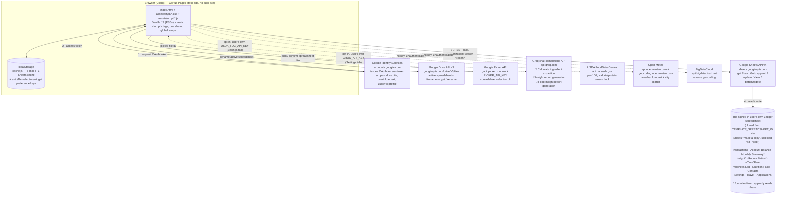
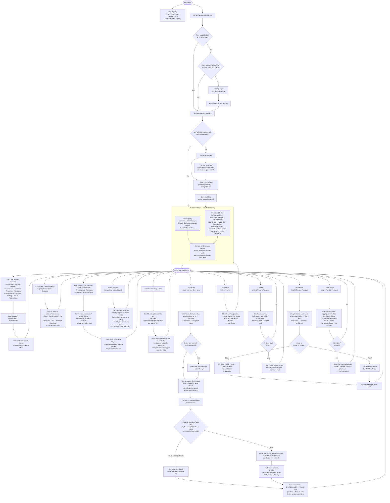

# Ledger

A private, serverless personal life dashboard — health, finances, time tracking, travel, applications, and contacts in one place. Ledger reads and writes directly to a Google Sheet you own — there is no backend, no database, and no third-party data store. The site is public on GitHub Pages and usable by anyone with a Google account: each user clones their own copy of the Ledger template and the app talks only to that copy, scoped via Google Drive's per-file `drive.file` permission — the data behind it is only ever accessible to the Google account that owns that particular spreadsheet.

## Table of Contents

- [Overview](#overview)
- [Features](#features)
- [Architecture](#architecture)
  - [System Diagram](#system-diagram)
  - [System Flowchart](#system-flowchart)
  - [Frontend Module Map](#frontend-module-map)
  - [Data Flow](#data-flow)
- [Data Model](#data-model)
- [Tech Stack](#tech-stack)
- [Project Structure](#project-structure)
- [Getting Started](#getting-started)
- [Deployment](#deployment)
- [Configuration Reference](#configuration-reference)
- [Caching Strategy](#caching-strategy)
- [Security & Privacy](#security--privacy)
- [License](#license)

---

## Overview

Ledger is a single-page application that authenticates the user with their own Google account, then reads and writes a private "Ledger" Google Sheet via the Sheets API v4. All aggregation, charting, filtering, sorting, and CRUD logic runs client-side in vanilla JavaScript — there is no build step and no server component to deploy or maintain.


## Features

- **Dashboard widgets** — a row of 4 self-contained "bulb" cards above every panel group, independent of the Google Sheet and working as soon as the page loads: **Time** (local `HH:mm:ss` next to a resolved location name, and a second, independently configurable reference clock defaulting to Isfahan, shown in a smaller muted style), **Date** (today's date in Gregorian ✝️, Shamsi 🌞, and Ghamari 🌜 calendars, laid out as a shared day/month/year grid so the three calendars line up column by column via the browser's own `Intl` calendar support — no vendored date-conversion library), **Azan** (Sobh/Zohr/Maghreb/Midnight prayer times computed client-side from sun-angle astronomical formulas using the Shia "Tehran"/University of Tehran method — Midnight is the standard midpoint between Maghrib and the next day's Fajr — for the resolved location), and **Weather** (current conditions plus a 3-day forecast for the resolved location). Location resolution tries, in order: a manual override (click the location name to auto-detect via `navigator.geolocation` + reverse-geocode, or type a city to search), then browser geolocation, then a `WIDGET_DEFAULT_CITY` `Settings` key, then a hardcoded Waterloo/Isfahan fallback — so the widgets never show a dead end even with location access denied. All of it runs on free, key-less public APIs called directly from the browser (Open-Meteo for weather + city search, BigDataCloud for reverse geocoding), cached in `localStorage` with their own TTLs separate from the Sheets data cache.
- **Responsive, mobile-friendly layout** — a breakpoint ladder (800px/640px/420px) tightens padding, grid columns, and the type scale for phones and half-width windows without a separate mobile view; every form field is pinned to a 16px floor so tapping into a date/text/select field never triggers a mobile browser's auto-zoom-and-pan. Dashboard summary/widget cards cap at a fixed column width instead of stretching edge-to-edge on wide screens.
- **Summary cards** — at-a-glance Net Worth, Monthly Income, Monthly Expenditure, and Monthly Cash Flow, at the top of the **Finances** panel group, above Spending by Category.
- **Spending by Category** — a grouped bar chart comparing each category's average monthly spend over four periods (Last Month as-is, Last Quarter Average ÷ 3, Last Year Average ÷ 12, and Lifelong Average ÷ total months of data; each category's 4 bars are shaded from its own color, most recent = most opaque), plus four donut charts breaking down each period's spending by category share. Both share one legend, and categories are ordered by Lifelong Average spend, highest first.
- **Spending Breakdown by Type** — for each spending category that has at least one `Type` recorded in `Insight`, four donut charts (Last Month, Last Quarter, Last Year, Lifelong) breaking that category's spend down by `Type`, a free-text prefix convention in the `Transactions` `Description` field (e.g. "Bread - milk and eggs"), pre-aggregated by formulas in the `Insight` sheet. Panels are built dynamically from whatever categories/Types `Insight` defines (no hardcoded list), ordered by lifelong spend (highest first), and each donut includes an "Untyped" slice for spending without a recognized prefix.
- **Spending Patterns** — a panel of three bar charts derived straight from transaction history (income rows excluded): **Top Expense Descriptions** and **Top Payees** (record counts, top 36), and **Payee Expenditure** (summed expense amounts, top 36 by absolute total, bars colored green/red for net income/expense).
- **Historical Trends** — three charts in one panel: **Category Expenditure Trend** (stacked bar chart of spending by category, month over month, with categories stacked in the same highest-to-lowest Lifelong Average order as Spending by Category), **Revenue vs. Expenditure** (stepped area chart of the full transaction history), and **Cumulative Net Worth** (running total of savings as a line chart).
- **Transaction History** — searchable, filterable, sortable, paginated (⬅️/➡️) table with add/edit/delete/duplicate (Duplicate opens the edit form pre-filled from that row, so a similar new entry can be filled in and saved without retyping everything). CSV import also exists (`csv.js`) but its button is hidden from the UI by default. The Payee, Description, and Category fields all autocomplete from your transaction history and the `Insight` category list (most-used values first) instead of a fixed dropdown, helping correct typos or voice-dictation mistakes and letting you type a brand-new category (e.g. "Income") on the fly. Long Payee/Description values are truncated with an ellipsis (hover to see the full text). The Amount field accepts a simple arithmetic expression (optionally prefixed with `=`, e.g. `=-9.97-1.30` to add tax, or `-32/2` to split a charge); results are rounded to the nearest cent. An "Advanced Filters" toggle (collapsed by default) reveals a From/To date range plus a filter builder — each row picks a field (Account, Payee, Description, Category, Amount), an operator (Contains/Equals/etc. for text fields, =, ≠, >, >=, <, <= for Amount), and a value, with rows after the first getting an AND/OR selector evaluated left to right (e.g. Category contains "Grocery" OR Category contains "Household", AND Amount < 0) — these narrow the same table (so sorting, pagination, and bulk edit/delete all keep working against the filtered set) and an Export CSV button writes exactly what's currently filtered, not just the visible page.
- **Bulk transaction operations** — a checkbox per row (plus a header "select all") shows a running count and total (privacy-mode aware) of the selected transactions below the table, alongside ✏️ Edit Selected and 🗑️ Delete Selected buttons. Edit Selected opens a form pre-filled with whichever fields are identical across every selected transaction (a field that differs is left blank); only fields you actually fill in are applied to all selected rows, so e.g. recategorizing a batch doesn't touch their dates or amounts. Bulk delete issues one `batchUpdate` with a `deleteDimension` request per row, ordered highest-row-first so earlier deletes in the same call can't invalidate later ones. Selection clears whenever the underlying view changes (search/filter/sort/page) but survives an unrelated re-render.
- **Undo for bulk edit and deletes** — editing or deleting a transaction (single or bulk) shows a toast with an Undo button for a few seconds. Undoing a delete re-appends the deleted row(s) — they land back at the end of the sheet rather than their original position, since Sheets addresses rows by position and the delete has already shifted everything below them. Undoing a bulk edit writes each transaction's original values back in place instead, since those rows were never removed.
- **Keyboard shortcuts** — `/` focuses the transaction search box, `n` opens Add Transaction, `Esc` closes whichever modal (or the account menu) is open, and `?` toggles a shortcuts-help overlay. All except `Esc` are ignored while focus is in any text field, so they never fire while typing.
- **Accessibility** — every modal exposes `role="dialog"`/`aria-modal`/`aria-labelledby`, auto-focuses its first field on open, traps `Tab`/`Shift+Tab` inside itself while open, and restores focus to whatever triggered it on close (including via `Esc`). Collapsible panel headings and sortable table headers are reachable and operable by keyboard (`Tab` + `Enter`/`Space`), and all interactive elements get a visible focus outline. An empty Transaction History/Account Summary/Work Log table shows a friendly message instead of rendering blank.
- **Portfolio** — the Portfolio Allocation donut chart (a 3-ring nested donut: the inner ring shows each account type's share of total balance shaded by type, the middle ring breaks that down by institution — each institution has one fixed color, even if its accounts span multiple types — and the outer ring by individual account, shaded by its institution's color; both rings use colors spread evenly around the color wheel so no two entries share a color, however many there are. Account types and institutions are both ordered by absolute balance highest first, so a type or institution with a large negative net — e.g. Credit/debt — still ranks by its size rather than sorting last; types and institutions with a zero balance total are omitted), followed by the Account Summary panel: a sortable table of balances by institution/type, with add/edit/delete, inline Net Worth recalculation, and a reconciliation status (✅ Reconciled, or ⚠️ with the gap amount if recorded balances don't match transaction history). The Balance field accepts the same arithmetic-expression syntax as the transaction Amount field.
- **Time Tracker** — a "Log a Day" button opens a modal to record a day's Company, Start/End time, Break, and an optional Task note (a weekday with no times but a Task note is treated as a holiday/day off; one with neither is flagged as a missed entry). Company is free text with an autocomplete datalist of previously used values, and defaults to whichever company was used on the most recently logged day. The modal shows a live "Log Time" duration preview that recomputes as Start/End/Break change (or shows "🏖 Holiday" once that checkbox is ticked), so you see the computed hours before saving. A reminder banner appears whenever today is a weekday with nothing logged yet **for your current company** (whichever company appears on the most recently dated entry — a day logged only under a company you've since left doesn't count), with its own "Log a Day" shortcut and an opt-in "Enable reminders" button — browsers require a direct user gesture to grant `Notification` permission, so it's never requested automatically; once granted, an OS-level notification fires once per day (guarded via `localStorage`) instead of only the in-page banner. The **Work Analytics** panel renders four charts above the log: histograms — each with a fitted normal-distribution curve overlay, bars shown as a % of all logged days (so the curve's height tracks the bars regardless of sample size; the tooltip still shows the underlying day count) — of Arrival Distribution, Departure Distribution, and Hours Worked Distribution across weekday work shifts (weekends, holidays/days off, and mis-keyed negative durations are excluded), plus a bar chart of Daily Hours Average over Last Week/Last Month/Last Quarter/Last Year/Lifelong, averaged only over working days so weekends and holidays don't pull the average down. All four charts share the same bar thickness and x-axis label-row height regardless of how many bars/bins each has, so they line up evenly side by side; Daily Hours Average's longer period labels are rotated vertical to fit that shared height without overlapping or clipping. Below the charts, a one-line **overtime summary** tallies time worked beyond an assumed 8h/day, scoped to that same current company — net/signed (a short day offsets a long one) across weekday shifts only, excluding weekends, un-logged days, and today's possibly-still-in-progress entry — broken out as Total/Last Year/Last Month/Last Week; it reads "⏱️ ... beyond an 8h/day pace overall" in bold red once the lifelong total is net-positive, or a muted "✅ At or under an 8h/day pace overall" otherwise, and stays blank until there's at least one full logged weekday to tally. Below that, the Work Log table lists entries (Company, Date, Day, Start, End, Break, Duration, Task) within a From/To date range, sortable by Date, with computed Duration and inline edit, paginated at 14 entries per page (⬅️/➡️); changing the date range or sort order resets to page 1.
- **Panel groups** — **Health**, **Finances**, **Time**, and **Other** (in that order, top to bottom) each wrap their related panels in a bordered group with one heading, linked from the top nav in the same order; clicking that link expands every panel in its group at once. **Finances** combines what were previously two separate groups (Journal's spending/transaction panels and Portfolio's account panels) under one heading, with the summary cards as its first block. **Other** holds Travel Insights + Travel List, Applications, and Contact List.
- **Collapsible panels** — every chart/table panel is collapsed by default; click its title to expand or collapse it (dragging to select the title's text does not toggle it). A floating "expand/collapse all" button toggles every panel at once. Collapsed content gets the `inert` attribute (not just a CSS animation to zero height), so it's pulled out of the accessibility tree, tab order, and text selection/find-in-page too — a collapsed table's rows genuinely aren't there for any consumer, not just visually hidden for mouse users.
- **Privacy mode** — a floating 🙈/👁️ button masks every dollar amount across the summary cards, tables, and charts by replacing each digit with `*` (e.g. `$1,234.56` → `$*,***.**`). It also covers: the Health Log table's Amount and Notes columns and the Health Tracker/Weight Trend & Forecast charts (axis ticks, tooltips, legend, and the ETA line); the Contact List's First/Last name and Email (fully masked, since letters carry the sensitive content there) and Phone (digit-masked, so the "(***) ***-****" shape stays recognizable); and the Settings panel's Value column (fully masked — API keys, city names, and calibration numbers all live there — while the Key column stays visible since a setting's name alone isn't sensitive). Numeric fields (Amount, axis/tooltip values, phone numbers) are digit-masked like currency; free-text fields (Notes, names, email, Settings values) are fully masked character-by-character so no words leak through either way. Amounts are hidden by default each time you sign in; click the button to reveal them for the rest of the session.
- **Dark mode** — a floating 🌙/☀️ button switches the whole app — including charts and the landing page — between light and dark themes, persisted in `localStorage`.
- **Resilient sign-in** — silent token refresh on return visits (including PWA/home-screen launches). A `ledger_consented` flag in `localStorage` tracks whether this browser has previously completed the OAuth consent flow — returning users get `prompt: ''` (Google can satisfy this silently or with a single account-picker click) while first-time users always go through the full consent prompt. Cleared on sign-out so a different person signing in on the same browser always gets their own consent flow. A tab left open also renews its own access token silently a few minutes before the ~1-hour expiry; if a silent refresh fails mid-session (e.g. a brief network blip), the app retries after a 2-minute backoff rather than signing the user out.
- **Account menu** — once signed in, the header shows the Google account's avatar (or initials, if it has none); clicking it opens a dropdown with the account's name/email and a Sign out button.
- **Health Tracker** — a dedicated section (accessible from the nav) for tracking health metrics across four categories, each a full-width chart (one per row) with x-axis date labels angled 45° and thinned to ~7 evenly-spaced ticks for readability, showing up to the last 84 days but starting at whichever date that category was actually first logged rather than always padding out to a fixed 84-day window with empty leading days (mirroring how the Weight Trend & Forecast chart below already starts at its own first weigh-in): **Caloric Intake** (bar chart, total per day, with a target line — `CALORIE_TARGET_KCAL` by default, or a personalized Mifflin-St Jeor/TDEE-based calculation if `HEIGHT_CM`, `BIRTH_DATE`, `SEX`, `ACTIVITY_MULTIPLIER`, and `WEEKLY_FAT_LOSS_KG` are all set in `Settings` and a weight has been logged — see [Data Model](#data-model)), **Physical Activity** (stacked bar chart normalized to minutes — steps entries are converted at 100 steps/min, hour entries are multiplied by 60 — with one stacked segment per Description (e.g. NEAT, Resistance, Cardio) so a day's mix of activity types is visible at a glance rather than one summed bar, plus a 100 min target line), **Rest & Recovery** (bar chart with an 8 hr target line), and **Protein Intake** (bar chart, total grams per day, with a target line — `PROTEIN_TARGET_G` by default, or `PROTEIN_TARGET_G_PER_KG` × your most recently logged weight if set). Body Weight isn't repeated here — it has its own dedicated history in the Weight Trend & Forecast chart, which is why these 4 can each go full-width instead of sharing one row. Above all of this, a **Today at a glance** row of 4 stat tiles (styled like the dashboard's summary cards) shows today's actual vs. target for Calories, Protein, Activity, and Sleep in one glance — colored green when you're on the right side of target (at/under for Calories, at/over for the other three) and red when you're not, gray when nothing's logged yet for that metric today. A **Weight Trend & Forecast** chart — the first thing shown inside the Health Metrics panel, above those 4 charts — plots historical weight (shaded) alongside a projected trajectory toward your weight goal (shaded in a distinct tint) using a multi-factor model (caloric balance, activity, sleep quality, and — once calibrated — protein intake). A third line, **Weight Trend**, overlays a centered moving average of nearby logged weigh-ins (a small window of points, not a calendar-day window, so it smooths the same way whether you log daily or sporadically) to filter out day-to-day water/food-weight noise without chasing a single high or low reading. Its x-axis is a true linear time scale (day-offset from the first plotted date, not equally-spaced categories), so daily historical entries followed by weekly (then a single distant ETA) projected points are spaced proportionally to how far apart they actually are, rather than implying every gap is the same length. When a `HEIGHT_CM` `Settings` key is set, a second **BMI** y-axis appears on the right — no separate BMI line is plotted, since BMI is just weight rescaled by a fixed constant and would exactly retrace the existing weight line; instead the axis's own bounds are derived directly from the weight axis's bounds (not auto-ranged independently), so BMI can be read straight off the weight line and the two axes stay true parallel twins instead of drifting out of correspondence. Below the chart, a **progress meter** (a fill bar plus a bold percentage) shows how far you've come from your first logged weight toward your goal — turning red if the current trend is heading the wrong way — alongside the projected arrival date and days remaining. A **⚙️ Calibrate** button beside the chart's heading opens a modal that fits this formula's constants — energy density, activity burn, sleep sensitivity, protein sensitivity, and a baseline drift term — to your own logged history via weighted least squares (rather than the generic population-average constants everyone starts with), previews the fitted values and a confidence score before you commit, and — once saved — persists them as `PROJ_*` keys in `Settings` (see [Data Model](#data-model)) so the personalized formula is used on every future load; "Reset to Default" removes them and reverts to the generic formula. The button works for anyone with enough weigh-in history regardless of whether they've ever calibrated before, and does nothing to the projection until Save is clicked. A **💡 Insight** button beside it opens a modal with a Look back selector (7/14/30 days) and a live, plain-language preview of exactly what would be sent — age, height, BMI, current weight vs. goal, average calories/protein/activity/sleep for the selected period vs. both your own targets and the immediately preceding period of the same length (so under/over-logged data is flagged rather than silently treated as zero), activity broken down further by Description (e.g. NEAT, Resistance, Cardio) with each one's own average minutes/day and trend versus the previous period, beneath the combined total, so the AI can comment on the mix of activity types rather than just the overall minutes, and a trajectory line reusing the same weight-forecast math above (rate toward goal, ETA, and whether it's your calibrated or the generic estimate) plus your calibrated energy density if you have one — nothing is sent until you click **🚀 Send to AI**. The resulting Groq-generated report (Overview / Going well / Needs attention / Suggestions, explicitly checking for a calorie deficit paired with under-target protein) renders in the same modal; nothing is saved, and closing it discards the report. A **🥗 Food Insight** button beside it opens a separate modal focused on *what* you ate rather than the totals: the same 7/14/30-day Look back selector drives a locally-computed table of every distinct ingredient logged via 🧮 Calculate in that window, summed across entries into one total amount/calories/protein per ingredient (highest-calorie first) — a unit-count total (e.g. 23 eggs) is converted to grams using that ingredient's own per-unit weight from the Nutrition Facts table, so the summary reads in one consistent unit rather than a bare, hard-to-picture count. An optional free-text question box (defaulting to "What vitamins or minerals might be missing from this diet?" if left blank) is combined with that ingredient list and, only once you click **🚀 Send to AI**, sent to Groq for a plain-language nutrient-gap read — explicitly framed as an inference from typical food composition rather than a lab-measured analysis, since no vitamin/mineral data is fetched or stored anywhere in this app. Nothing is saved; closing the modal discards the report, same as Insight. Below the charts, a filterable/sortable **Health Log** table (search across description/notes/unit/category, plus a date range and category filter, sortable by date, paginated at 28 entries per page ⬅️/➡️) with add/edit/delete/duplicate — a thicker top border marks each row where the date changes from the row above, so day boundaries are visible at a glance regardless of sort direction. The Log Entry form is category-aware: selecting a category pre-fills the unit field and populates a datalist of Description suggestions sourced from your past entries for that category (most-used first), falling back to built-in defaults. The Amount field accepts arithmetic expressions (same syntax as Journal). A 🧮 **Calculate** button lets you type a freeform ingredient list into Notes (e.g. "125g ground beef, 1 cup crushed tomatoes, 30g rice") instead of a calorie number: an LLM (Groq) splits it into per-item gram-weight/calorie-density/protein-density estimates, then each item is matched against your own **Nutrition Facts** table first (see below and [Data Model](#data-model)) by the ingredient name *you actually typed* — never the AI's own rephrasing of it, so it can't silently rename or fork what you already have — a trusted match there (e.g. the exact brand/product you buy) is used as-is, scaled to the logged quantity, with no further lookup. Only a miss falls back to cross-checking against real values from the USDA FoodData Central database — falling back further to the model's own estimate only if the database has no plausible match either, so a mismatched database entry can't silently produce a wildly wrong number. That fallback result is shown in the breakdown table with a **＋ Save** button rather than banked automatically — reviewing before it joins your trusted table catches a typo'd or misphrased name (e.g. "oilve oil" not matching an existing "olive oil" row) before it becomes a same-food duplicate under the wrong name; leaving it unsaved and fixing/retyping the ingredient in Notes, then recalculating, is the intended fix instead. (**Recalculate Selected**, below, has no per-row review UI and so still banks a miss automatically, same as before.) The final totals are always summed client-side rather than trusted from the model. The Category/Unit/Amount/Notes fields are then filled in automatically — Category set to `Calories; Protein`, Amount to `"<kcal>; <protein g>"`, Unit to `kcal; g` — keeping one meal's calorie and protein estimate on a single entry, ready to review and Save. Results are cached per exact input text, so recalculating the same entry is instant and gives the same answer every time. Requires `GROQ_API_KEY` and `USDA_FDC_API_KEY` in `Settings` (see below) — the button is always present, but shows an inline error/warning if a key is missing or a result looks implausible. A checkbox column and select-all let you act on several Health Log rows at once: **✏️ Edit Selected** opens a form pre-filled with whichever of Category/Description/Notes is identical across every selected entry (a field that differs is left blank); only fields you actually fill in are patched onto all selected rows — Amount/Unit are always left untouched — with an undo toast once it finishes; **Recalculate Selected** re-runs the same Nutrition Facts/Groq/USDA estimate independently for each selected Calories/Calories; Protein entry using its own Notes text (entries without ingredient text, or of another category, are skipped and reported rather than erroring), with an undo toast once it finishes; **Merge Selected** requires 2+ entries sharing one exact category, sums their calorie (and protein, if composite) amounts, combines differing Descriptions and Notes rather than dropping either, writes the result onto the earliest-selected row, and deletes the rest — this one can't be undone. Backed by a `Wellness Log` sheet tab in the same Google Sheet as all other data. Below the Health Log, a **Nutrition Facts** panel lists every known ingredient (Name/Amount/Calories/Protein) in a searchable, sortable table, backed by its own `Nutrition Facts` sheet tab (see [Data Model](#data-model)): "+ Add Ingredient" lets you pin down the exact numbers for a specific brand/product — Amount needs either a gram weight in it (e.g. "1 scoop (32g)") so Calculate can scale it by weight, or, for a food naturally counted in whole pieces, a leading count (e.g. "1 rice cake", "2 eggs") so it scales by how many units you logged instead — ✏️/🗑️ edit and delete each row, and a checkbox column with **🔗 Merge Selected** consolidates 2+ rows you ended up phrasing slightly differently across entries — merge matching is always exact-text against what you typed, never a fuzzy or AI-driven match, so search + manual merge is the intended way to keep it clean (blanks on the earliest-selected row are filled in from the others; nothing is summed, unlike the Health Log's own merge). Calculate's own table lookup is a little more forgiving than that on one specific point: after an exact match fails, it also tries folding a trailing "s" off both sides (so a Notes line typed as "2 eggs" still hits an existing "egg" row, and vice versa) before falling back to USDA/AI — everything else about a name still has to match exactly.
- **Travel** — a searchable, sortable Travel List table (Country/City, Port, Type, Via, Date, Time, Reason, Detail) with add/edit/delete, backed by a `Travel` sheet tab. Above the table, a **Travel Insights** panel derives two views from that same log: a **Time Spent by Country** grid of flag-emoji tiles (hover for country name + duration) computed by pairing each Arrival with its closing Departure (an open-ended final Arrival counts as an ongoing stay, credited up to today), and a **Countries Visited** choropleth world map (Chart.js + `chartjs-chart-geo`, world borders from `world-atlas`) highlighting every visited country. If a `BIRTH_DATE` key is set in `Settings` and the very first Travel row is a Departure, the years lived in the home country before that first trip are credited too, rather than being silently dropped just because the log itself only starts at the first trip ever taken.
- **Applications** — an Applications panel tracking immigration/visa applications as expandable cards, one per application (Type, App Number, Submitted date, latest status), each expanding to its full status-update history. Cards are grouped under "Ongoing" and "Closed" headings: an application counts as ongoing as long as its submission date or any status update is dated today (a still-active application's last recorded date keeps moving forward with each new update; once closed, that date stops advancing and stops matching "today" the next day). Add creates a new application header row only — status updates and the Delay figure are managed directly in the Sheet, since the Delay formula's cell references are hand-maintained per application. New applications are inserted at the top of the sheet's data (not appended after it) so the sheet's whole-column footer formulas (`Total Waiting time`, `Total Time in Canada`) shift down intact instead of a new row landing after them. Backed by an `Applications` sheet tab.
- **Contacts** — a searchable, sortable, paginated Contact List table (name, phone, email, tags) with add/edit/delete; the full record (prefix, birthday, up to 3 phones/2 emails, address with Province/Region for tax purposes, Website/LinkedIn/2 Telegram links, Tags, and a free-text Note) is edited in the Add/Edit Contact modal. Backed by a `Contacts` sheet tab. A checkbox column plus a bulk-actions bar let you select multiple rows to **export just the selection** (CSV formatted for Google/Phone Contacts or Outlook), **bulk-delete**, or **merge 2+ contacts into one** (fields already filled on the target row are kept, blanks are filled in from the others, and phone/email/Telegram lists are combined and deduplicated) — handy for cleaning up near-duplicates. `scripts/merge_contacts.py` is a one-time local tool that merges a Google Contacts export, an old manual spreadsheet, and a JSON contacts list into one deduplicated starting point for this tab — see its module docstring and the `Contacts` entry under [Data Model](#data-model) for the merge/dedup logic.
- **Settings** — a compact panel just below Contact List for managing the `Settings` tab's key/value pairs (see [Data Model](#data-model)) without leaving the app or opening the spreadsheet directly: a Key/Value table with ✏️ edit and 🗑️ delete per row, and a "+ Add" button. The Add/Edit modal's Key field autocompletes from the app's known setting keys (`WEIGHT_GOAL_KG`, `CALORIE_TARGET_KCAL`, `SLEEP_TARGET_HOURS`, `ACTIVITY_TARGET_MIN`, `PROTEIN_TARGET_G`, `PROTEIN_TARGET_G_PER_KG`, `HEIGHT_CM`, `BIRTH_DATE`, `SEX`, `ACTIVITY_MULTIPLIER`, `WEEKLY_FAT_LOSS_KG`, `WIDGET_DEFAULT_CITY`, `WIDGET_SECOND_CLOCK_CITY`, and the 8 `PROJ_*` calibration keys) while still accepting a free-text custom key, and also has an optional Notes field (column C — still never read by the app itself, just a place to jot what a setting is for). Saving or deleting a row immediately re-applies the change to any live widget that reads it (e.g. a changed weight goal updates the Body Weight target line right away), without a page reload. If the `Settings` tab doesn't exist yet, the panel shows an explanatory message and disables "+ Add" instead of erroring.
- **Local caching** — a 5-minute `localStorage` cache avoids redundant Sheets API calls; manual refresh and clear-cache controls are available as floating buttons.

Category-based charts (Spending by Category, Category Expenditure Trend, Spending Breakdown by Type) all assign each category/type a color spread evenly around the color wheel, ordered by highest-to-lowest absolute spend.

Every dollar-denominated chart axis (Average Monthly Spending by Category, Category Expenditure Trend, Revenue vs. Expenditure, Cumulative Net Worth, Payee Expenditure) formats its y-axis ticks as currency rather than raw numbers; count-based charts (Top Payees/Top Expense Descriptions) and the Time Tracker's hours- and percentage-based charts are left as plain numbers since they aren't money.

---

## Architecture

### System Diagram

Ledger is a static site that talks directly to Google's APIs — and a handful of other free/opt-in APIs — from the browser. There is no application server in the request path, ever.


<sub>Simplified high-level view of the core OAuth + Sheets flow — see the detailed diagram below for the full set of integrations, including the ones added since this image was captured.</sub>



Because every Sheets API call carries the signed-in user's own OAuth token, scoped via `drive.file` to only the specific spreadsheet they created or picked, each user can only ever read or write their own copy — even though the static site and `config.js` (Client ID, template spreadsheet ID, and Picker API key) are visible to everyone; none of those three are secrets (see [Security & Privacy](#security--privacy)).

The other four integrations are all opt-in or key-less, and none of them ever see spreadsheet data: Groq and USDA FoodData Central are only called from the Health Log's 🧮 Calculate button (and 💡 Insight / 🥗 Food Insight, Groq only) — and only once `GROQ_API_KEY`/`USDA_FDC_API_KEY` are set in the user's own `Settings` tab, sending nothing but the typed ingredient text (or, for Insight/Food Insight, the aggregated summary described in [Security & Privacy](#security--privacy)) — while Open-Meteo and BigDataCloud power the Time/Date/Azan/Weather dashboard widgets with no API key, login, or financial data involved at all, sending only coordinates (from `navigator.geolocation` or a typed city name).

### System Flowchart

Where the diagram above shows *who the browser talks to*, this shows *what happens, in order* — the same control flow documented in prose in [Data Flow](#data-flow) below, laid out as a diagram. Every branch here is a real code path, not an illustrative simplification.



### Frontend Module Map

Loaded as classic `<script>` tags (no bundler), in this order, sharing one global scope:

| Order | Module | Responsibility | Key exports used elsewhere |
|---|---|---|---|
| 1 | `config.js` | `CONFIG`: Client ID, template spreadsheet ID, Picker API key, sheet tab names | `CONFIG` |
| 2 | `auth.js` | Google sign-in/out, token persistence (`localStorage`), silent refresh, account profile lookup for the header avatar menu | `initAuth`, `signIn`, `signOut`, `getAccessToken`, `fetchUserInfo` |
| 3 | `drive.js` | Per-user spreadsheet selection: opens Sheets' "make a copy" link for the template, Google Picker for selecting/confirming a file, `localStorage`-backed active spreadsheet ID | `openTemplateCopyLink`, `pickSpreadsheet`, `getActiveSpreadsheetId`, `setActiveSpreadsheetId`, `clearActiveSpreadsheetId` |
| 4 | `sheets.js` | Thin Sheets API v4 wrapper (get / batchGet / append / update / clear / batchUpdate) against the active spreadsheet ID | `getValues`, `batchGetValues`, `appendValues`, `updateValues`, `batchUpdate`, `getSpreadsheetMetadata` |
| 5 | `cache.js` | `localStorage`-backed cache with a configurable per-call TTL (5 minutes by default), hard-refresh (cache + Cache Storage + service workers), and the shared numeric-expression evaluator used by the Balance and Amount fields | `getCached`, `setCached`, `clearCache`, `hardRefresh`, `evaluateNumberExpression` |
| 6 | `ui-helpers.js` | Shared DOM/CRUD helpers used by every entity module (Transactions, Accounts, Time Tracker, Health Log, Contacts, Travel, Applications, Settings panel): sheet-ID-by-tab-title lookup, a confirm-then-delete wrapper, form field error display, row-action-button/table-cell builders, sortable-column-header wiring, and pagination rendering — the mechanical bits of the "table + modal form" pattern shared across those modules, kept out of each one's own file | `findSheetId`, `confirmAndDelete`, `showFieldError`, `clearFieldError`, `makeRowActionButton`, `makeCell`, `makeSortableHeaders`, `renderPager` |
| 7 | `groq.js` | Groq chat-completions client for the Health Log's Calculate button: sends a freeform ingredient description, tolerantly parses the model's JSON reply (extracts the outermost `{...}` rather than trusting `response_format: json_object`, and evaluates any inline arithmetic expression left in a numeric field instead of rejecting it), and returns per-item search phrasing/gram-weight/whole-unit-count/calorie-density estimates — deliberately does *not* rewrite or standardize the user's own Notes text; the model's `query` field is used only as an internal USDA search term, never as an ingredient's identity or shown/saved back to the user (`calorie-estimator.js` resolves identity from the user's own typed text instead) | `groqExtractIngredients` |
| 8 | `usda.js` | USDA FoodData Central client: looks up real per-100g calorie data for a food name, returning several search candidates (not just the top hit) so the caller can cross-check against the model's own estimate rather than trusting an unranked first result | `usdaLookupKcalCandidates` |
| 9 | `nutrition.js` | Nutrition Facts: a personal, editable ingredient table (Name/Amount/Calories/Protein) that `calorie-estimator.js` checks before ever calling Groq/USDA for a given ingredient — searchable/sortable table below the Health Log, add/edit/delete, multi-select bulk Merge to consolidate duplicate/near-duplicate names. `findNutritionEntry`'s lookup tries an exact case-insensitive match first, then falls back to folding a trailing "s" off both sides ("egg"/"eggs") before reporting a miss | `initNutrition`, `refreshNutrition`, `findNutritionEntry`, `addNutritionEntry`, `parseGramsFromAmount`, `parseCountFromAmount` |
| 10 | `calorie-estimator.js` | The Health Log's 🧮 Calculate button's full logic: reads the Notes field, deterministically splits it into segments itself (`splitNotesIntoSegments`/`extractIngredientName`/`extractIngredientQuantity` — no AI, also stripping generic size adjectives like "small"/"large" and gluing/canonicalizing units), and calls `groq.js` to extract gram/count/fallback estimates for those same items; each item's identity for the Nutrition Facts lookup/banking is resolved from the user's *own* typed segment (paired 1:1 with Groq's items whenever the split lines up, which is the common case) rather than Groq's own `query` phrasing, so the AI can never rename an ingredient or cause a near-duplicate table row. Per item, checks `nutrition.js`'s table first by that resolved name (a trusted hit skips `usda.js` entirely) and falls back to `usda.js` cross-checked against the model's own estimate on a miss. That fallback result is surfaced with a **＋ Save** button in the breakdown table rather than banked automatically (an `autoBank` option on the shared `estimateCaloriesAndProtein` function — the interactive Calculate button passes `false`; `wellness.js`'s Recalculate Selected, which has no per-row review UI, leaves it `true` and still banks automatically), so a typo'd or misphrased name can be caught and fixed in Notes before it becomes a same-food duplicate under the wrong name. Sums client-side, fills in Category/Description/Amount, and deterministically rewrites Notes into a standardized one-ingredient-per-line form (`50g Greek yogurt`, `2x apple`, quantity+unit glued with no space, a bare count replaced by the real determined weight once Calculate has one), highest-calorie ingredient first — no AI involved in that rewrite or ordering, only in the density estimates that feed it. Renders a per-item breakdown table (Name/Amount/Calories/Protein/**Density used**/Source/Save), in that same calorie-descending order, so the exact kcal-per-100g-or-per-unit figure behind each total is visible without DevTools, and that same breakdown (including any still-unsaved `newRow`) is JSON-encoded into the `Wellness Log`'s `Breakdown` column (see [Data Model](#data-model)) so reopening an entry for edit restores it instantly instead of recalculating — including a not-yet-saved row's Save button, if it was never clicked. Caches only the Groq split by exact input text (the Nutrition Facts lookup itself is never cached, so an edited table row takes effect immediately), and surfaces warnings/errors — `wellness.js` only wires the button's click to this module's `calculateWellnessCalories`, and restores a saved breakdown on Edit/Duplicate via `renderCalcBreakdown` | `calculateWellnessCalories` |
| 11 | `widgets.js` | The 4 dashboard "bulb" widgets (Time, Date, Azan, Weather): geolocation + reverse/forward geocoding and the manual location pickers, the Tehran-method prayer-time calculation (including Midnight, the standard Maghrib/next-Fajr midpoint), the Gregorian/Shamsi/Ghamari date formatting rendered as a shared day/month/year grid, and the Open-Meteo weather fetch/render — entirely independent of the Google Sheet | `initWidgets`, `applySettingsToWidgets` |
| 12 | `charts.js` | Chart.js renderers for the dashboard charts, including the 4-donut Spending by Category breakdown grid, the per-category Spending Breakdown by Type donut grids, the nested Portfolio Allocation donut, the Health Tracker's 4 metric charts (Caloric Intake/Protein Intake/Rest & Recovery/Physical Activity — the latter a stacked bar chart broken down per activity Description — each starting its x-axis at that category's own earliest logged entry rather than a fixed trailing window) plus its Weight Trend & Forecast projection chart (which plots Body Weight itself, alongside a smoothed trend line and the projection), the Work Analytics charts (Arrival/Departure/Hours Worked Distribution histograms with a normal-curve overlay, plus the Daily Hours Average bar chart), the Spending Patterns panel's Top Payees/Top Expense Descriptions and Payee Expenditure bar charts, the Time Spent by Country flag-tile computation, and the Countries Visited choropleth world map | `renderSpendingTrendChart`, `renderSpendingBreakdownCharts`, `renderTypeBreakdownCharts`, `renderIncomeExpenseChart`, `renderExpenseBreakdownTrendChart`, `renderSavingsTrendChart`, `renderAccountCompositionChart`, `renderWellnessCharts`, `renderTimesheetDistributionCharts`, `renderTimesheetDailyAverageChart`, `renderTimesheetOvertimeSummary`, `renderCommonPayeeChart`, `renderCommonDescriptionChart`, `renderPayeeSpendChart`, `computeCountryDays`, `getVisitedCountries`, `renderCountryDaysList`, `renderWorldMapChart`, `getCalibratedGains`, `getProteinTargetG`, `getCalorieTargetKcal` |
| 13 | `transactions.js` | Transaction History table: list, search/filter/date-range/advanced field filters, sortable columns, pagination, add/edit/delete, Payee/Description/Category autocomplete, multi-select bulk edit/delete with selected-row sum | `initTransactions`, `refreshTransactions`, `refreshAccountOptions`, `bulkDeleteTransactions`, `restoreTransactions`, `openBulkEditForm`, `submitBulkEditForm`, `getFilteredTransactions` |
| 14 | `accounts.js` | Account Summary table: balances + validation list, sortable, add/edit/delete | `initAccountManager` |
| 15 | `timesheet.js` | Time Tracker: Work Log table (date-range filter, sortable, add/edit), holiday/missed-entry detection, client-side Duration computation, the data feeding the Work Analytics charts, the today-not-logged reminder banner/notification, and scoping the overtime summary/reminder to whichever company was most recently logged, on or before today | `initTimeSheet`, `refreshTimeSheet`, `getFilteredTimeEntries`, `checkTimesheetReminder`, `getLastCompany`, `entriesForLastCompany`, `populateTimesheetCompanyOptions` |
| 16 | `csv.js` | CSV import for transactions, the advanced filter-builder engine (date range + AND/OR field filters) shared by Transaction History's "Advanced Filters" toggle and CSV export, and a shared text-file download helper (`downloadTextFile`) used by both transaction and contact CSV exports | `initCsvControls`, `getExportFilters`, `transactionMatchesExportFilters`, `downloadTextFile`, `todayStamp` |
| 17 | `wellness.js` | Health Tracker: filterable/sortable Health Log table, category-aware Log Entry form with history-based autocomplete, CRUD against the `Wellness Log` tab (including its `Breakdown` column — restoring a saved breakdown on Edit/Duplicate, dropping it on Merge or a Notes-changing bulk edit since it'd no longer match), multi-select bulk Edit/Recalculate/Merge, and wiring the Calculate button to `calorie-estimator.js` — chart rendering itself lives in `charts.js` | `initWellness`, `refreshWellness` |
| 18 | `contacts.js` | Contacts: searchable/sortable Contact List table, add/edit/delete, multi-select bulk export/delete/merge, CSV export for Google/Phone import and Outlook import | `initContacts`, `refreshContacts` |
| 19 | `settings-panel.js` | Settings panel: Key/Value/Notes table below Contact List, add/edit/delete against the `Settings` tab, re-applying `app.js`'s `loadSettings`/`applySettingsToWidgets` after every change so live widgets/targets pick up the new value immediately | `initSettingsPanel`, `refreshSettingsList` |
| 20 | `travel.js` | Travel: sortable/searchable Travel List table, add/edit/delete, and pairing Arrival/Departure rows into the Time Spent by Country and Countries Visited data `charts.js` renders | `initTravel`, `refreshTravel` |
| 21 | `applications.js` | Applications: parses `Applications`' header-row-plus-status-updates grouping into Ongoing/Closed cards, searchable, add (inserts at the top of the sheet)/edit/delete (removes a whole application's row range) | `initApplications`, `refreshApplications`, `parseApplications` |
| 22 | `calibration.js` | Weight Trend & Forecast's Calibrate button: fits `charts.js`'s projection formula (energy density, activity, and sleep gains, plus a baseline drift term) to the user's own historical Weight/Calories/Activity/Sleep entries via weighted least squares, and writes the resulting gains to the `Settings` tab (using the same row-diff/update/append pattern `settings-panel.js` uses) so `charts.js`'s `calcProjection` picks them up on the next render | `initCalibrationPanel`, `runCalibration`, `saveCalibratedGains`, `resetCalibration` |
| 23 | `insight.js` | Weight Trend & Forecast's 💡 Insight button: aggregates the selected look-back period (plus the immediately preceding period of the same length, for trend comparison) from `allWellnessEntries` — including activity broken down per Description (e.g. NEAT/Resistance/Cardio), each with its own avg minutes/day and trend, alongside the combined total — reuses `charts.js`'s `calcProjection`/`getCalibratedGains` for the trajectory line and calibrated energy density, computes BMI client-side, and — only once "🚀 Send to AI" is clicked — sends the resulting plain-language summary to Groq and renders the free-text report | `initInsightPanel` |
| 24 | `food-insight.js` | Weight Trend & Forecast's 🥗 Food Insight button: aggregates every Calculate-derived breakdown item across `allWellnessEntries` in the selected look-back window into one per-ingredient total (name, amount, calories, protein), converting a unit-count total to grams via that ingredient's own per-unit weight in the Nutrition Facts table (`nutrition.js`'s `findNutritionEntry`/`parseGramsFromAmount`/`parseCountFromAmount`) so the summary reads in one consistent unit — and, only once "🚀 Send to AI" is clicked, sends that list plus an optional free-text question to Groq and renders the free-text nutrient-gap report. A separate feature/modal from `insight.js` by design; no vitamin/mineral data is fetched or stored anywhere in this app, so this leans entirely on the model's own general food-composition knowledge | `initFoodInsightPanel` |
| 25 | `app.js` | Orchestration: report aggregation, dashboard rendering, file-selection gate, scroll-spy nav, collapsible panels (toggling `inert` on collapsed content, not just a CSS animation, so it's excluded from the accessibility tree/tab order/text selection too), dark mode toggle, privacy mode (`maskDigits`/`maskText`, used by every module that renders currency, Health Log Amount/Notes, Health Tracker chart ticks/tooltips/legend, Contact List name/phone/email, and Settings values), app-level keyboard shortcuts, modal focus management (focus-on-open/restore-on-close, Tab trapping, skipping date/time fields as an auto-focus target so opening a modal never pops a mobile date picker), the shared empty-state table row helper, the shared undo toast, wiring everything together on `window.load` | `loadDashboard`, `handleAuthChange`, `setupKeyboardShortcuts`, `setupModalFocusManagement`, `renderEmptyRow`, `showUndoToast`, `formatCurrency`, `maskDigits`, `maskText`, `setPanelCollapsed` |

### Data Flow

**Dashboard widgets** (independent of sign-in)
0. `app.js`'s `window.load` handler calls `initWidgets()` unconditionally — the widget row only needs the (possibly still-hidden) `#dashboard` markup to exist, not an authenticated session, so the clock/date/Azan/weather bulbs start immediately regardless of sign-in state. Once `loadDashboard()` does run (see below), it also calls `applySettingsToWidgets()` so a `WIDGET_DEFAULT_CITY`/`WIDGET_SECOND_CLOCK_CITY` `Settings` value can override the hardcoded defaults, without overriding a location the user already picked manually in-browser.

**Sign-in**
1. `app.js` calls `initAuth(handleAuthChange)`.
2. `auth.js` checks `localStorage` for a non-expired token. If found, it's used immediately. If not, a *silent* `requestAccessToken({ prompt: 'none' })` is tried against the existing Google session — only if that fails does the landing page's "Sign in with Google" button trigger a full consent prompt.
3. On success, `handleAuthChange(token)` checks `getActiveSpreadsheetId()` (`drive.js`). If a spreadsheet is already selected for this browser, it swaps the landing page for the dashboard and calls `loadDashboard()`. Otherwise it shows the file-selection gate.

**File selection** (first run on a browser, or after sign-out/clearing storage)
3a. "Get the Template" opens Google Sheets' own `/copy` URL for `CONFIG.TEMPLATE_SPREADSHEET_ID` in a new tab — Sheets clones it directly into the user's Drive via Google's UI, with no extra OAuth scope needed.
3b. "Select my Ledger" calls `pickSpreadsheet()`, which opens a Google Picker scoped to Sheets files. Picking a file (the new copy, or an existing one from a prior session) is what grants the `drive.file`-scoped token access to that specific file; its ID is stored as `ledger_spreadsheet_id` and the dashboard loads.

**Dashboard load**
4. `loadReport()` returns cached data (`ledger_cache_report`, 5-minute TTL) or issues a single `batchGetValues` for the `Monthly Summary`, `Account Balance`, `Insight`, and `Reconciliation` ranges, then derives the summary cards, the Revenue vs. Expenditure and Cumulative Net Worth trends, the Category Expenditure Trend over time, the Spending by Category comparisons, the per-category `Type` breakdown for the Spending Breakdown by Type donuts, and the reconciliation status shown above the Account Summary table.
5. `initTransactions()`, `initAccountManager()`, `initTimeSheet()`, `initWellness()`, `initContacts()`, `initSettingsPanel()`, `initTravel()`, and `initApplications()` run concurrently (`Promise.allSettled`), each checking their own cache before calling the Sheets API. Once `initTransactions()` resolves, `app.js` renders the Spending Patterns panel's three charts (Top Payees, Top Expense Descriptions, Payee Expenditure) from the loaded transaction list. Once `initTravel()` resolves, it derives and renders the Time Spent by Country and Countries Visited data from the loaded Travel rows.
6. `charts.js` renders all Chart.js canvases — the 4 line/bar charts, the 4-donut Spending by Category breakdown grid, the per-category Spending Breakdown by Type donut grids, and the Work Analytics charts; `app.js` renders the summary cards; `accounts.js`, `transactions.js`, and `timesheet.js` render their tables.

**Writes** (add/edit/delete transaction or account, edit balance, CSV import)
7. UI actions call `appendValues` / `updateValues` / `batchUpdate` directly against the spreadsheet.
8. On success, the relevant cache key is refreshed (`refreshTransactions(true)`, `refreshAccountsList(true)`, `refreshNetWorth()`, etc.) so the UI reflects the change immediately without a full page reload.

**Weight Forecast calibration** (user-triggered, `calibration.js`)
9. Clicking ⚙️ Calibrate → Run Calibration fits the weighted-least-squares model (energy density, activity burn, sleep sensitivity, protein sensitivity, baseline drift) entirely client-side against the already-loaded `allWellnessEntries` (no API call) and previews the fitted gains plus a confidence score.
10. Save re-fetches `Settings` fresh via `initSettingsPanel(true)` — so it can't race `loadDashboard()`'s own concurrent `Promise.allSettled` load — diffs the 8 `PROJ_*` keys against existing rows, writes them (`updateValues` for keys that already exist, one batched `appendValues` for new ones), then refreshes the Settings cache and **explicitly** re-renders the Weight Trend & Forecast chart (`applySettingsToWidgets()` alone doesn't touch charts). Reset to Default reverses this: it deletes the 8 rows via `batchUpdate` (sorted descending by row, same as `transactions.js`'s bulk-delete), then does the same refresh-and-re-render.

**AI Health Insight** (user-triggered, `insight.js`)
11. Opening the 💡 Insight modal computes the data preview client-side (look-back + previous-period aggregation from `allWellnessEntries`, `charts.js`'s `calcProjection`/`getCalibratedGains` for the trajectory line, and BMI if `HEIGHT_CM` is set) — no API call yet, and changing the Look back selector just recomputes this preview.
12. Only clicking "🚀 Send to AI" sends that plain-language summary to Groq's chat-completions API and renders the free-text response; nothing about this step touches the spreadsheet or any cache.

**AI Food Insight** (user-triggered, `food-insight.js`)
13. Opening the 🥗 Food Insight modal computes an ingredient summary client-side — every Calculate breakdown item across `allWellnessEntries` in the selected look-back window, grouped by name, with a unit-count total converted to grams via `nutrition.js`'s Nutrition Facts lookup — no API call yet.
14. Only clicking "🚀 Send to AI" sends that ingredient list, plus your question (or the built-in default if left blank), to Groq's chat-completions API and renders the free-text nutrient-gap response; nothing about this step touches the spreadsheet or any cache, and it never affects the (separate) Insight modal's own state.

**Manual refresh**
15. The 🔄 Refresh and 🧹 Clear Cache buttons — part of the floating action button stack in the bottom-right corner — clear the cache and re-fetch everything; Clear Cache additionally clears Cache Storage and unregisters any service workers, then reloads — for recovering from a stale deployed version. The same stack also holds the 🌙/☀️ dark mode toggle and the expand/collapse-all panels button.

---

## Data Model

A single Google Sheet (cloned per-user from the template) with the following tabs, accessible only to the Google account that owns that copy.

### `Transactions`

| Column | Type | Notes |
|---|---|---|
| A — Date | Date | ISO format |
| B — Account | Text | Must match a name in `Account Balance` column A |
| C — Payee | Text | Merchant / person / institution |
| D — Category | Text | Must match a category name in `Insight` column A |
| E — Description | Text | Optional detail |
| F — Amount | Number | Positive = income, negative = expense. The sign alone defines the type — there is no separate Income/Expense column. |

### `Account Balance`

Net worth snapshot and the account list, combined in one tab.

| Cell/Column | Type | Notes |
|---|---|---|
| D1 | Number (formula) | Net Worth, e.g. `=ROUND(SUM(D3:D100),2)` |
| Row 2 | Header | `Account \| Institute \| Type \| Balance` |
| A3:A | Text | Account name — also the dropdown source for `Transactions` and the Account Summary table |
| B3:B | Text | Institution, e.g. a bank or brokerage name |
| C3:C | Text | Type — one of `Cash`, `Chequing`, `Checking`, `Saving`, `Credit`, `Investment`, `Investment (Managed)`, `Investment (Member)`, `Investment (Employer)`, `Person`, `Other` |
| D3:D | Number | Account balance |

### `Monthly Summary` (formula-driven)

`SUMIFS` against `Transactions`, recomputed automatically whenever transaction data changes — no client-side aggregation. Row 1 is the header; data rows start at row 2.

| Column | Contents |
|---|---|
| A | Month label |
| B | Income |
| C | Expenses |
| D onward | Per-category expense totals — one column per category in `Insight` column A, matched by header name (see below) |
| Second-to-last | Saved (income − expenses) |
| Last | Cumulative savings |

`app.js` reads row 1 as headers and matches each category name from `Insight` column A against the `Monthly Summary` headers to find its column — except "Income"/"Expenses" (columns B/C), which are excluded even if `Insight` also has a row with that name, since they aren't spending categories. `Saved` and `Cumulative` aren't matched by name; they're always taken as the last two columns of the data rows, so inserting a new category column anywhere before them doesn't break either chart. Adding or renaming a category only requires updating `Insight` and adding a matching column/header to `Monthly Summary` — no code changes needed.

### `Insight` (formula-driven)

Per-category, per-`Type` spending breakdown used by the Spending Breakdown by Type donuts. `Type` is not a separate column on `Transactions` — it's a free-text prefix convention on the `Description` field (e.g. a transaction with Description "Bread - milk and eggs" has Type "Bread"). Data rows start at row 2.

| Column | Contents |
|---|---|
| A — Category | Category name. Column A is also the source of the category list used throughout the dashboard and the transaction form's Category autocomplete suggestions — each unique value across all rows becomes one category. The form isn't limited to this list — typing a new value (e.g. "Income") works too. |
| B — Type | A `Description` prefix, or **blank** for a row holding that category's overall total |
| C — Last Month | `-SUMIFS(...)` over `Transactions`, matching Category, `Description` starting with `Type` (via `Type&"*"`, or no Description filter if `Type` is blank), `Amount < 0`, and the date window for "last month" |
| D — Last Quarter | Same, for the trailing 3-month window |
| E — Last Year | Same, for the trailing 12-month window |
| F — Lifelong | Same, with no date filter |

Cell `H1` holds `=TODAY()`, the single anchor date that every period's `EOMONTH(...)`-based date window is computed relative to.

For each category, the blank-`Type` row's totals are used as that category's overall spend; the gap between that total and the sum of its named `Type` rows becomes the "Untyped" donut slice. `Type` rows with a Lifelong value of `0` (a retired Type with no historical spend) are excluded entirely, so removing a Type from active use doesn't leave an empty entry in the legend. The 5 categories shown (Grocery, Household, Personal, Transportation, Housing) are a fixed list in `charts.js` (`TYPE_BREAKDOWN_CATEGORIES`) — adding a new category requires adding its rows to `Insight`, the category name to that constant, and a matching donut-grid block in `index.html`.

### `eTimeSheet`

One row per logged calendar day, oldest first. Data rows start at row 2.

| Column | Type | Notes |
|---|---|---|
| A — Company | Text | Free-text employer name |
| B — Date | Date | ISO format |
| C — Day | Text | Weekday name; only written when a brand-new row is appended, never read back |
| D — Start | Text | `HH:MM`, blank for a holiday/day off |
| E — End | Text | `HH:MM`, blank for a holiday/day off |
| F — Break | Number (minutes) | Break length; pre-existing Excel-style `H:MM`/`H:MM:SS` duration cells are also parsed |
| G — Duration | — | Never read or written by the app — `timesheet.js` always computes worked time client-side from Start/End/Break |
| H — Task | Text | Free-text note. On a weekday with no Start/End, a non-blank Task marks the day as a holiday/day off; blank instead flags a missed entry |

A weekend day (Saturday/Sunday) with no Start/End is neither a holiday nor a missed entry — it's just not logged. Logging a new date that leaves a gap since the last logged date backfills every missing day in between with a blank row first, keeping one row per calendar day.

The 8h/day overtime pace summary and the "log today" reminder only consider entries whose Company matches the most recently dated entry that has one — entries from a company you've since left don't skew either.

### `Wellness Log`

One row per wellness measurement, newest appended last. Data rows start at row 2.

| Column | Type | Notes |
|---|---|---|
| A — Date | Date | ISO format. Blank marks the row a reusable **pattern** — a template you can 📋 Duplicate and assign a real date to later, e.g. logging the same meal-prep across several days. Pattern rows always sort to the top of the Health Log table regardless of the Date column's sort direction, are excluded from every chart, target, and calibration calculation, and aren't hidden by an active date-range filter |
| B — Time | Text | `HH:MM`, optional |
| C — Category | Text | One of `Sleep`, `Weight`, `Calories`, `Activity`, or the composite `Calories; Protein` written by the 🧮 Calculate button |
| D — Description | Text | E.g. "Morning Weight", "Lunch", "Run" |
| E — Amount | Number, or a `;`-joined pair | The measured value; units defined by column F. For `Calories; Protein` rows, two values joined as `"<kcal>; <protein g>"` (e.g. `"320; 10"`) instead of a single number |
| F — Unit | Text | Auto-filled by category: `kg` for Weight, `kcal` for Calories, `hr` for Sleep, `steps` (or `min`/`hr`) for Activity, `kcal; g` for `Calories; Protein` |
| G — Notes | Text | Optional free-text note |
| H — Breakdown | Text (JSON) | Not present in the template by default — add it manually (see below). The 🧮 Calculate button's per-item breakdown (name/amount/calories/protein/density/source, plus a not-yet-banked USDA/AI-miss row's pending Nutrition Facts values if its **＋ Save** button was never clicked), JSON-encoded, so opening an existing `Calories; Protein` entry for edit shows it again instantly — no re-run of Groq/USDA needed, and an unclicked Save button reappears too. Blank for entries never Calculated (or manually merged/edited since), and blank/invalid JSON is just treated as "none" rather than an error |

Not present in the template by default — add a column H header named exactly `Breakdown` to enable it; the app works fine without it (Calculate simply won't have anything to restore on a later Edit).

The Activity chart normalizes all entries to minutes before plotting (steps ÷ 100, hours × 60), so step-count and duration entries are comparable on the same axis, and stacks one bar segment per distinct Description value (e.g. NEAT, Resistance, Cardio) rather than summing them into a single bar.

The `Calories; Protein` category keeps one meal's calorie and protein estimate on a single row rather than two: the 🧮 Calculate button writes it directly, and it's picked up everywhere a plain `Calories` row would be (Caloric Intake chart, Weight Trend & Forecast projection, calibration) while its protein half feeds the separate Protein Intake chart and target.

### `Nutrition Facts`

One row per known ingredient, no fixed order. Data rows start at row 2. Not present in the template by default — add it manually (tab name and header row exactly as below) before the app can use it.

| Column | Type | Notes |
|---|---|---|
| A — Name | Text | Generic ingredient name (e.g. "chicken breast", "whey protein powder", "rice cake"); matched case-insensitively, exact-text, against the ingredient text *you actually typed* in a Health Log entry's Notes (recovered by `calorie-estimator.js`'s own deterministic split) — never against Groq's own rephrasing of it, so the AI can't silently match (or bank a new row under) a name it invented instead of what was typed |
| B — Amount | Text | Freeform serving-size text, scaled by `calorie-estimator.js` one of two ways: **by weight** if a bare number immediately followed by `g` appears anywhere in it (e.g. `100g`, `1 scoop (32g)`, `1 cup (240g)`) — scaled against the AI's estimated gram weight of however much was eaten; or, if no gram figure is found, **by count** for a food naturally counted in whole pieces (e.g. `1 rice cake`, `2 eggs`) — scaled against the AI's estimated count of whole units eaten, using Amount's own leading number as the unit count Calories/Protein correspond to (default 1 if there isn't one). A row with neither is still visible/editable but is treated as a miss by Calculate |
| C — Calories | Number | kcal for the stated Amount |
| D — Protein | Number | grams of protein for the stated Amount |

Rows are added three ways: manually via "+ Add Ingredient" to pin down the real numbers for a specific brand/product — either by weight or, for a discrete food, by count (e.g. `1 rice cake`); reviewed via the Calculate breakdown table's **＋ Save** button the first time an ingredient falls back to USDA/AI (always written as `Amount: "100g"`, matching whatever per-100g figure it computed, regardless of whether that particular mention was phrased by weight or count, and always banked under the name *you typed* — never the AI's own search phrasing); or, for `wellness.js`'s Recalculate Selected bulk action (no per-row review UI), the same USDA/AI fallback is banked automatically, same as Calculate always used to. Once a row exists, Calculate always trusts it over a fresh guess; a count-based row only matches when the AI can extract a whole-unit count from that mention (a vague/fractional phrasing falls back to USDA/AI instead, same as no row at all). Lookup tries an exact case-insensitive name match first, then falls back to folding a trailing "s" off both sides ("egg"/"eggs") before treating it as a miss. The "🔗 Merge Selected" bulk action consolidates duplicate/near-duplicate names *you* typed differently across entries (e.g. a name the plural fold above doesn't cover) — merge matching itself is exact-text only, no automatic fuzzy matching, so search + manual merge is the intended way to keep the table clean.

### `Contacts`

One row per contact. Data rows start at row 2. Not present in the template by default — see `scripts/merge_contacts.py` for a one-time tool that merges a Google Contacts export, an old manual sheet, and a JSON contacts list into a deduplicated starting point for this tab.

| Column | Type | Notes |
|---|---|---|
| A — First Name | Text | |
| B — Middle Name | Text | |
| C — Last Name | Text | |
| D — Prefix | Text | e.g. `Dr.`, `Prof.`, `Mr.` |
| E — Tags | Text | Comma-separated, e.g. `UW, Family` |
| F — Birthday | Date | ISO format; used for birthday reminders |
| G/H/I — Phone 1/2/3 | Text | No label column — first slot is the primary number |
| J/K — Email 1/2 | Text | |
| L — Street Address | Text | |
| M — City | Text | |
| N — Province/Region | Text | Drives applicable tax rate on receipts/quotes |
| O — Postal Code | Text | |
| P — Country | Text | |
| Q — Website | URL | Personal/company site |
| R — LinkedIn | URL | |
| S/T — Telegram / Telegram 2 | URL | |
| U — Note | Text | Free-text; also where the merge script folds in anything that overflowed a slot (4th+ phone, 3rd+ email, etc.) |

### `Travel`

One row per border-crossing event (an Arrival or a Departure), oldest first. Data rows start at row 2.

| Column | Type | Notes |
|---|---|---|
| A — Country, City | Text | e.g. `Canada, Toronto` — only the part before the comma is used as the country name (flag lookup, world map, Time Spent by Country totals) |
| B — Port | Text | Airport/border checkpoint/terminal name |
| C — Type | Text | `Departure` or `Arival` (sic — matched case-insensitively; anything not "Departure" is treated as an Arrival) |
| D — Via | Text | e.g. `Flight`, `Bus`; blank on Arrival rows |
| E — Date | Date | ISO format |
| F — Time | Text | `HH:MM`, optional — combined with Date so a same-day round trip still nets a real sub-day duration instead of rounding to 0 |
| G — Reason | Text | e.g. `Tourism`, `Student`, `Work`; blank on Departure rows |
| H — Detail | Text | Free-text, e.g. an itinerary note or employer/school name |

`charts.js`'s `computeCountryDays()` walks the rows in order: an Arrival opens a stay in that country, and the next Departure (regardless of its own Country/City, since it's wherever that stay was) closes it and credits the elapsed time to the country the stay opened in; a trailing Arrival with no following Departure is an ongoing stay credited up to today. Since the log only starts at the first trip ever taken, a `BIRTH_DATE` key in `Settings` lets the years lived at home before that first trip count too (see below).

### `Applications`

Not a flat table — each application is a header row (Delay, Date, Action, Type, App Number all set) optionally followed by status-update rows that only carry Date + Action, until the next application's header row starts. Data rows start at row 2.

| Column | Type | Notes |
|---|---|---|
| A — Delay (in Days) | Number (formula) | Header rows only — a hand-maintained formula referencing that specific application's own first and last logged row, e.g. `=DATEVALUE(B17)-DATEVALUE(B2)`. Left blank by the app when adding a new application, since there's no "last row" yet to reference. |
| B — Date | Date | ISO format |
| C — Action | Text | e.g. `Submited` (header row), or a status update like `IRCC Application Received` |
| D — Type | Text | Header rows only, e.g. `Visa 5`, `Post-graduation Work Permit` |
| E — App Number | Text | Header rows only |

The sheet's last two rows are whole-column footer formulas (`Total Waiting time` = `SUM` of every Delay, `Total Time in Canada` = a running `DATEDIF`), not data — `applications.js`'s `parseApplications()` skips any row whose Action contains "Total" so they're never mistaken for a status update. Adding a new application via the UI inserts a fresh row 2 (rather than appending after the existing data) so those footer formulas' ranges shift down and stay correct instead of a new row landing after them.

### `Settings` (optional, user-managed)

A plain key-value tab for personal parameters that would otherwise be hardcoded — currently the 5 Health Tracker targets, `BIRTH_DATE`, the two `WIDGET_*` city keys, two third-party API keys (`GROQ_API_KEY`, `USDA_FDC_API_KEY`) used by the Health Log's calorie calculator, and the 8 `PROJ_*` keys the Weight Trend & Forecast's Calibrate button writes. Not present in the template by default; the app works with today's defaults until a user adds it (or adds their first row via the in-app **Settings** panel — see [Features](#features) — which creates the tab's data going forward but won't create the tab itself). Data rows start at row 2.

| Column | Type | Notes |
|---|---|---|
| A — Key | Text | `UPPER_SNAKE_CASE`, matched by code (e.g. `WEIGHT_GOAL_KG`); the Settings panel's Add/Edit modal autocompletes from the known keys below but also accepts a free-text custom one |
| B — Value | Number or Text | Numeric for the Health Tracker targets; `BIRTH_DATE`, `SEX`, and the two `WIDGET_*` city keys are text-valued (read via `getSettingString()` rather than `getSetting()`) |
| C — Notes | Text | Free-text, human-only — never read by `getSetting`/`getSettingString`; editable via the Settings panel as a place to note what a setting is for |

Recognized keys today, with their fallback if the tab or a row is missing:

| Key | Default | Used for |
|---|---|---|
| `WEIGHT_GOAL_KG` | `82` | Weight Trend & Forecast chart goal line and ETA projection |
| `CALORIE_TARGET_KCAL` | `2000` | Caloric Intake chart target line; caloric-balance input for the Weight Trend & Forecast projection. Ignored if `HEIGHT_CM`, `BIRTH_DATE`, `SEX`, `ACTIVITY_MULTIPLIER`, and `WEEKLY_FAT_LOSS_KG` are all set and a Weight entry has been logged — see below |
| `SEX` | *(none — falls back to `CALORIE_TARGET_KCAL`)* | `male` or `female` — the Mifflin-St Jeor BMR constant (`+5`/`−161`) `getCalorieTargetKcal()` uses when calculating a personalized calorie target (see `ACTIVITY_MULTIPLIER` below) |
| `ACTIVITY_MULTIPLIER` | *(none — falls back to `CALORIE_TARGET_KCAL`)* | Standard TDEE activity factor, e.g. `1.2` sedentary, `1.375` lightly active, `1.55` moderately active, `1.725` very active, `1.9` extra active — multiplies the Mifflin-St Jeor BMR (from `HEIGHT_CM`, `BIRTH_DATE`'s age, `SEX`, and the most recently logged Weight) to get maintenance calories |
| `WEEKLY_FAT_LOSS_KG` | *(none — falls back to `CALORIE_TARGET_KCAL`)* | Desired rate of fat loss in kg/week, e.g. `0.5` — `getCalorieTargetKcal()` converts this to a daily deficit (using the calibrated energy density once available, `GENERIC_KCAL_PER_KG_FAT` — 7,700 — otherwise) and subtracts it from the calculated maintenance calories from `ACTIVITY_MULTIPLIER` to get the actual `CALORIE_TARGET_KCAL` used everywhere. Set to a negative value for a lean bulk instead of a cut |
| `SLEEP_TARGET_HOURS` | `8` | Rest & Recovery chart target line; sleep-quality factor in the Weight Trend & Forecast projection |
| `ACTIVITY_TARGET_MIN` | `100` | Physical Activity chart target line |
| `PROTEIN_TARGET_G` | `100` | Protein Intake chart target line; protein factor in the Weight Trend & Forecast projection (once calibrated). Ignored if `PROTEIN_TARGET_G_PER_KG` is set and a Weight entry has been logged |
| `PROTEIN_TARGET_G_PER_KG` | *(none — falls back to `PROTEIN_TARGET_G`)* | Grams of protein per kg of body weight (e.g. `1.6`) — `getProteinTargetG()` multiplies this by the most recently logged Weight entry to get the actual target, so it scales automatically as weight changes instead of needing to be re-entered as a flat gram amount |
| `HEIGHT_CM` | *(none — BMI line/axis and Insight's BMI figure are both omitted)* | Height in cm — enables the Weight Trend & Forecast chart's BMI line/axis and is included (alongside age, current weight, and BMI) in the 💡 Insight report for context |
| `BIRTH_DATE` | *(none — feature skipped)* | ISO date, e.g. `1991-02-12`. If set and the first `Travel` row is a Departure, credits the home country with the time from this date to that first Departure in the Time Spent by Country breakdown |
| `WIDGET_DEFAULT_CITY` | `Waterloo, ON` (hardcoded) | A city name, e.g. `Waterloo, ON, Canada` — geocoded via Open-Meteo and used as the Azan/Weather widgets' fallback location whenever the browser doesn't share (or hasn't yet resolved) a location and no manual override is set for that browser |
| `WIDGET_SECOND_CLOCK_CITY` | `Isfahan` (hardcoded) | A city name — geocoded to a timezone and used for the Time widget's second clock row, unless overridden per-browser by clicking that city's name |
| `GROQ_API_KEY` | *(none — Calculate shows an inline error)* | Bearer token for [Groq](https://groq.com/)'s chat-completions API, used by the Health Log's 🧮 Calculate button to parse a freeform ingredient description into per-item food name/gram-weight/calorie-density estimates |
| `USDA_FDC_API_KEY` | *(none — falls back to the model's own estimate)* | Bearer token for [USDA FoodData Central](https://fdc.nal.usda.gov/), used to cross-check each ingredient's calorie density against real nutrition data before accepting the model's guess; get a free key at fdc.nal.usda.gov |
| `PROJ_BASELINE_KG_PER_DAY` | *(none — generic formula used)* | Written by the Weight Trend & Forecast's Calibrate button (`calibration.js`): the fitted baseline kg/day drift not explained by logged calories/activity/sleep. All 4 `PROJ_*` gain keys must be present for `calcProjection` to use the calibrated formula — if any is missing, it falls back to the generic 7,700 kcal/kg formula |
| `PROJ_CAL_KG_PER_KCAL_DAY` | *(none — generic formula used)* | Calibrated kg/day of weight-trend change per kcal/day of intake above `CALORIE_TARGET_KCAL` (replaces the generic formula's fixed 7,700 kcal/kg) |
| `PROJ_ACTIVITY_KG_PER_MIN_DAY` | *(none — generic formula used)* | Calibrated kg/day per minute/day of logged activity (replaces the generic formula's fixed 5 kcal/min) |
| `PROJ_SLEEP_KG_PER_HOUR_DAY` | *(none — generic formula used)* | Calibrated kg/day per hour/day of sleep above/below `SLEEP_TARGET_HOURS` (replaces the generic formula's 0.7–1.0 multiplicative clamp with an additive term) |
| `PROJ_PROTEIN_KG_PER_G_DAY` | `0` (no effect) | Calibrated kg/day per gram/day of protein above/below `PROTEIN_TARGET_G`. Unlike the 4 keys above, this one isn't required for the calibrated formula to apply — an existing calibration from before protein tracking existed keeps working as-is, and only starts factoring in protein after the next Calibrate run |
| `PROJ_CALIBRATED_AT` | *(none)* | ISO date the calibration was last run — informational, shown in the Calibrate modal |
| `PROJ_CALIBRATION_R2` | *(none)* | The calibrated fit's R² — informational trust signal, shown in the Calibrate modal |
| `PROJ_CALIBRATION_SAMPLES` | *(none)* | Number of weigh-in intervals the calibration was fit against — informational, shown in the Calibrate modal |

Each key falls back independently — a missing tab, a missing row, or a non-numeric Value only affects that one parameter, never the rest of the dashboard. This tab is meant to grow (e.g. a future API key or SMTP setting is just another row) but is read over the same OAuth-authenticated Sheets API as every other tab — as private as the rest of the workbook, not extra-protected secret storage. **`GROQ_API_KEY` and `USDA_FDC_API_KEY` are the first genuine secrets stored this way** — unlike `config.js`'s values (see [Security & Privacy](#security--privacy)), these two are real bearer tokens sent directly from the browser to Groq/USDA on every Calculate click; they're only ever as protected as this Settings tab itself.

### `Reconciliation` (formula-driven)

A single reconciliation check comparing recorded account balances against transaction history.

| Cell | Contents |
|---|---|
| A5 | Label — "Missing Amount" |
| B5 | The discrepancy: non-zero means an `Account Balance` entry is wrong or a `Transactions` row is missing |

`app.js` reads `B5` and shows a reconciliation status above the Accounts table — ✅ Reconciled if it's `0` (within half a cent), or ⚠️ with the discrepancy amount otherwise.

---

## Tech Stack

| Layer | Choice |
|---|---|
| Frontend | HTML5, CSS3, vanilla JavaScript (ES6+) — no framework, no build step |
| Charts | [Chart.js](https://www.chartjs.org/), plus [chartjs-chart-geo](https://github.com/sgratzl/chartjs-chart-geo) + a [world-atlas](https://github.com/topojson/world-atlas) topojson dataset (both CDN-loaded) for the Countries Visited choropleth map |
| Authentication | [Google Identity Services](https://developers.google.com/identity) (GIS), OAuth 2.0 token flow, `drive.file` + `userinfo.email`/`userinfo.profile` scopes |
| File selection | [Google Picker API](https://developers.google.com/drive/picker) |
| Data store | Google Sheets API v4 |
| Location/weather widgets | Browser `navigator.geolocation` + `Intl` (calendars, timezones); [Open-Meteo](https://open-meteo.com/) forecast + geocoding APIs and [BigDataCloud](https://www.bigdatacloud.com/) reverse geocoding — both free, key-less, called directly from the browser |
| Health Log calorie/protein calculator, AI Insight | [Groq](https://groq.com/) chat-completions API — ingredient parsing/estimation (calorie-estimator.js) cross-checked against [USDA FoodData Central](https://fdc.nal.usda.gov/) (real per-100g nutrition data), and free-text health coaching reports (insight.js) — both called directly from the browser with a per-user `GROQ_API_KEY` (and `USDA_FDC_API_KEY` for the calculator) stored in `Settings` |
| Hosting | GitHub Pages |

---

## Project Structure

```text
ledger/
├── index.html              # Page shell: sign-in gate, dashboard, modals, footer
├── favicon.svg              # Browser tab icon
├── manifest.json            # Web app manifest (PWA/home-screen install)
├── robots.txt               # Search engine crawling rules
├── sitemap.xml              # Sitemap for search engines
├── assets/
│   ├── images/
│   │   ├── social-preview.png   # Open Graph / Twitter card image
│   │   └── apple-touch-icon.png # iOS home-screen icon
│   ├── style/
│   │   └── styles.css       # All styling
│   └── script/
│       ├── config.js        # Client ID + template Spreadsheet ID + Picker API key + sheet/range names
│       ├── auth.js           # Google Identity Services sign-in/out, token storage
│       ├── drive.js          # Per-user spreadsheet selection: template copy link, Picker, active-file storage
│       ├── sheets.js         # Sheets API wrapper (get, batchGet, append, update, batchUpdate)
│       ├── cache.js          # localStorage cache + hard refresh
│       ├── ui-helpers.js     # Shared DOM/CRUD helpers (sheet-id lookup, confirm-delete, sortable headers, pager, etc.)
│       ├── groq.js           # Groq chat-completions client for the Health Log calorie calculator
│       ├── usda.js           # USDA FoodData Central client for the Health Log calorie calculator
│       ├── calorie-estimator.js # Health Log Calculate button: Groq+USDA calorie estimation logic
│       ├── widgets.js        # Dashboard bulbs: Time/Date/Azan/Weather, location pickers
│       ├── charts.js         # Chart.js renderers
│       ├── transactions.js   # Transactions table: filters, sorting, CRUD
│       ├── accounts.js       # Accounts table: balances + CRUD
│       ├── timesheet.js      # Time Sheet: Time Log table + Work Pattern Analysis chart data
│       ├── csv.js            # CSV export/import for transactions
│       ├── wellness.js       # Wellness Log: charts, log table, CRUD
│       ├── contacts.js       # Contacts: Contact List table, CRUD, bulk export/delete/merge
│       ├── settings-panel.js # Settings panel: Key/Value/Notes table + CRUD against the Settings tab
│       ├── travel.js         # Travel List table + CRUD; feeds Time Spent by Country / Countries Visited
│       ├── applications.js   # Applications: parses header+status-update rows into cards, CRUD
│       ├── calibration.js    # Weight Trend & Forecast's Calibrate button: fits/saves personalized projection gains
│       ├── insight.js        # Weight Trend & Forecast's Insight button: AI-generated health report
│       └── app.js            # Orchestration, report aggregation, scroll-spy nav
├── LICENSE
└── README.md
```

---

## Getting Started

These steps are for the app's developer/deployer, done once. Individual users don't configure anything — they just sign in and pick or create their own spreadsheet from the running app (see [Data Flow](#data-flow)).

### 1. Create the template Google Sheet

Create a spreadsheet with the tabs described in [Data Model](#data-model), pre-populated with a small amount of sample data so charts aren't empty on a new user's first run. Share it as **Anyone with the link can view** — this is the file every user's personal copy gets cloned from via Sheets' own "make a copy" flow, so it must be link-viewable but should contain no real personal data.

### 2. Create a Google Cloud project and credentials

1. Create a Google Cloud project and enable the **Google Sheets API**, the **Google Drive API**, and the **Google Picker API**.
2. Create an **OAuth 2.0 Client ID** (Web application). Add the origin(s) the app will be served from (e.g. `https://<your-username>.github.io`) as authorized JavaScript origins. For local development, also add `http://localhost:8000`.
3. Create an **API key** (Cloud Console → Credentials → Create Credentials → API key) and restrict it to the Picker API and the same origins. This is separate from the OAuth Client ID — the Picker widget needs it to initialize.

### 3. Configure the app

Edit `assets/script/config.js`:

```js
const CONFIG = {
  CLIENT_ID: '<your-client-id>.apps.googleusercontent.com',
  TEMPLATE_SPREADSHEET_ID: '<your-template-spreadsheet-id>',
  PICKER_API_KEY: '<your-picker-api-key>',
  SHEETS: {
    TRANSACTIONS: 'Transactions',
    REPORT: 'Monthly Summary',
    BALANCE: 'Account Balance',
    ACCOUNTS: 'Account Balance',
    INSIGHT: 'Insight',
    RECONCILIATION: 'Reconciliation',
    TIMESHEET: 'eTimeSheet',
    WELLNESS: 'Wellness Log',
    CONTACTS: 'Contacts',
    SETTINGS: 'Settings',
    TRAVEL: 'Travel',
    APPLICATIONS: 'Applications',
  },
};
```

None of these values are secrets — see [Security & Privacy](#security--privacy). Note that the `drive.file` scope (see [Tech Stack](#tech-stack)) is an unverified-app-friendly scope, so this doesn't require Google's sensitive-scope OAuth verification review the way a broader Sheets/Drive scope would.

### 4. Run locally

No build step is required. Serve the directory with any static file server, e.g.:

```sh
python -m http.server 8000
```

Then open `http://localhost:8000`.

---

## Deployment

The app is a static site — any static host works, but GitHub Pages requires zero configuration:

1. Push the repository to GitHub.
2. Open **Settings → Pages**.
3. Under **Source**, select **Deploy from a branch**, branch `main`, folder `/ (root)`.
4. Save. The site will be published at `https://<your-username>.github.io/<repo-name>`.

Make sure that URL is added as an authorized JavaScript origin for the OAuth client (see [Getting Started](#getting-started)).

---

## Configuration Reference

**Sheet ranges read/written by the app:**

| Range | Used in | Purpose |
|---|---|---|
| `'Monthly Summary'!A1:Z149` | `app.js` | Header row (for dynamic category column matching) plus monthly income/expense/category data and cumulative net worth |
| `'Account Balance'!A1:D1` | `app.js` | Net Worth figure (`D1`) for the summary card |
| `Insight!A2:F200` | `app.js` | Per-category, per-Type spend breakdown for the Spending by Category bar chart and donuts, and the Spending Breakdown by Type donuts, and the source of the category list (column A) for chart category matching |
| `'Reconciliation'!B5` | `app.js` | Missing Amount — non-zero means recorded account balances don't reconcile with transaction history (a transaction may be missing or a balance may be wrong) |
| `Transactions!A2:F` | `transactions.js`, `csv.js` | Transaction rows |
| `'Account Balance'!A3:D100` | `accounts.js` | Account name, institution, type, balance |
| `'Account Balance'!A3:A100`, `Insight!A2:A200` | `transactions.js` | Account dropdown and Category autocomplete suggestions for the transaction form |
| `eTimeSheet!A2:H` | `timesheet.js` | Work Log rows; read for the table, Work Analytics charts, and gap backfill, appended/updated on add or edit |
| `'Wellness Log'!A2:G` | `wellness.js` | Health Log entries; read for all charts and the Health Log table, appended on add, updated on edit, deleted via `batchUpdate` |
| `'Nutrition Facts'!A2:D` | `nutrition.js`, `calorie-estimator.js` | Ingredient Name/Amount/Calories/Protein rows; read for the Nutrition Facts table and 🧮 Calculate's trusted-lookup pass, appended on add (manual or Calculate's own USDA/AI fallback), updated on edit or merge, deleted via `batchUpdate` |
| `'Contacts'!A2:U` | `contacts.js` | Contact rows; read for the Contact List table, appended on add, updated on edit, deleted via `batchUpdate` |
| `'Travel'!A2:H` | `travel.js` | Travel rows; read for the Travel List table and the Time Spent by Country / Countries Visited data, appended on add, updated on edit, deleted via `batchUpdate` |
| `'Applications'!A2:E` | `applications.js` | Application header + status-update rows, grouped client-side into cards; new applications inserted at row 2 via `batchUpdate`, edited in place, deleted (whole row range) via `batchUpdate` |
| `Settings!A2:C` | `app.js`, `settings-panel.js`, `calibration.js` | Optional personal-parameter overrides (e.g. Health Tracker targets, `BIRTH_DATE`, the two `WIDGET_*` city keys, the 8 `PROJ_*` calibration gains); missing tab/row falls back to hardcoded/generic defaults. `app.js` only reads it (columns A/B); `settings-panel.js` reads all 3 columns and appends/updates/deletes rows via the Settings panel UI; `calibration.js` reads/writes/deletes just the 8 `PROJ_*` rows via the Calibrate modal |

**Client-side cache (`localStorage` via `cache.js`, 5-minute TTL by default unless noted):**

| Cache key | Set by | Contents |
|---|---|---|
| `ledger_cache_report` | `app.js` | Aggregated report (summary cards, chart data, Spending by Category comparison, Spending Breakdown by Type) |
| `ledger_cache_lists` | `transactions.js` | Transactions sheet ID + account/category dropdown options |
| `ledger_cache_transactions` | `transactions.js` | Raw `Transactions!A2:F` rows |
| `ledger_cache_accounts-meta` | `accounts.js` | `Account Balance` sheet ID |
| `ledger_cache_account-list` | `accounts.js` | Raw `'Account Balance'!A3:D100` rows |
| `ledger_cache_timesheet` | `timesheet.js` | Raw `eTimeSheet!A2:H` rows |
| `ledger_cache_wellness` | `wellness.js` | Raw `'Wellness Log'!A2:G` rows |
| `ledger_cache_nutrition` | `nutrition.js` | Raw `'Nutrition Facts'!A2:D` rows |
| `ledger_cache_contacts` | `contacts.js` | Raw `'Contacts'!A2:U` rows |
| `ledger_cache_travel` | `travel.js` | Raw `'Travel'!A2:H` rows |
| `ledger_cache_applications` | `applications.js` | Raw `'Applications'!A2:E` rows |
| `ledger_cache_settings` | `app.js` | Parsed `Settings` key-value map (`{}` if the tab is absent) |
| `ledger_cache_settings-panel-meta` | `settings-panel.js` | `Settings` sheet ID for the Settings panel's row-delete calls (`null` if the tab is absent) |
| `ledger_cache_setting-list` | `settings-panel.js` | Raw `Settings!A2:C` rows (Key/Value/Notes) backing the Settings panel's table |
| `ledger_cache_widget_location` | `widgets.js` | Auto-detected `{ lat, lon, label }` from `navigator.geolocation` + BigDataCloud reverse geocoding — 6-hour TTL |
| `ledger_cache_widget_weather_<lat>_<lon>` | `widgets.js` | Open-Meteo current + 3-day forecast response for a given coordinate pair — 30-minute TTL |

**Auth, file selection, and widget preferences (`localStorage`, separate from the cache above):**

| Key | Set by | Contents |
|---|---|---|
| `ledger_token` | `auth.js` | `{ token, expiresAt }` — OAuth access token + expiry, enables silent refresh |
| `ledger_consented` | `auth.js` | Set to `'1'` once the user completes the OAuth consent flow; controls whether `signIn()` uses `prompt: ''` (returning user) or `prompt: 'consent'` (first-time user); cleared on sign-out |
| `ledger_spreadsheet_id` | `drive.js` | The signed-in user's chosen spreadsheet's Drive file ID — every Sheets API call in `sheets.js` targets this ID, not a fixed constant |
| `ledger_last_reminder_notified` | `timesheet.js` | Today's date once the Time Sheet OS notification has fired, so it only fires once per day rather than on every reload |
| `ledger_widget_manual_location` | `widgets.js` | `{ lat, lon, label }` set via the Time widget's location picker ("Enter a city…"); overrides both auto-detected geolocation and any `WIDGET_DEFAULT_CITY` Settings value until cleared |
| `ledger_widget_second_clock_location` | `widgets.js` | `{ label, timezone }` set via the second clock row's own picker; overrides both the hardcoded Isfahan default and any `WIDGET_SECOND_CLOCK_CITY` Settings value |

---

## Caching Strategy

- `index.html` is served with `Cache-Control: no-cache, no-store, must-revalidate`, so the app shell is never stale.
- All Sheets API responses are cached in `localStorage` for 5 minutes (`cache.js`), keyed per data set (see [Configuration Reference](#configuration-reference)).
- Every write operation (add/edit/delete) immediately refreshes only the affected cache entries, so the UI updates without a full reload.
- The 🔄 **Refresh** button (floating, bottom-right) clears the cache and re-fetches all data.
- The 🧹 **Clear Cache** button (floating, bottom-right) additionally purges Cache Storage and unregisters any service workers before reloading — useful if a browser has pinned an old deployed version.

---

## Security & Privacy

- Each user's financial data lives in their own private Google Sheet (a personal clone of the public template), accessible only to them.
- The frontend authenticates with per-user Google OAuth using the `drive.file` scope — the narrowest Drive scope available, granting access only to files the app created or the user explicitly selected via Picker. It cannot see or list the rest of a user's Drive. It also requests the non-sensitive `userinfo.email`/`userinfo.profile` scopes, used only to show the account's name/avatar in the header menu — no separate API or data store is involved.
- `CLIENT_ID`, `TEMPLATE_SPREADSHEET_ID`, and `PICKER_API_KEY` in `config.js` are not secrets — access is enforced by Google's OAuth consent and each spreadsheet's own ownership/sharing, not by hiding these values. The template itself is intentionally link-viewable and contains no real personal data — see the template-build process in `scripts/build_template.py`.
- There is no backend, no password storage, and no third-party data store for financial data. The dashboard widgets are the one exception to "Google only": if location access is granted, the browser sends coordinates (or a typed city name) directly to Open-Meteo and BigDataCloud to resolve weather/prayer-time/place-name data — no account, no financial data, and no server-side component of this app is involved, and it can be avoided entirely by leaving location access denied and/or not setting a custom city.
- The Health Log's calorie/protein calculator and the 💡 Insight / 🥗 Food Insight reports are opt-in exceptions: if `GROQ_API_KEY`/`USDA_FDC_API_KEY` are set, clicking 🧮 Calculate sends the typed ingredient text (not any other Sheet data) directly from the browser to Groq and USDA FoodData Central. Insight sends more — age, height, BMI, current weight/goal, and aggregated calorie/protein/activity/sleep averages. Food Insight sends your aggregated ingredient list (name, total amount, total calories/protein) for the selected look-back window plus whatever question you typed (or the built-in default) — no vitamin/mineral data is ever fetched or sent, since none exists anywhere in this app. Either report sends only from the moment its own "🚀 Send to AI" is clicked (opening either modal, and adjusting its Look back selector, only computes the preview locally, sending nothing). Unlike `CLIENT_ID`/`TEMPLATE_SPREADSHEET_ID`/`PICKER_API_KEY`, these two Settings values **are** real bearer-token secrets, not just non-sensitive config — they grant API access billed to whoever's key it is. They're stored in the user's own private `Settings` tab (same access model as the rest of the workbook, not extra-protected secret storage) and never committed to this repository; both features are entirely unused, and no key is required, unless a user explicitly adds one.
- **Privacy mode** masks on-screen amounts by default (see [Features](#features)) for safer screen-sharing or use in public — this is a display-only toggle and doesn't affect what's stored in the spreadsheet.

---

## License

All rights reserved. See [LICENSE](LICENSE) — no permission is granted to copy, modify, or redistribute this project without the copyright holder's prior written consent.
