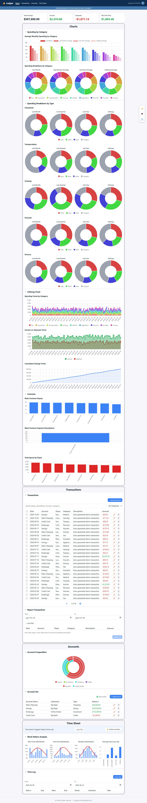
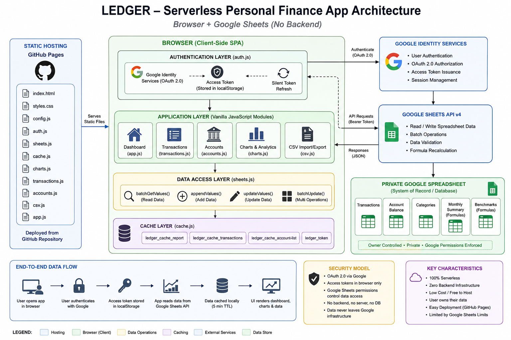

# Ledger

A private, serverless personal life dashboard — finances, time tracking, health, contacts, travel, and immigration/visa applications in one place. Ledger reads and writes directly to a Google Sheet you own — there is no backend, no database, and no third-party data store. The site is public on GitHub Pages and usable by anyone with a Google account: each user clones their own copy of the Ledger template and the app talks only to that copy, scoped via Google Drive's per-file `drive.file` permission — the data behind it is only ever accessible to the Google account that owns that particular spreadsheet.

## Table of Contents

- [Overview](#overview)
- [Features](#features)
- [Architecture](#architecture)
  - [System Diagram](#system-diagram)
  - [Frontend Module Map](#frontend-module-map)
  - [Data Flow](#data-flow)
- [Data Model](#data-model)
- [Tech Stack](#tech-stack)
- [Project Structure](#project-structure)
- [Getting Started](#getting-started)
- [Deployment](#deployment)
- [Configuration Reference](#configuration-reference)
- [Caching Strategy](#caching-strategy)
- [Security & Privacy](#security--privacy)
- [License](#license)

---

## Overview

Ledger is a single-page application that authenticates the user with their own Google account, then reads and writes a private "Ledger" Google Sheet via the Sheets API v4. All aggregation, charting, filtering, sorting, and CRUD logic runs client-side in vanilla JavaScript — there is no build step and no server component to deploy or maintain.



## Features

- **Dashboard widgets** — a row of 4 self-contained "bulb" cards above the summary cards, independent of the Google Sheet and working as soon as the page loads: **Time** (local `HH:mm:ss` next to a resolved location name, and a second, independently configurable reference clock defaulting to Isfahan), **Date** (today's date in Gregorian ✝️, Shamsi 🌞, and Ghamari 🌜 calendars, each as `{day} {MonthName} ({MonthNumber}) {year}`, via the browser's own `Intl` calendar support — no vendored date-conversion library), **Azan** (Sobh/Zohr/Maghreb prayer times computed client-side from sun-angle astronomical formulas using the Shia "Tehran"/University of Tehran method, for the resolved location), and **Weather** (current conditions plus a 3-day forecast for the resolved location). Location resolution tries, in order: a manual override (click the location name to auto-detect via `navigator.geolocation` + reverse-geocode, or type a city to search), then browser geolocation, then a `WIDGET_DEFAULT_CITY` `Settings` key, then a hardcoded Waterloo/Isfahan fallback — so the widgets never show a dead end even with location access denied. All of it runs on free, key-less public APIs called directly from the browser (Open-Meteo for weather + city search, BigDataCloud for reverse geocoding), cached in `localStorage` with their own TTLs separate from the Sheets data cache.
- **Summary cards** — at-a-glance Net Worth, Monthly Income, Monthly Expenditure, and Monthly Cash Flow.
- **Spending by Category** — a grouped bar chart comparing each category's average monthly spend over four periods (Last Month as-is, Last Quarter Average ÷ 3, Last Year Average ÷ 12, and Lifelong Average ÷ total months of data; each category's 4 bars are shaded from its own color, most recent = most opaque), plus four donut charts breaking down each period's spending by category share. Both share one legend, and categories are ordered by Lifelong Average spend, highest first.
- **Spending Breakdown by Type** — for each spending category that has at least one `Type` recorded in `Insight`, four donut charts (Last Month, Last Quarter, Last Year, Lifelong) breaking that category's spend down by `Type`, a free-text prefix convention in the `Transactions` `Description` field (e.g. "Bread - milk and eggs"), pre-aggregated by formulas in the `Insight` sheet. Panels are built dynamically from whatever categories/Types `Insight` defines (no hardcoded list), ordered by lifelong spend (highest first), and each donut includes an "Untyped" slice for spending without a recognized prefix.
- **Spending Patterns** — a panel of three bar charts derived straight from transaction history (income rows excluded): **Top Expense Descriptions** and **Top Payees** (record counts, top 36), and **Payee Expenditure** (summed expense amounts, top 36 by absolute total, bars colored green/red for net income/expense).
- **Historical Trends** — three charts in one panel: **Category Expenditure Trend** (stacked bar chart of spending by category, month over month, with categories stacked in the same highest-to-lowest Lifelong Average order as Spending by Category), **Revenue vs. Expenditure** (stepped area chart of the full transaction history), and **Cumulative Net Worth** (running total of savings as a line chart).
- **Transaction History** — searchable, filterable, sortable, paginated (⬅️/➡️) table with add/edit/delete/duplicate (Duplicate opens the edit form pre-filled from that row, so a similar new entry can be filled in and saved without retyping everything). CSV import also exists (`csv.js`) but its button is hidden from the UI by default. The Payee, Description, and Category fields all autocomplete from your transaction history and the `Insight` category list (most-used values first) instead of a fixed dropdown, helping correct typos or voice-dictation mistakes and letting you type a brand-new category (e.g. "Income") on the fly. Long Payee/Description values are truncated with an ellipsis (hover to see the full text). The Amount field accepts a simple arithmetic expression (optionally prefixed with `=`, e.g. `=-9.97-1.30` to add tax, or `-32/2` to split a charge); results are rounded to the nearest cent. An "Advanced Filters" toggle (collapsed by default) reveals a From/To date range plus a filter builder — each row picks a field (Account, Payee, Description, Category, Amount), an operator (Contains/Equals/etc. for text fields, =, ≠, >, >=, <, <= for Amount), and a value, with rows after the first getting an AND/OR selector evaluated left to right (e.g. Category contains "Grocery" OR Category contains "Household", AND Amount < 0) — these narrow the same table (so sorting, pagination, and bulk edit/delete all keep working against the filtered set) and an Export CSV button writes exactly what's currently filtered, not just the visible page.
- **Bulk transaction operations** — a checkbox per row (plus a header "select all") shows a running count and total (privacy-mode aware) of the selected transactions below the table, alongside ✏️ Edit Selected and 🗑️ Delete Selected buttons. Edit Selected opens a form pre-filled with whichever fields are identical across every selected transaction (a field that differs is left blank); only fields you actually fill in are applied to all selected rows, so e.g. recategorizing a batch doesn't touch their dates or amounts. Bulk delete issues one `batchUpdate` with a `deleteDimension` request per row, ordered highest-row-first so earlier deletes in the same call can't invalidate later ones. Selection clears whenever the underlying view changes (search/filter/sort/page) but survives an unrelated re-render.
- **Undo for bulk edit and deletes** — editing or deleting a transaction (single or bulk) shows a toast with an Undo button for a few seconds. Undoing a delete re-appends the deleted row(s) — they land back at the end of the sheet rather than their original position, since Sheets addresses rows by position and the delete has already shifted everything below them. Undoing a bulk edit writes each transaction's original values back in place instead, since those rows were never removed.
- **Keyboard shortcuts** — `/` focuses the transaction search box, `n` opens Add Transaction, `Esc` closes whichever modal (or the account menu) is open, and `?` toggles a shortcuts-help overlay. All except `Esc` are ignored while focus is in any text field, so they never fire while typing.
- **Accessibility** — every modal exposes `role="dialog"`/`aria-modal`/`aria-labelledby`, auto-focuses its first field on open, traps `Tab`/`Shift+Tab` inside itself while open, and restores focus to whatever triggered it on close (including via `Esc`). Collapsible panel headings and sortable table headers are reachable and operable by keyboard (`Tab` + `Enter`/`Space`), and all interactive elements get a visible focus outline. An empty Transaction History/Account Summary/Work Log table shows a friendly message instead of rendering blank.
- **Portfolio** — the Portfolio Allocation donut chart (a 3-ring nested donut: the inner ring shows each account type's share of total balance shaded by type, the middle ring breaks that down by institution — each institution has one fixed color, even if its accounts span multiple types — and the outer ring by individual account, shaded by its institution's color; both rings use colors spread evenly around the color wheel so no two entries share a color, however many there are. Account types and institutions are both ordered by absolute balance highest first, so a type or institution with a large negative net — e.g. Credit/debt — still ranks by its size rather than sorting last; types and institutions with a zero balance total are omitted), followed by the Account Summary panel: a sortable table of balances by institution/type, with add/edit/delete, inline Net Worth recalculation, and a reconciliation status (✅ Reconciled, or ⚠️ with the gap amount if recorded balances don't match transaction history). The Balance field accepts the same arithmetic-expression syntax as the transaction Amount field.
- **Time Tracker** — a "Log a Day" button opens a modal to record a day's Start/End time, Break, and an optional Task note (a weekday with no times but a Task note is treated as a holiday/day off; one with neither is flagged as a missed entry). The modal shows a live "Log Time" duration preview that recomputes as Start/End/Break change (or shows "🏖 Holiday" once that checkbox is ticked), so you see the computed hours before saving. A reminder banner appears whenever today is a weekday with nothing logged yet, with its own "Log a Day" shortcut and an opt-in "Enable reminders" button — browsers require a direct user gesture to grant `Notification` permission, so it's never requested automatically; once granted, an OS-level notification fires once per day (guarded via `localStorage`) instead of only the in-page banner. The **Work Analytics** panel renders four charts above the log: histograms — each with a fitted normal-distribution curve overlay, bars shown as a % of all logged days (so the curve's height tracks the bars regardless of sample size; the tooltip still shows the underlying day count) — of Arrival Distribution, Departure Distribution, and Hours Worked Distribution across weekday work shifts (weekends, holidays/days off, and mis-keyed negative durations are excluded), plus a bar chart of Daily Hours Average over Last Week/Last Month/Last Quarter/Last Year/Lifelong, averaged only over working days so weekends and holidays don't pull the average down. All four charts share the same bar thickness and x-axis label-row height regardless of how many bars/bins each has, so they line up evenly side by side; Daily Hours Average's longer period labels are rotated vertical to fit that shared height without overlapping or clipping. Below that, the Work Log table lists entries within a From/To date range, sortable by Date, with computed Duration and inline edit, paginated at 14 entries per page (⬅️/➡️); changing the date range or sort order resets to page 1.
- **Panel groups** — Health Tracker, Time Tracker, Journal, and Portfolio (in that order, top to bottom) each wrap their related panels in a bordered group with one heading, linked from the top nav in the same order; clicking that link expands every panel in its group at once. **Other** is a fifth panel group (Travel Insights + Travel List, Applications, and Contact List) that isn't linked from the nav — it's reached by scrolling.
- **Collapsible panels** — every chart/table panel is collapsed by default; click its title to expand or collapse it (dragging to select the title's text does not toggle it). A floating "expand/collapse all" button toggles every panel at once.
- **Privacy mode** — a floating 🙈/👁️ button masks every dollar amount across the summary cards, tables, and charts by replacing each digit with `*` (e.g. `$1,234.56` → `$*,***.**`). Amounts are hidden by default each time you sign in; click the button to reveal them for the rest of the session.
- **Dark mode** — a floating 🌙/☀️ button switches the whole app — including charts and the landing page — between light and dark themes, persisted in `localStorage`.
- **Resilient sign-in** — silent token refresh on return visits (including PWA/home-screen launches). A `ledger_consented` flag in `localStorage` tracks whether this browser has previously completed the OAuth consent flow — returning users get `prompt: ''` (Google can satisfy this silently or with a single account-picker click) while first-time users always go through the full consent prompt. Cleared on sign-out so a different person signing in on the same browser always gets their own consent flow. A tab left open also renews its own access token silently a few minutes before the ~1-hour expiry; if a silent refresh fails mid-session (e.g. a brief network blip), the app retries after a 2-minute backoff rather than signing the user out.
- **Account menu** — once signed in, the header shows the Google account's avatar (or initials, if it has none); clicking it opens a dropdown with the account's name/email and a Sign out button.
- **Health Tracker** — a dedicated section (accessible from the nav) for tracking health metrics across four categories, each a last-10-days chart with x-axis date labels angled 45° and thinned to ~5 evenly-spaced ticks for readability: **Body Weight** (line chart with a red dashed target line), **Caloric Intake** (bar chart, total per day, with a 2,000 kcal target line), **Rest & Recovery** (bar chart with an 8 hr target line), and **Physical Activity** (bar chart normalized to minutes — steps entries are converted at 100 steps/min, hour entries are multiplied by 60 — with a 100 min target line). A **Weight Trend & Forecast** chart below the four metrics plots historical weight (shaded) alongside a projected trajectory toward your weight goal (shaded in a distinct tint) using a multi-factor model (caloric balance, activity, and sleep quality), with a predicted arrival date. Its x-axis is a true linear time scale (day-offset from the first plotted date, not equally-spaced categories), so daily historical entries followed by weekly (then a single distant ETA) projected points are spaced proportionally to how far apart they actually are, rather than implying every gap is the same length. Below the charts, a filterable/sortable **Health Log** table (date range + category filter, sortable by date, paginated at 28 entries per page ⬅️/➡️) with add/edit/delete/duplicate. The Log Entry form is category-aware: selecting a category pre-fills the unit field and populates a datalist of Description suggestions sourced from your past entries for that category (most-used first), falling back to built-in defaults. The Amount field accepts arithmetic expressions (same syntax as Journal). A 🧮 **Calculate** button lets you type a freeform ingredient list into Notes (e.g. "125g ground beef, 1 cup crushed tomatoes, 30g rice") instead of a calorie number: an LLM (Groq) splits it into per-item food name/gram-weight/calorie-density estimates, each item's calorie density is cross-checked against real values from the USDA FoodData Central database — falling back to the model's own estimate only if the database has no plausible match, so a mismatched database entry can't silently produce a wildly wrong number — and the final total is always summed client-side rather than trusted from the model. The Category/Unit/Amount/Notes fields are then filled in automatically (Category set to "Calories"), ready to review and Save. Results are cached per exact input text, so recalculating the same entry is instant and gives the same answer every time. Requires `GROQ_API_KEY` and `USDA_FDC_API_KEY` in `Settings` (see below) — the button is always present, but shows an inline error/warning if a key is missing or a result looks implausible. Backed by a `Wellness Log` sheet tab in the same Google Sheet as all other data.
- **Travel** — a searchable, sortable Travel List table (Country/City, Port, Type, Via, Date, Time, Reason, Detail) with add/edit/delete, backed by a `Travel` sheet tab. Above the table, a **Travel Insights** panel derives two views from that same log: a **Time Spent by Country** grid of flag-emoji tiles (hover for country name + duration) computed by pairing each Arrival with its closing Departure (an open-ended final Arrival counts as an ongoing stay, credited up to today), and a **Countries Visited** choropleth world map (Chart.js + `chartjs-chart-geo`, world borders from `world-atlas`) highlighting every visited country. If a `BIRTH_DATE` key is set in `Settings` and the very first Travel row is a Departure, the years lived in the home country before that first trip are credited too, rather than being silently dropped just because the log itself only starts at the first trip ever taken.
- **Applications** — an Applications panel tracking immigration/visa applications as expandable cards, one per application (Type, App Number, Submitted date, latest status), each expanding to its full status-update history. Cards are grouped under "Ongoing" and "Closed" headings: an application counts as ongoing as long as its submission date or any status update is dated today (a still-active application's last recorded date keeps moving forward with each new update; once closed, that date stops advancing and stops matching "today" the next day). Add creates a new application header row only — status updates and the Delay figure are managed directly in the Sheet, since the Delay formula's cell references are hand-maintained per application. New applications are inserted at the top of the sheet's data (not appended after it) so the sheet's whole-column footer formulas (`Total Waiting time`, `Total Time in Canada`) shift down intact instead of a new row landing after them. Backed by an `Applications` sheet tab.
- **Contacts** — a searchable, sortable, paginated Contact List table (name, phone, email, tags) with add/edit/delete; the full record (prefix, birthday, up to 3 phones/2 emails, address with Province/Region for tax purposes, Website/LinkedIn/2 Telegram links, Tags, and a free-text Note) is edited in the Add/Edit Contact modal. Backed by a `Contacts` sheet tab. A checkbox column plus a bulk-actions bar let you select multiple rows to **export just the selection** (CSV formatted for Google/Phone Contacts or Outlook), **bulk-delete**, or **merge 2+ contacts into one** (fields already filled on the target row are kept, blanks are filled in from the others, and phone/email/Telegram lists are combined and deduplicated) — handy for cleaning up near-duplicates. `scripts/merge_contacts.py` is a one-time local tool that merges a Google Contacts export, an old manual spreadsheet, and a JSON contacts list into one deduplicated starting point for this tab — see its module docstring and the `Contacts` entry under [Data Model](#data-model) for the merge/dedup logic.
- **Settings** — a compact panel just below Contact List for managing the `Settings` tab's key/value pairs (see [Data Model](#data-model)) without leaving the app or opening the spreadsheet directly: a Key/Value table with ✏️ edit and 🗑️ delete per row, and a "+ Add" button. The Add/Edit modal's Key field autocompletes from the app's known setting keys (`WEIGHT_GOAL_KG`, `CALORIE_TARGET_KCAL`, `SLEEP_TARGET_HOURS`, `ACTIVITY_TARGET_MIN`, `BIRTH_DATE`, `WIDGET_DEFAULT_CITY`, `WIDGET_SECOND_CLOCK_CITY`) while still accepting a free-text custom key, and also has an optional Notes field (column C — still never read by the app itself, just a place to jot what a setting is for). Saving or deleting a row immediately re-applies the change to any live widget that reads it (e.g. a changed weight goal updates the Body Weight target line right away), without a page reload. If the `Settings` tab doesn't exist yet, the panel shows an explanatory message and disables "+ Add" instead of erroring.
- **Local caching** — a 5-minute `localStorage` cache avoids redundant Sheets API calls; manual refresh and clear-cache controls are available as floating buttons.

Category-based charts (Spending by Category, Category Expenditure Trend, Spending Breakdown by Type) all assign each category/type a color spread evenly around the color wheel, ordered by highest-to-lowest absolute spend.

Every dollar-denominated chart axis (Average Monthly Spending by Category, Category Expenditure Trend, Revenue vs. Expenditure, Cumulative Net Worth, Payee Expenditure) formats its y-axis ticks as currency rather than raw numbers; count-based charts (Top Payees/Top Expense Descriptions) and the Time Tracker's hours- and percentage-based charts are left as plain numbers since they aren't money.

---

## Architecture

### System Diagram

Ledger is a static site that talks directly to Google's APIs from the browser. There is no application server in the request path.



```text
┌───────────────────────────────────────────────────────────────────────┐
│                            Browser (Client)                            │
│                                                                         │
│   GitHub Pages static site: index.html + assets/style + assets/script │
│   Vanilla JS (ES6+), classic <script> tags, no build step             │
└───────────────────┬─────────────────────────────┬─────────────────────┘
                     │                             │
   (1) OAuth 2.0 token request      (3) REST calls — Authorization: Bearer <token>
       via Google Identity Services                │
                     │                             │
                     ▼                             ▼
     ┌────────────────────────────┐   ┌─────────────────────────────────┐
     │  Google Identity Services   │   │       Google Sheets API v4       │
     │  accounts.google.com        │   │       sheets.googleapis.com      │
     │  - issues OAuth access token│──▶│  (2) validates token + scope     │
     │  - scope: .../drive.file    │   └────────────────┬──────────────────┘
     └────────────────────────────┘                    │ (4) read / write
                                                          ▼
                                  ┌─────────────────────────────────────────────┐
                                  │      The signed-in user's own Ledger copy    │
                                  │   (cloned from TEMPLATE_SPREADSHEET_ID via    │
                                  │    Sheets' "make a copy", picked via Picker) │
                                  │                                               │
                                  │  Transactions    Account Balance             │
                                  │  Monthly Summary (formulas)                  │
                                  │  Insight (formulas)                          │
                                  │  Reconciliation (formulas)                   │
                                  └───────────────────────────────────────────────┘
```

Because every Sheets API call carries the signed-in user's own OAuth token, scoped via `drive.file` to only the specific spreadsheet they created or picked, each user can only ever read or write their own copy — even though the static site and `config.js` (Client ID + the public template ID) are visible to everyone.

Separately, and independent of the diagram above, `widgets.js` makes its own read-only, unauthenticated calls straight from the browser to two free public APIs — Open-Meteo (weather + city search) and BigDataCloud (reverse geocoding) — to power the Time/Date/Azan/Weather widgets. No API key, login, or personal financial data is involved; only coordinates (from `navigator.geolocation` or a typed city name) leave the browser.

### Frontend Module Map

Loaded as classic `<script>` tags (no bundler), in this order, sharing one global scope:

| Order | Module | Responsibility | Key exports used elsewhere |
|---|---|---|---|
| 1 | `config.js` | `CONFIG`: Client ID, template spreadsheet ID, Picker API key, sheet tab names | `CONFIG` |
| 2 | `auth.js` | Google sign-in/out, token persistence (`localStorage`), silent refresh, account profile lookup for the header avatar menu | `initAuth`, `signIn`, `signOut`, `getAccessToken`, `fetchUserInfo` |
| 3 | `drive.js` | Per-user spreadsheet selection: opens Sheets' "make a copy" link for the template, Google Picker for selecting/confirming a file, `localStorage`-backed active spreadsheet ID | `openTemplateCopyLink`, `pickSpreadsheet`, `getActiveSpreadsheetId`, `setActiveSpreadsheetId`, `clearActiveSpreadsheetId` |
| 4 | `sheets.js` | Thin Sheets API v4 wrapper (get / batchGet / append / update / clear / batchUpdate) against the active spreadsheet ID | `getValues`, `batchGetValues`, `appendValues`, `updateValues`, `batchUpdate`, `getSpreadsheetMetadata` |
| 5 | `cache.js` | `localStorage`-backed cache with a configurable per-call TTL (5 minutes by default), hard-refresh (cache + Cache Storage + service workers), and the shared numeric-expression evaluator used by the Balance and Amount fields | `getCached`, `setCached`, `clearCache`, `hardRefresh`, `evaluateNumberExpression` |
| 6 | `groq.js` | Groq chat-completions client for the Health Log's Calculate button: sends a freeform ingredient description, tolerantly parses the model's JSON reply (extracts the outermost `{...}` rather than trusting `response_format: json_object`, and evaluates any inline arithmetic expression left in a numeric field instead of rejecting it), and returns per-item food name/gram-weight/calorie-density estimates plus a standardized notes summary | `groqExtractIngredients` |
| 7 | `usda.js` | USDA FoodData Central client: looks up real per-100g calorie data for a food name, returning several search candidates (not just the top hit) so the caller can cross-check against the model's own estimate rather than trusting an unranked first result | `usdaLookupKcalCandidates` |
| 8 | `widgets.js` | The 4 dashboard "bulb" widgets (Time, Date, Azan, Weather): geolocation + reverse/forward geocoding and the manual location pickers, the Tehran-method prayer-time calculation, the Gregorian/Shamsi/Ghamari date formatting, and the Open-Meteo weather fetch/render — entirely independent of the Google Sheet | `initWidgets`, `applySettingsToWidgets` |
| 9 | `charts.js` | Chart.js renderers for the dashboard charts, including the 4-donut Spending by Category breakdown grid, the per-category Spending Breakdown by Type donut grids, the nested Portfolio Allocation donut, the Work Analytics charts (Arrival/Departure/Hours Worked Distribution histograms with a normal-curve overlay, plus the Daily Hours Average bar chart), the Spending Patterns panel's Top Payees/Top Expense Descriptions and Payee Expenditure bar charts, the Time Spent by Country flag-tile computation, and the Countries Visited choropleth world map | `renderSpendingTrendChart`, `renderSpendingBreakdownCharts`, `renderTypeBreakdownCharts`, `renderIncomeExpenseChart`, `renderExpenseBreakdownTrendChart`, `renderSavingsTrendChart`, `renderAccountCompositionChart`, `renderTimesheetDistributionCharts`, `renderTimesheetDailyAverageChart`, `renderCommonPayeeChart`, `renderCommonDescriptionChart`, `renderPayeeSpendChart`, `computeCountryDays`, `getVisitedCountries`, `renderCountryDaysList`, `renderWorldMapChart` |
| 10 | `transactions.js` | Transaction History table: list, search/filter/date-range/advanced field filters, sortable columns, pagination, add/edit/delete, Payee/Description/Category autocomplete, multi-select bulk edit/delete with selected-row sum | `initTransactions`, `refreshTransactions`, `refreshAccountOptions`, `bulkDeleteTransactions`, `restoreTransactions`, `openBulkEditForm`, `submitBulkEditForm`, `getFilteredTransactions` |
| 11 | `accounts.js` | Account Summary table: balances + validation list, sortable, add/edit/delete | `initAccountManager` |
| 12 | `timesheet.js` | Time Tracker: Work Log table (date-range filter, sortable, add/edit), holiday/missed-entry detection, client-side Duration computation, the data feeding the Work Analytics charts, and the today-not-logged reminder banner/notification | `initTimeSheet`, `refreshTimeSheet`, `getFilteredTimeEntries`, `checkTimesheetReminder` |
| 13 | `csv.js` | CSV import for transactions, plus the advanced filter-builder engine (date range + AND/OR field filters) shared by Transaction History's "Advanced Filters" toggle and CSV export | `initCsvControls`, `getExportFilters`, `transactionMatchesExportFilters` |
| 14 | `wellness.js` | Health Tracker: Body Weight/Caloric Intake/Rest & Recovery/Physical Activity charts (with red-dashed target lines), Weight Trend & Forecast projection chart, filterable/sortable Health Log table, category-aware Log Entry form with history-based autocomplete, step-to-minute conversion for Activity entries, and the Calculate button's Groq+USDA-backed calorie estimation (extract ingredients → cross-check each item's calorie density against the database, falling back to the model's estimate → sum in code → cache by exact input text) | `initWellness`, `refreshWellness` |
| 15 | `contacts.js` | Contacts: searchable/sortable Contact List table, add/edit/delete, multi-select bulk export/delete/merge, CSV export for Google/Phone import and Outlook import | `initContacts`, `refreshContacts` |
| 16 | `settings-panel.js` | Settings panel: Key/Value/Notes table below Contact List, add/edit/delete against the `Settings` tab, re-applying `app.js`'s `loadSettings`/`applySettingsToWidgets` after every change so live widgets/targets pick up the new value immediately | `initSettingsPanel`, `refreshSettingsList` |
| 17 | `travel.js` | Travel: sortable/searchable Travel List table, add/edit/delete, and pairing Arrival/Departure rows into the Time Spent by Country and Countries Visited data `charts.js` renders | `initTravel`, `refreshTravel` |
| 18 | `applications.js` | Applications: parses `Applications`' header-row-plus-status-updates grouping into Ongoing/Closed cards, searchable, add (inserts at the top of the sheet)/edit/delete (removes a whole application's row range) | `initApplications`, `refreshApplications`, `parseApplications` |
| 19 | `app.js` | Orchestration: report aggregation, dashboard rendering, file-selection gate, scroll-spy nav, collapsible panels, dark mode toggle, app-level keyboard shortcuts, modal focus management (focus-on-open/restore-on-close, Tab trapping), the shared empty-state table row helper, the shared undo toast, wiring everything together on `window.load` | `loadDashboard`, `handleAuthChange`, `setupKeyboardShortcuts`, `setupModalFocusManagement`, `renderEmptyRow`, `showUndoToast` |

### Data Flow

**Dashboard widgets** (independent of sign-in)
0. `app.js`'s `window.load` handler calls `initWidgets()` unconditionally — the widget row only needs the (possibly still-hidden) `#dashboard` markup to exist, not an authenticated session, so the clock/date/Azan/weather bulbs start immediately regardless of sign-in state. Once `loadDashboard()` does run (see below), it also calls `applySettingsToWidgets()` so a `WIDGET_DEFAULT_CITY`/`WIDGET_SECOND_CLOCK_CITY` `Settings` value can override the hardcoded defaults, without overriding a location the user already picked manually in-browser.

**Sign-in**
1. `app.js` calls `initAuth(handleAuthChange)`.
2. `auth.js` checks `localStorage` for a non-expired token. If found, it's used immediately. If not, a *silent* `requestAccessToken({ prompt: 'none' })` is tried against the existing Google session — only if that fails does the landing page's "Sign in with Google" button trigger a full consent prompt.
3. On success, `handleAuthChange(token)` checks `getActiveSpreadsheetId()` (`drive.js`). If a spreadsheet is already selected for this browser, it swaps the landing page for the dashboard and calls `loadDashboard()`. Otherwise it shows the file-selection gate.

**File selection** (first run on a browser, or after sign-out/clearing storage)
3a. "Get the Template" opens Google Sheets' own `/copy` URL for `CONFIG.TEMPLATE_SPREADSHEET_ID` in a new tab — Sheets clones it directly into the user's Drive via Google's UI, with no extra OAuth scope needed.
3b. "Select my Ledger" calls `pickSpreadsheet()`, which opens a Google Picker scoped to Sheets files. Picking a file (the new copy, or an existing one from a prior session) is what grants the `drive.file`-scoped token access to that specific file; its ID is stored as `ledger_spreadsheet_id` and the dashboard loads.

**Dashboard load**
4. `loadReport()` returns cached data (`ledger_cache_report`, 5-minute TTL) or issues a single `batchGetValues` for the `Monthly Summary`, `Account Balance`, `Insight`, and `Reconciliation` ranges, then derives the summary cards, the Revenue vs. Expenditure and Cumulative Net Worth trends, the Category Expenditure Trend over time, the Spending by Category comparisons, the per-category `Type` breakdown for the Spending Breakdown by Type donuts, and the reconciliation status shown above the Account Summary table.
5. `initTransactions()`, `initAccountManager()`, `initTimeSheet()`, `initWellness()`, `initContacts()`, `initSettingsPanel()`, `initTravel()`, and `initApplications()` run concurrently (`Promise.allSettled`), each checking their own cache before calling the Sheets API. Once `initTransactions()` resolves, `app.js` renders the Spending Patterns panel's three charts (Top Payees, Top Expense Descriptions, Payee Expenditure) from the loaded transaction list. Once `initTravel()` resolves, it derives and renders the Time Spent by Country and Countries Visited data from the loaded Travel rows.
6. `charts.js` renders all Chart.js canvases — the 4 line/bar charts, the 4-donut Spending by Category breakdown grid, the per-category Spending Breakdown by Type donut grids, and the Work Analytics charts; `app.js` renders the summary cards; `accounts.js`, `transactions.js`, and `timesheet.js` render their tables.

**Writes** (add/edit/delete transaction or account, edit balance, CSV import)
7. UI actions call `appendValues` / `updateValues` / `batchUpdate` directly against the spreadsheet.
8. On success, the relevant cache key is refreshed (`refreshTransactions(true)`, `refreshAccountsList(true)`, `refreshNetWorth()`, etc.) so the UI reflects the change immediately without a full page reload.

**Manual refresh**
9. The 🔄 Refresh and 🧹 Clear Cache buttons — part of the floating action button stack in the bottom-right corner — clear the cache and re-fetch everything; Clear Cache additionally clears Cache Storage and unregisters any service workers, then reloads — for recovering from a stale deployed version. The same stack also holds the 🌙/☀️ dark mode toggle and the expand/collapse-all panels button.

---

## Data Model

A single Google Sheet (cloned per-user from the template) with the following tabs, accessible only to the Google account that owns that copy.

### `Transactions`

| Column | Type | Notes |
|---|---|---|
| A — Date | Date | ISO format |
| B — Account | Text | Must match a name in `Account Balance` column A |
| C — Payee | Text | Merchant / person / institution |
| D — Category | Text | Must match a category name in `Insight` column A |
| E — Description | Text | Optional detail |
| F — Amount | Number | Positive = income, negative = expense. The sign alone defines the type — there is no separate Income/Expense column. |

### `Account Balance`

Net worth snapshot and the account list, combined in one tab.

| Cell/Column | Type | Notes |
|---|---|---|
| D1 | Number (formula) | Net Worth, e.g. `=ROUND(SUM(D3:D100),2)` |
| Row 2 | Header | `Account \| Institute \| Type \| Balance` |
| A3:A | Text | Account name — also the dropdown source for `Transactions` and the Account Summary table |
| B3:B | Text | Institution, e.g. a bank or brokerage name |
| C3:C | Text | Type — one of `Cash`, `Chequing`, `Checking`, `Saving`, `Credit`, `Investment`, `Investment (Managed)`, `Investment (Member)`, `Investment (Employer)`, `Person`, `Other` |
| D3:D | Number | Account balance |

### `Monthly Summary` (formula-driven)

`SUMIFS` against `Transactions`, recomputed automatically whenever transaction data changes — no client-side aggregation. Row 1 is the header; data rows start at row 2.

| Column | Contents |
|---|---|
| A | Month label |
| B | Income |
| C | Expenses |
| D onward | Per-category expense totals — one column per category in `Insight` column A, matched by header name (see below) |
| Second-to-last | Saved (income − expenses) |
| Last | Cumulative savings |

`app.js` reads row 1 as headers and matches each category name from `Insight` column A against the `Monthly Summary` headers to find its column — except "Income"/"Expenses" (columns B/C), which are excluded even if `Insight` also has a row with that name, since they aren't spending categories. `Saved` and `Cumulative` aren't matched by name; they're always taken as the last two columns of the data rows, so inserting a new category column anywhere before them doesn't break either chart. Adding or renaming a category only requires updating `Insight` and adding a matching column/header to `Monthly Summary` — no code changes needed.

### `Insight` (formula-driven)

Per-category, per-`Type` spending breakdown used by the Spending Breakdown by Type donuts. `Type` is not a separate column on `Transactions` — it's a free-text prefix convention on the `Description` field (e.g. a transaction with Description "Bread - milk and eggs" has Type "Bread"). Data rows start at row 2.

| Column | Contents |
|---|---|
| A — Category | Category name. Column A is also the source of the category list used throughout the dashboard and the transaction form's Category autocomplete suggestions — each unique value across all rows becomes one category. The form isn't limited to this list — typing a new value (e.g. "Income") works too. |
| B — Type | A `Description` prefix, or **blank** for a row holding that category's overall total |
| C — Last Month | `-SUMIFS(...)` over `Transactions`, matching Category, `Description` starting with `Type` (via `Type&"*"`, or no Description filter if `Type` is blank), `Amount < 0`, and the date window for "last month" |
| D — Last Quarter | Same, for the trailing 3-month window |
| E — Last Year | Same, for the trailing 12-month window |
| F — Lifelong | Same, with no date filter |

Cell `H1` holds `=TODAY()`, the single anchor date that every period's `EOMONTH(...)`-based date window is computed relative to.

For each category, the blank-`Type` row's totals are used as that category's overall spend; the gap between that total and the sum of its named `Type` rows becomes the "Untyped" donut slice. `Type` rows with a Lifelong value of `0` (a retired Type with no historical spend) are excluded entirely, so removing a Type from active use doesn't leave an empty entry in the legend. The 5 categories shown (Grocery, Household, Personal, Transportation, Housing) are a fixed list in `charts.js` (`TYPE_BREAKDOWN_CATEGORIES`) — adding a new category requires adding its rows to `Insight`, the category name to that constant, and a matching donut-grid block in `index.html`.

### `eTimeSheet`

One row per logged calendar day, oldest first. Data rows start at row 2.

| Column | Type | Notes |
|---|---|---|
| A — Date | Date | ISO format |
| B — Day | Text | Weekday name; only written when a brand-new row is appended, never read back |
| C — Start | Text | `HH:MM`, blank for a holiday/day off |
| D — End | Text | `HH:MM`, blank for a holiday/day off |
| E — Break | Number (minutes) | Break length; pre-existing Excel-style `H:MM`/`H:MM:SS` duration cells are also parsed |
| F — Duration | — | Never read or written by the app — `timesheet.js` always computes worked time client-side from Start/End/Break |
| G — Task | Text | Free-text note. On a weekday with no Start/End, a non-blank Task marks the day as a holiday/day off; blank instead flags a missed entry |

A weekend day (Saturday/Sunday) with no Start/End is neither a holiday nor a missed entry — it's just not logged. Logging a new date that leaves a gap since the last logged date backfills every missing day in between with a blank row first, keeping one row per calendar day.

### `Wellness Log`

One row per wellness measurement, newest appended last. Data rows start at row 2.

| Column | Type | Notes |
|---|---|---|
| A — Date | Date | ISO format |
| B — Time | Text | `HH:MM`, optional |
| C — Category | Text | One of `Sleep`, `Weight`, `Calories`, `Activity` |
| D — Description | Text | E.g. "Morning Weight", "Lunch", "Run" |
| E — Amount | Number | The measured value; units defined by column F |
| F — Unit | Text | Auto-filled by category: `kg` for Weight, `kcal` for Calories, `hr` for Sleep, `steps` (or `min`/`hr`) for Activity |
| G — Notes | Text | Optional free-text note |

The Activity chart normalizes all entries to minutes before plotting (steps ÷ 100, hours × 60), so step-count and duration entries are comparable on the same axis.

### `Contacts`

One row per contact. Data rows start at row 2. Not present in the template by default — see `scripts/merge_contacts.py` for a one-time tool that merges a Google Contacts export, an old manual sheet, and a JSON contacts list into a deduplicated starting point for this tab.

| Column | Type | Notes |
|---|---|---|
| A — First Name | Text | |
| B — Middle Name | Text | |
| C — Last Name | Text | |
| D — Prefix | Text | e.g. `Dr.`, `Prof.`, `Mr.` |
| E — Tags | Text | Comma-separated, e.g. `UW, Family` |
| F — Birthday | Date | ISO format; used for birthday reminders |
| G/H/I — Phone 1/2/3 | Text | No label column — first slot is the primary number |
| J/K — Email 1/2 | Text | |
| L — Street Address | Text | |
| M — City | Text | |
| N — Province/Region | Text | Drives applicable tax rate on receipts/quotes |
| O — Postal Code | Text | |
| P — Country | Text | |
| Q — Website | URL | Personal/company site |
| R — LinkedIn | URL | |
| S/T — Telegram / Telegram 2 | URL | |
| U — Note | Text | Free-text; also where the merge script folds in anything that overflowed a slot (4th+ phone, 3rd+ email, etc.) |

### `Travel`

One row per border-crossing event (an Arrival or a Departure), oldest first. Data rows start at row 2.

| Column | Type | Notes |
|---|---|---|
| A — Country, City | Text | e.g. `Canada, Toronto` — only the part before the comma is used as the country name (flag lookup, world map, Time Spent by Country totals) |
| B — Port | Text | Airport/border checkpoint/terminal name |
| C — Type | Text | `Departure` or `Arival` (sic — matched case-insensitively; anything not "Departure" is treated as an Arrival) |
| D — Via | Text | e.g. `Flight`, `Bus`; blank on Arrival rows |
| E — Date | Date | ISO format |
| F — Time | Text | `HH:MM`, optional — combined with Date so a same-day round trip still nets a real sub-day duration instead of rounding to 0 |
| G — Reason | Text | e.g. `Tourism`, `Student`, `Work`; blank on Departure rows |
| H — Detail | Text | Free-text, e.g. an itinerary note or employer/school name |

`charts.js`'s `computeCountryDays()` walks the rows in order: an Arrival opens a stay in that country, and the next Departure (regardless of its own Country/City, since it's wherever that stay was) closes it and credits the elapsed time to the country the stay opened in; a trailing Arrival with no following Departure is an ongoing stay credited up to today. Since the log only starts at the first trip ever taken, a `BIRTH_DATE` key in `Settings` lets the years lived at home before that first trip count too (see below).

### `Applications`

Not a flat table — each application is a header row (Delay, Date, Action, Type, App Number all set) optionally followed by status-update rows that only carry Date + Action, until the next application's header row starts. Data rows start at row 2.

| Column | Type | Notes |
|---|---|---|
| A — Delay (in Days) | Number (formula) | Header rows only — a hand-maintained formula referencing that specific application's own first and last logged row, e.g. `=DATEVALUE(B17)-DATEVALUE(B2)`. Left blank by the app when adding a new application, since there's no "last row" yet to reference. |
| B — Date | Date | ISO format |
| C — Action | Text | e.g. `Submited` (header row), or a status update like `IRCC Application Received` |
| D — Type | Text | Header rows only, e.g. `Visa 5`, `Post-graduation Work Permit` |
| E — App Number | Text | Header rows only |

The sheet's last two rows are whole-column footer formulas (`Total Waiting time` = `SUM` of every Delay, `Total Time in Canada` = a running `DATEDIF`), not data — `applications.js`'s `parseApplications()` skips any row whose Action contains "Total" so they're never mistaken for a status update. Adding a new application via the UI inserts a fresh row 2 (rather than appending after the existing data) so those footer formulas' ranges shift down and stay correct instead of a new row landing after them.

### `Settings` (optional, user-managed)

A plain key-value tab for personal parameters that would otherwise be hardcoded — currently the 4 Health Tracker targets, `BIRTH_DATE`, the two `WIDGET_*` city keys, and two third-party API keys (`GROQ_API_KEY`, `USDA_FDC_API_KEY`) used by the Health Log's calorie calculator. Not present in the template by default; the app works with today's defaults until a user adds it (or adds their first row via the in-app **Settings** panel — see [Features](#features) — which creates the tab's data going forward but won't create the tab itself). Data rows start at row 2.

| Column | Type | Notes |
|---|---|---|
| A — Key | Text | `UPPER_SNAKE_CASE`, matched by code (e.g. `WEIGHT_GOAL_KG`); the Settings panel's Add/Edit modal autocompletes from the known keys below but also accepts a free-text custom one |
| B — Value | Number or Text | Numeric for the Health Tracker targets; `BIRTH_DATE` and the two `WIDGET_*` city keys are text-valued (read via `getSettingString()` rather than `getSetting()`) |
| C — Notes | Text | Free-text, human-only — never read by `getSetting`/`getSettingString`; editable via the Settings panel as a place to note what a setting is for |

Recognized keys today, with their fallback if the tab or a row is missing:

| Key | Default | Used for |
|---|---|---|
| `WEIGHT_GOAL_KG` | `82` | Weight Trend & Forecast chart goal line and ETA projection |
| `CALORIE_TARGET_KCAL` | `2000` | Caloric Intake chart target line; caloric-balance input for the Weight Trend & Forecast projection |
| `SLEEP_TARGET_HOURS` | `8` | Rest & Recovery chart target line; sleep-quality factor in the Weight Trend & Forecast projection |
| `ACTIVITY_TARGET_MIN` | `100` | Physical Activity chart target line |
| `BIRTH_DATE` | *(none — feature skipped)* | ISO date, e.g. `1991-02-12`. If set and the first `Travel` row is a Departure, credits the home country with the time from this date to that first Departure in the Time Spent by Country breakdown |
| `WIDGET_DEFAULT_CITY` | `Waterloo, ON` (hardcoded) | A city name, e.g. `Waterloo, ON, Canada` — geocoded via Open-Meteo and used as the Azan/Weather widgets' fallback location whenever the browser doesn't share (or hasn't yet resolved) a location and no manual override is set for that browser |
| `WIDGET_SECOND_CLOCK_CITY` | `Isfahan` (hardcoded) | A city name — geocoded to a timezone and used for the Time widget's second clock row, unless overridden per-browser by clicking that city's name |
| `GROQ_API_KEY` | *(none — Calculate shows an inline error)* | Bearer token for [Groq](https://groq.com/)'s chat-completions API, used by the Health Log's 🧮 Calculate button to parse a freeform ingredient description into per-item food name/gram-weight/calorie-density estimates |
| `USDA_FDC_API_KEY` | *(none — falls back to the model's own estimate)* | Bearer token for [USDA FoodData Central](https://fdc.nal.usda.gov/), used to cross-check each ingredient's calorie density against real nutrition data before accepting the model's guess; get a free key at fdc.nal.usda.gov |

Each key falls back independently — a missing tab, a missing row, or a non-numeric Value only affects that one parameter, never the rest of the dashboard. This tab is meant to grow (e.g. a future API key or SMTP setting is just another row) but is read over the same OAuth-authenticated Sheets API as every other tab — as private as the rest of the workbook, not extra-protected secret storage. **`GROQ_API_KEY` and `USDA_FDC_API_KEY` are the first genuine secrets stored this way** — unlike `config.js`'s values (see [Security & Privacy](#security--privacy)), these two are real bearer tokens sent directly from the browser to Groq/USDA on every Calculate click; they're only ever as protected as this Settings tab itself.

### `Reconciliation` (formula-driven)

A single reconciliation check comparing recorded account balances against transaction history.

| Cell | Contents |
|---|---|
| A5 | Label — "Missing Amount" |
| B5 | The discrepancy: non-zero means an `Account Balance` entry is wrong or a `Transactions` row is missing |

`app.js` reads `B5` and shows a reconciliation status above the Accounts table — ✅ Reconciled if it's `0` (within half a cent), or ⚠️ with the discrepancy amount otherwise.

---

## Tech Stack

| Layer | Choice |
|---|---|
| Frontend | HTML5, CSS3, vanilla JavaScript (ES6+) — no framework, no build step |
| Charts | [Chart.js](https://www.chartjs.org/), plus [chartjs-chart-geo](https://github.com/sgratzl/chartjs-chart-geo) + a [world-atlas](https://github.com/topojson/world-atlas) topojson dataset (both CDN-loaded) for the Countries Visited choropleth map |
| Authentication | [Google Identity Services](https://developers.google.com/identity) (GIS), OAuth 2.0 token flow, `drive.file` + `userinfo.email`/`userinfo.profile` scopes |
| File selection | [Google Picker API](https://developers.google.com/drive/picker) |
| Data store | Google Sheets API v4 |
| Location/weather widgets | Browser `navigator.geolocation` + `Intl` (calendars, timezones); [Open-Meteo](https://open-meteo.com/) forecast + geocoding APIs and [BigDataCloud](https://www.bigdatacloud.com/) reverse geocoding — both free, key-less, called directly from the browser |
| Health Log calorie calculator | [Groq](https://groq.com/) chat-completions API (ingredient parsing/estimation) cross-checked against [USDA FoodData Central](https://fdc.nal.usda.gov/) (real per-100g nutrition data) — both called directly from the browser with per-user API keys stored in `Settings` |
| Hosting | GitHub Pages |

---

## Project Structure

```text
ledger/
├── index.html              # Page shell: sign-in gate, dashboard, modals, footer
├── favicon.svg              # Browser tab icon
├── manifest.json            # Web app manifest (PWA/home-screen install)
├── robots.txt               # Search engine crawling rules
├── sitemap.xml              # Sitemap for search engines
├── assets/
│   ├── images/
│   │   ├── social-preview.png   # Open Graph / Twitter card image
│   │   └── apple-touch-icon.png # iOS home-screen icon
│   ├── style/
│   │   └── styles.css       # All styling
│   └── script/
│       ├── config.js        # Client ID + template Spreadsheet ID + Picker API key + sheet/range names
│       ├── auth.js           # Google Identity Services sign-in/out, token storage
│       ├── drive.js          # Per-user spreadsheet selection: template copy link, Picker, active-file storage
│       ├── sheets.js         # Sheets API wrapper (get, batchGet, append, update, batchUpdate)
│       ├── cache.js          # localStorage cache + hard refresh
│       ├── groq.js           # Groq chat-completions client for the Health Log calorie calculator
│       ├── usda.js           # USDA FoodData Central client for the Health Log calorie calculator
│       ├── widgets.js        # Dashboard bulbs: Time/Date/Azan/Weather, location pickers
│       ├── charts.js         # Chart.js renderers
│       ├── transactions.js   # Transactions table: filters, sorting, CRUD
│       ├── accounts.js       # Accounts table: balances + CRUD
│       ├── timesheet.js      # Time Sheet: Time Log table + Work Pattern Analysis chart data
│       ├── csv.js            # CSV export/import for transactions
│       ├── wellness.js       # Wellness Log: charts, log table, CRUD
│       ├── contacts.js       # Contacts: Contact List table, CRUD, bulk export/delete/merge
│       ├── settings-panel.js # Settings panel: Key/Value/Notes table + CRUD against the Settings tab
│       ├── travel.js         # Travel List table + CRUD; feeds Time Spent by Country / Countries Visited
│       ├── applications.js   # Applications: parses header+status-update rows into cards, CRUD
│       └── app.js            # Orchestration, report aggregation, scroll-spy nav
├── LICENSE
└── README.md
```

---

## Getting Started

These steps are for the app's developer/deployer, done once. Individual users don't configure anything — they just sign in and pick or create their own spreadsheet from the running app (see [Data Flow](#data-flow)).

### 1. Create the template Google Sheet

Create a spreadsheet with the tabs described in [Data Model](#data-model), pre-populated with a small amount of sample data so charts aren't empty on a new user's first run. Share it as **Anyone with the link can view** — this is the file every user's personal copy gets cloned from via Sheets' own "make a copy" flow, so it must be link-viewable but should contain no real personal data.

### 2. Create a Google Cloud project and credentials

1. Create a Google Cloud project and enable the **Google Sheets API**, the **Google Drive API**, and the **Google Picker API**.
2. Create an **OAuth 2.0 Client ID** (Web application). Add the origin(s) the app will be served from (e.g. `https://<your-username>.github.io`) as authorized JavaScript origins. For local development, also add `http://localhost:8000`.
3. Create an **API key** (Cloud Console → Credentials → Create Credentials → API key) and restrict it to the Picker API and the same origins. This is separate from the OAuth Client ID — the Picker widget needs it to initialize.

### 3. Configure the app

Edit `assets/script/config.js`:

```js
const CONFIG = {
  CLIENT_ID: '<your-client-id>.apps.googleusercontent.com',
  TEMPLATE_SPREADSHEET_ID: '<your-template-spreadsheet-id>',
  PICKER_API_KEY: '<your-picker-api-key>',
  SHEETS: {
    TRANSACTIONS: 'Transactions',
    REPORT: 'Monthly Summary',
    BALANCE: 'Account Balance',
    ACCOUNTS: 'Account Balance',
    INSIGHT: 'Insight',
    RECONCILIATION: 'Reconciliation',
    TIMESHEET: 'eTimeSheet',
    WELLNESS: 'Wellness Log',
    CONTACTS: 'Contacts',
    SETTINGS: 'Settings',
    TRAVEL: 'Travel',
    APPLICATIONS: 'Applications',
  },
};
```

None of these values are secrets — see [Security & Privacy](#security--privacy). Note that the `drive.file` scope (see [Tech Stack](#tech-stack)) is an unverified-app-friendly scope, so this doesn't require Google's sensitive-scope OAuth verification review the way a broader Sheets/Drive scope would.

### 4. Run locally

No build step is required. Serve the directory with any static file server, e.g.:

```sh
python -m http.server 8000
```

Then open `http://localhost:8000`.

---

## Deployment

The app is a static site — any static host works, but GitHub Pages requires zero configuration:

1. Push the repository to GitHub.
2. Open **Settings → Pages**.
3. Under **Source**, select **Deploy from a branch**, branch `main`, folder `/ (root)`.
4. Save. The site will be published at `https://<your-username>.github.io/<repo-name>`.

Make sure that URL is added as an authorized JavaScript origin for the OAuth client (see [Getting Started](#getting-started)).

---

## Configuration Reference

**Sheet ranges read/written by the app:**

| Range | Used in | Purpose |
|---|---|---|
| `'Monthly Summary'!A1:Z149` | `app.js` | Header row (for dynamic category column matching) plus monthly income/expense/category data and cumulative net worth |
| `'Account Balance'!A1:D1` | `app.js` | Net Worth figure (`D1`) for the summary card |
| `Insight!A2:F200` | `app.js` | Per-category, per-Type spend breakdown for the Spending by Category bar chart and donuts, and the Spending Breakdown by Type donuts, and the source of the category list (column A) for chart category matching |
| `'Reconciliation'!B5` | `app.js` | Missing Amount — non-zero means recorded account balances don't reconcile with transaction history (a transaction may be missing or a balance may be wrong) |
| `Transactions!A2:F` | `transactions.js`, `csv.js` | Transaction rows |
| `'Account Balance'!A3:D100` | `accounts.js` | Account name, institution, type, balance |
| `'Account Balance'!A3:A100`, `Insight!A2:A200` | `transactions.js` | Account dropdown and Category autocomplete suggestions for the transaction form |
| `eTimeSheet!A2:G` | `timesheet.js` | Work Log rows; read for the table, Work Analytics charts, and gap backfill, appended/updated on add or edit |
| `'Wellness Log'!A2:G` | `wellness.js` | Health Log entries; read for all charts and the Health Log table, appended on add, updated on edit, deleted via `batchUpdate` |
| `'Contacts'!A2:U` | `contacts.js` | Contact rows; read for the Contact List table, appended on add, updated on edit, deleted via `batchUpdate` |
| `'Travel'!A2:H` | `travel.js` | Travel rows; read for the Travel List table and the Time Spent by Country / Countries Visited data, appended on add, updated on edit, deleted via `batchUpdate` |
| `'Applications'!A2:E` | `applications.js` | Application header + status-update rows, grouped client-side into cards; new applications inserted at row 2 via `batchUpdate`, edited in place, deleted (whole row range) via `batchUpdate` |
| `Settings!A2:C` | `app.js`, `settings-panel.js` | Optional personal-parameter overrides (e.g. Health Tracker targets, `BIRTH_DATE`, the two `WIDGET_*` city keys); missing tab/row falls back to hardcoded defaults. `app.js` only reads it (columns A/B); `settings-panel.js` reads all 3 columns and appends/updates/deletes rows via the Settings panel UI |

**Client-side cache (`localStorage` via `cache.js`, 5-minute TTL by default unless noted):**

| Cache key | Set by | Contents |
|---|---|---|
| `ledger_cache_report` | `app.js` | Aggregated report (summary cards, chart data, Spending by Category comparison, Spending Breakdown by Type) |
| `ledger_cache_lists` | `transactions.js` | Transactions sheet ID + account/category dropdown options |
| `ledger_cache_transactions` | `transactions.js` | Raw `Transactions!A2:F` rows |
| `ledger_cache_accounts-meta` | `accounts.js` | `Account Balance` sheet ID |
| `ledger_cache_account-list` | `accounts.js` | Raw `'Account Balance'!A3:D100` rows |
| `ledger_cache_timesheet` | `timesheet.js` | Raw `eTimeSheet!A2:G` rows |
| `ledger_cache_wellness` | `wellness.js` | Raw `'Wellness Log'!A2:G` rows |
| `ledger_cache_contacts` | `contacts.js` | Raw `'Contacts'!A2:U` rows |
| `ledger_cache_travel` | `travel.js` | Raw `'Travel'!A2:H` rows |
| `ledger_cache_applications` | `applications.js` | Raw `'Applications'!A2:E` rows |
| `ledger_cache_settings` | `app.js` | Parsed `Settings` key-value map (`{}` if the tab is absent) |
| `ledger_cache_settings-panel-meta` | `settings-panel.js` | `Settings` sheet ID for the Settings panel's row-delete calls (`null` if the tab is absent) |
| `ledger_cache_setting-list` | `settings-panel.js` | Raw `Settings!A2:C` rows (Key/Value/Notes) backing the Settings panel's table |
| `ledger_cache_widget_location` | `widgets.js` | Auto-detected `{ lat, lon, label }` from `navigator.geolocation` + BigDataCloud reverse geocoding — 6-hour TTL |
| `ledger_cache_widget_weather_<lat>_<lon>` | `widgets.js` | Open-Meteo current + 3-day forecast response for a given coordinate pair — 30-minute TTL |

**Auth, file selection, and widget preferences (`localStorage`, separate from the cache above):**

| Key | Set by | Contents |
|---|---|---|
| `ledger_token` | `auth.js` | `{ token, expiresAt }` — OAuth access token + expiry, enables silent refresh |
| `ledger_consented` | `auth.js` | Set to `'1'` once the user completes the OAuth consent flow; controls whether `signIn()` uses `prompt: ''` (returning user) or `prompt: 'consent'` (first-time user); cleared on sign-out |
| `ledger_spreadsheet_id` | `drive.js` | The signed-in user's chosen spreadsheet's Drive file ID — every Sheets API call in `sheets.js` targets this ID, not a fixed constant |
| `ledger_last_reminder_notified` | `timesheet.js` | Today's date once the Time Sheet OS notification has fired, so it only fires once per day rather than on every reload |
| `ledger_widget_manual_location` | `widgets.js` | `{ lat, lon, label }` set via the Time widget's location picker ("Enter a city…"); overrides both auto-detected geolocation and any `WIDGET_DEFAULT_CITY` Settings value until cleared |
| `ledger_widget_second_clock_location` | `widgets.js` | `{ label, timezone }` set via the second clock row's own picker; overrides both the hardcoded Isfahan default and any `WIDGET_SECOND_CLOCK_CITY` Settings value |

---

## Caching Strategy

- `index.html` is served with `Cache-Control: no-cache, no-store, must-revalidate`, so the app shell is never stale.
- All Sheets API responses are cached in `localStorage` for 5 minutes (`cache.js`), keyed per data set (see [Configuration Reference](#configuration-reference)).
- Every write operation (add/edit/delete) immediately refreshes only the affected cache entries, so the UI updates without a full reload.
- The 🔄 **Refresh** button (floating, bottom-right) clears the cache and re-fetches all data.
- The 🧹 **Clear Cache** button (floating, bottom-right) additionally purges Cache Storage and unregisters any service workers before reloading — useful if a browser has pinned an old deployed version.

---

## Security & Privacy

- Each user's financial data lives in their own private Google Sheet (a personal clone of the public template), accessible only to them.
- The frontend authenticates with per-user Google OAuth using the `drive.file` scope — the narrowest Drive scope available, granting access only to files the app created or the user explicitly selected via Picker. It cannot see or list the rest of a user's Drive. It also requests the non-sensitive `userinfo.email`/`userinfo.profile` scopes, used only to show the account's name/avatar in the header menu — no separate API or data store is involved.
- `CLIENT_ID`, `TEMPLATE_SPREADSHEET_ID`, and `PICKER_API_KEY` in `config.js` are not secrets — access is enforced by Google's OAuth consent and each spreadsheet's own ownership/sharing, not by hiding these values. The template itself is intentionally link-viewable and contains no real personal data — see the template-build process in `scripts/build_template.py`.
- There is no backend, no password storage, and no third-party data store for financial data. The dashboard widgets are the one exception to "Google only": if location access is granted, the browser sends coordinates (or a typed city name) directly to Open-Meteo and BigDataCloud to resolve weather/prayer-time/place-name data — no account, no financial data, and no server-side component of this app is involved, and it can be avoided entirely by leaving location access denied and/or not setting a custom city.
- The Health Log's calorie calculator is a second, opt-in exception: if `GROQ_API_KEY`/`USDA_FDC_API_KEY` are set, clicking 🧮 Calculate sends the typed ingredient text (not any other Sheet data) directly from the browser to Groq and USDA FoodData Central. Unlike `CLIENT_ID`/`TEMPLATE_SPREADSHEET_ID`/`PICKER_API_KEY`, these two Settings values **are** real bearer-token secrets, not just non-sensitive config — they grant API access billed to whoever's key it is. They're stored in the user's own private `Settings` tab (same access model as the rest of the workbook, not extra-protected secret storage) and never committed to this repository; the feature is entirely unused, and no key is required, unless a user explicitly adds one.
- **Privacy mode** masks on-screen amounts by default (see [Features](#features)) for safer screen-sharing or use in public — this is a display-only toggle and doesn't affect what's stored in the spreadsheet.

---

## License

All rights reserved. See [LICENSE](LICENSE) — no permission is granted to copy, modify, or redistribute this project without the copyright holder's prior written consent.
