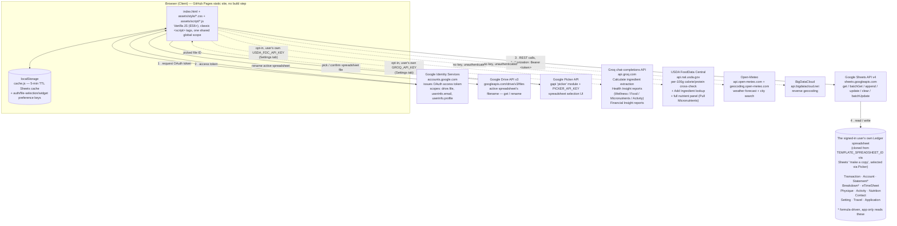
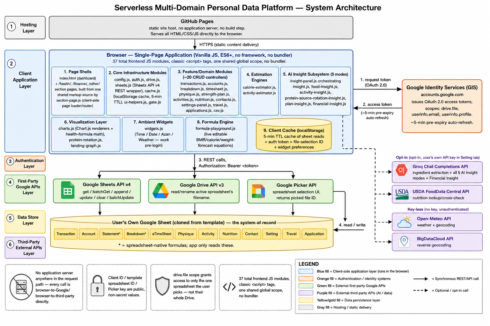
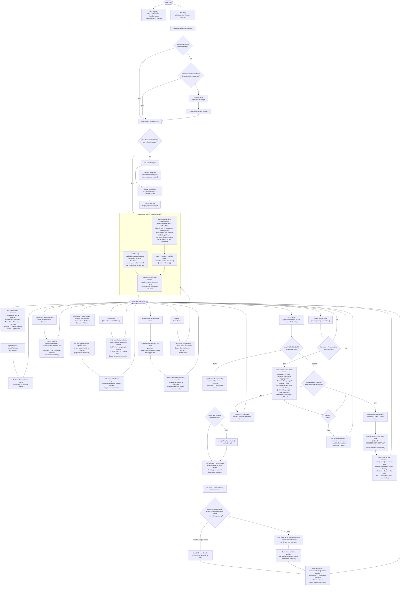

# Ledger

A private, serverless personal life dashboard — health, finances, time tracking, travel, applications, and contacts in one place.

- Reads and writes **directly to a Google Sheet you own**. No backend, no database, no third-party data store.
- Public on GitHub Pages, usable by anyone with a Google account.
- Each user clones their own copy of the template; the app only ever touches that copy.
- Scoped via Google Drive's per-file `drive.file` permission — data is visible only to the account owning that sheet.

## Table of Contents

- [Overview](#overview)
- [Features](#features)
- [Architecture](#architecture)
  - [System Diagram](#system-diagram)
  - [Section pages](#section-pages)
  - [System Flowchart](#system-flowchart)
  - [Frontend Module Map](#frontend-module-map)
  - [Data Flow](#data-flow)
- [Data Model](#data-model)
- [Health Formula Reference](#health-formula-reference)
- [Tech Stack](#tech-stack)
- [Project Structure](#project-structure)
- [Getting Started](#getting-started)
- [Deployment](#deployment)
- [Configuration Reference](#configuration-reference)
- [Caching Strategy](#caching-strategy)
- [Security & Privacy](#security--privacy)
- [License](#license)

---

## Overview

- Single-page app; authenticates with the user's own Google account.
- Reads/writes a private "Ledger" spreadsheet via Sheets API v4.
- All aggregation, charting, filtering, sorting and CRUD runs client-side in vanilla JS.
- No build step, no server component to deploy or maintain.

---

## Features

### Dashboard widgets

- Four self-contained "bulb" cards above each panel group; work before sign-in.
- **Time** — local `HH:mm:ss` plus a second, independently configurable reference clock.
- **Date** — Gregorian, Shamsi and Ghamari in one aligned day/month/year grid, via `Intl`.
- **Azan** — Sobh/Zohr/Maghreb/Midnight, computed client-side (Shia "Tehran" method).
- **Weather** — current conditions plus a 3-day forecast.
- Location resolution order: manual override → browser geolocation → `WIDGET_DEFAULT_CITY` → Waterloo/Isfahan fallback.
- Powered by free key-less APIs (Open-Meteo, BigDataCloud), cached with their own TTLs.

### Layout and interaction

- Responsive breakpoint ladder (950/820/800/640/420px); no separate mobile view.
- Every form field has a 16px floor so mobile browsers never auto-zoom on focus.
- Modals are full-width on phones; cards cap at a fixed column width on wide screens.
- **Collapsible panels** — collapsed by default; collapsed content gets `inert`, so it leaves the a11y tree, tab order and find-in-page.
- **Stacking order is explicit**: page chrome 0-1, sticky `header` 10, dropdowns hanging off it 20, landing tooltips 50, the floating dark-mode & privacy stack 90, **modals 100**, and toasts 110 so a countdown to undo something stays readable over an open form. The floating stack sits *below* a modal for the same reason the header does — on a phone it covered the bottom-left corner of an open form, and a toggle that's one Escape away isn't worth a field you can't reach. A modal with no `z-index` of its own lost to the header — both are positioned, so the header's 10 beat the modal's `auto` and painted over the top of a centred card, which is where `.modal-close` sits. Any long form (the card maxes at `100vh − 4rem`, so its top lands ~32px down while the header is taller than that) became uncloseable.
- **A panel's primary action sits on its heading line** (`.panel-header`), not in a bar under it. `.panel-header` is exempt from the collapse rules, so the action stays reachable while the panel is shut. Bars under the heading are kept for the cases that aren't one primary action: bulk bars that appear on selection, secondary sets (Export CSV, the contact exporters), and a submit that belongs below the thing it submits (each **Send to AI**).
- **Those buttons are one word — `Log` or `Add`** — with the long phrasing moved to the `title` tooltip: Physique, Transaction, Work Time, Travel, Application and Activity all read **Log**; Nutrition, Account, Contact, Settings and Activity's catalogue button read **Add**. Which thing gets logged is the panel's own heading, and the modal that opens says it again in full.
  - Driven by **Activity**, the one panel carrying three of them (**Add**, **Guide**, **Log**): "Activity Plan" + "Add Activity" + "Instruction" + "Log a Workout" could not share a phone's heading line, and `.panel-header` wraps rather than squeezing the heading, so the labels were what had to give.
  - Modal `<h2>`s keep the long form (*Log a Transaction*, *Add Ingredient*) — a heading has the width, and it's where you land after clicking.
  - **A modal scoped to one calendar day appends " — {date}" to that long form** (`formTitleWithDate`, `ui-helpers.js`) — *Edit Physique — 2026-08-23*, *Log a Work Time — 2026-08-23*, *Micronutrients — 2026-08-23* — so the heading alone confirms which day is open, one shared suffix style across Physique, Timesheet and the Physique day's own Micronutrients view. A dateless Physique pattern leaves the title bare rather than showing a trailing dash with nothing after it.
  - Empty-state hints quote the new label (`click "Log" in the panel heading`), so no text in the app names a button that no longer exists.
  - The one exception is the timesheet **reminder banner**'s Log Time — a standalone CTA in a sentence, not a crowded heading.
- **Panel headings are one word too** where the longer form only restated the thing behind it: *Activity Plan* → **Activity**, *Nutrition Facts* → **Nutrition**, *Account Summary* → **Account**, *Contact List* → **Contact**, *Accounts* → **Account**, *Health Indicators* → **Health Indicator**, *Financial Indicators* → **Financial Indicator**. The sheet tabs now read the same way (`Transaction`, `Account`, `Nutrition`, `Activity`, `Statement`, `Breakdown`, …) — but that's a spreadsheet-side choice, not something the app depends on: **every tab name lives in `CONFIG.SHEETS` (`config.js`) and nowhere else**, so renaming a tab is one line there. Labels that have to agree with a tab name (the breakdown table's "from your own table" source) are read off the same object rather than spelled out again.
- **Charts live in the panel of the data they describe** rather than a panel of their own, so a view and its table collapse together: Work Analytics folded into Work Time, Travel Insights into Travel, Protein Source Rotation into Health Indicator.
- **Panel groups** — Health, Finance, Other. Each is a page of its own at `/health/`, `/finance/` and `/other/`, and the nav links are those addresses rather than in-page anchors, so a group can be linked to, bookmarked and refreshed on its own (see [Section pages](#section-pages)). The logo is the way back to all three at once.
- **Keyboard shortcuts** — `/` search, `n` add transaction, `Esc` close modal, `?` help. Ignored while typing.
- **Accessibility** — `role="dialog"`/`aria-modal` on modals, focus trap, focus restore, keyboard-operable headers, visible focus rings.
- **Dark mode** — floating toggle, persisted.
- **Privacy mode** — floating toggle masks amounts, health figures, contact details and Settings values.

### Button roles

- **Blue** — add or save (Add/Log buttons, Save, Save & Add Another, bank).
- **Amber** — spends an AI call (Send to AI, Calculate, Recalculate Selected).
- **Red** — destructive, text labels only (the export filter's remove).
- **Default** — everything else, including all emoji buttons (close, delete) — an emoji on a dark fill is hard to read.
- Slow actions append `…` to the label and block re-clicks until they settle: all form saves, bulk merge/delete, every row delete, and the AI/USDA calls.

### Finance

- **Summary cards** — Net Worth, Monthly Cash Flow, Monthly Income, Monthly Expenditure.
  - **Expenditure** also shows the average of the **previous 3 months**, separated by `/`. The current month is excluded from its own benchmark; a tooltip names the months averaged.
  - **Income shows this month alone.** Income is lumpy in a way spending isn't — one quarter catching a bonus or a contract makes every ordinary month read as a shortfall against its own baseline, which looks like a verdict without being one. Its average is still on the card's tooltip, and in Financial Insight, where it arrives with context.
- **Financial Indicator** — Cumulative Net Worth (line), Category Expenditure Trend (stacked bars **with that month's income as a line over them**), grouped bars over four periods (Last Month, Quarter ÷3, Year ÷12, Lifelong ÷ months) plus four category donuts.
  - The income line is what retired the separate **Revenue vs. Expenditure** area chart: that chart's expense series was this one's stack total, and its income series is now the line — so "where did it go" and "was it more than came in" are read off one shape instead of two. The line is `targetMarkColor()` (near-black on light, near-white on dark) rather than a literal black, which would vanish in dark mode; it carries its own `stack` so a stacked y axis draws it *across* the bars instead of on top of them, and `order: 0` keeps it drawn over the tallest month.
  - **`stepped: 'middle'`, not a sloped line.** A month's income is one flat figure for that month, so joining the points with a slope invents a value for every day in between and renders a pay rise as a peak. Stepping halfway between months puts each flat run centred over its own bar, with the jump on the boundary — the same read the old stepped area chart gave.
  - The axis maximum is 1.2× the **second**-highest month, measured on whichever is taller that month, spend or income — sizing on the stack alone drew the line off the top of the plot in every month that earned more than it spent.
  - **Spending Breakdown by Type is currently switched off** — the per-category donut wall (Housing, Transportation, Grocery, Personal, Household …, four periods each plus an *Untyped* remainder), driven by a free-text `Description` prefix convention and built dynamically from `Breakdown`. It's commented out in two places and deleted in none: the section in `index.html` and the `renderTypeBreakdownCharts` call in `app.js`'s `reportPromise`. The renderer in `charts.js` and the `typeBreakdown` parse behind it are untouched, so uncommenting those two brings it back exactly as it was.
- **Financial Insight (AI)** — click "Financial Snapshot" to preview net worth, total Market Value, monthly cash flow/income/expenditure, spending by category over four complete periods (Previous Month/Quarter/Year/Lifelong), and every open account's Balance vs. Market Value; optionally ask a question, then **Send to AI** for a plain-text read — Overview, Going well, Needs attention, Investment Outlook (short-term liquidity, long-term growth), Suggestions. Nothing is computed until that click — same as Health Insight below.
  - A same-day figure (Cash Flow/Income/Expenditure) is flagged "partial month in progress" so the AI doesn't mistake an early-month total for a decline; closed/empty accounts and Institution are left out of what's sent.
- **Transaction Log** — searchable, filterable, sortable, paginated; add/edit/delete/duplicate.
  - Payee/Description/Category autocomplete from history; new categories can be typed inline.
  - Amount accepts arithmetic (`=-9.97-1.30`, `-32/2`), rounded to the cent. The placeholder carries both the sign convention and the expression form, so the form has no hint line under it.
  - **Tax** button in the form's actions row multiplies Amount by the tax rate and writes the result back (`1` → `1.13`, `-45.50` → `-51.42` — an expense is negative and so is its tax). Not a submit: the taxed figure sits on screen to check before Save takes it, and clicking twice compounds, since the box is left holding a plain number. The rate is `TAX_RATE_PCT` on the Settings tab, defaulting to **13** (Ontario HST); the button says only "Tax" and the tooltip names the rate.
  - **Update the account balance** — a tick box under Amount, **on by default**, that adds the amount to the selected account's Balance on the `Account` tab as part of the same save. The sign is the whole of it: `-10` on WV takes WV down ten, a deposit puts it back. A transaction and the balance it moves are one act, and doing them separately is how the two drift apart.
    - **Never over a formula.** Balance is often the sheet's own arithmetic (`=SUMIF(Transaction!…)`, a GOOGLEFINANCE conversion), which already counts the row that was just appended — adding to it would count the transaction twice, and writing a number over it would cost the sheet its arithmetic for good. Picking such an account turns the box off and prints why under it. Same for a Balance holding a label like `Closed`: there's no amount to add to. A blank Balance counts as zero.
    - Telling the two apart needs the column read **as formulas** — the accounts list is read `UNFORMATTED_VALUE`, where a formula and a typed number both arrive as today's figure. That read is lazy (nothing but this box wants it, so the dashboard's own load doesn't pay for it) and taken once per accounts refresh.
    - **New rows only.** On an edit the balance would need the *difference* between the old amount and the new one — and nothing at all when the amount wasn't what changed — so rather than guess, the box is off the form there and the Account panel stays the place to correct a balance by hand. A duplicate counts as a new row, like Save & Add Another.
    - Untick it and the choice sticks while the form is open, including across a change of account; each new form arms it again. The balance write happens **after** the transaction row is safely in, and is reported (not raised as a save failure) if the sheet refuses or the call fails — a failed save invites a second Save, which would be a duplicate row.
  - Advanced Filters: date range plus an AND/OR field-filter builder; Export CSV writes exactly what's filtered.
- **Bulk transaction ops** — select rows for Edit Selected (only filled fields applied) or Delete Selected (one `batchUpdate`, highest row first).
- **Undo** — toast after bulk edit/delete; deletes re-append, edits write original values back in place.
- **Portfolio** — 3-ring nested allocation donut (type → institution → account), then the **Account** table (with a Total row summing Balance and Market Value) and reconciliation status.
  - **The two rings are coloured from two bands of one hue wheel, not one.** Type keeps the vivid band (`65% / 55%`); institution takes a half-step hue offset and a deeper, less saturated one (`45% / 42%`), and the outer account ring is alpha-shaded from its institution's colour. Both palettes used to start at the same hue with the same step, so a similar number of types and institutions made them *identical* — the second-largest institution came out in exactly the second-largest type's colour, which is what made a TFSA (an Investment) read as "the Saving colour" against the legend above it. The offset separates neighbouring hues; the band is what still separates the rings when differing counts realign the wheel anyway.

### Breakdown

- The `Breakdown` tab as a maintainable table rather than only a chart source (`breakdown.js`): searchable and sortable, one row per Category × Type, with that row's **Last Month / Last Quarter / Last Year / Lifelong** figures.
- **The money is never written.** Columns C-F are the spreadsheet's own formulas — the same ones Financial Indicator is drawn from — so every write here is scoped to `A:B`, the two text columns that name the row. There is no path in this panel that can replace a formula with the number it produced.
  - Editing therefore offers Category and Type only; the four amounts appear in the modal as text, labelled as the sheet's own.
- **A blank Type is a category's own total row** (the one summing every Type under it) — kept blank rather than normalised, since that blank is what the sheet reads as "total". The table shows `—` with a tooltip saying so.
- **Add and Duplicate both copy an existing row's formulas** via `copyPaste`, which rewrites relative references for the new row. A values-append would land a row with four permanently empty money columns; pasting formula text would leave it pointing at the row it came from. Add picks its template by shape — a typed row for a typed row, a total row for a total row — and takes the last such row, so a new one lands at the bottom instead of inside an existing category's block.
- **Delete** removes the row; the confirmation says out loud that a formula elsewhere pointing at it will lose it.
- Figures are right-aligned as a column (`.num`), header included — `.income`/`.expense` already right-align the coloured cells, and on this tab most of a quiet month is `$0.00` cells that would otherwise be the only ones hanging off the left.
- It reads the tab itself rather than sharing `loadReport()`'s copy: that one keeps what the charts derived, while the panel needs each row's own sheet row number to edit it.

### Time Tracker

- **Log a Work Time** modal — Company, Start/End, Break, optional Task; live duration preview. The modal keeps the long name; the button that opens it is the app-wide one-word **Log**.
  - Break is an `HH:mm` duration typed into a plain text input (`pattern="[0-9]{1,2}:[0-5][0-9]"`), not a clock time — a `type="time"` control (still used for Start/End) would force an AM/PM time-of-day picker onto it. `parseBreakMinutes` reads the typed value back into minutes for the live duration preview, and `minutesToTimeInput` normalizes it back to an `"H:MM"` string on save, since some Break columns carry pre-existing Excel-style duration formatting that reinterprets a raw integer as a day count.
- Company autocompletes and defaults to the most recently logged one.
- Reminder banner on an unlogged weekday, scoped to your current company; opt-in OS notification fires once per day.
- One **Work Time** panel holds the lot, charts above the table — they read the same logged hours, so they collapse together rather than sitting in a separate panel:
  - Arrival, Departure and Hours Worked histograms with normal-curve overlays, plus Daily Hours Average by period.
  - **Overtime summary** — net time beyond an 8h/day pace, broken out Total/Year/Month/Week.
  - The table itself — date range, sortable, computed Duration, inline edit, paginated.

### Health — Today at a glance

- Four tiles: **Max/Min Calory Intake**, **Activity**, **Protein**, **Sleep**.
- Each reads `actual / target unit`, green on the right side of the figure, red otherwise, grey when nothing's logged.
- Activity also restates its target in kcal — `— / 100 min → 394 kcal` — from `getActivityTargetKcal`, the same pin-aware figure the Physical Activity chart's target line uses.
- The Calories heading carries which side of the target it is (max or min), since the number alone can't say it.
- Protein is a **band**, so its tile reads as a range (`53 / 112~154 g`).

### Health — Health Indicator

Every chart and tile below reads the **`Physique`** tab — one row per day — via `physiqueAsWellnessEntries()` (`physique.js`), which expands each day back into the per-event shape `charts.js` consumes. It is the only tab any of them read.

- All charts share one height and one plot-area width, so their date labels line up down the page.
- **One From/To pair, above Body Mass, is the panel's window** — Body Mass, Calorie Balance, Caloric Intake, Physical Activity, Protein Intake, Rest & Recovery and Protein Source Rotation all plot it, and all redraw together on a change. Default is the last 4 weeks (`WELLNESS_METRICS_DAYS`). Protein Source Rotation used to carry a second pair of its own, so the panel showed two windows at once.
  - **State Trend & Forecast is deliberately outside it**: that chart is the whole journey plus a projection, and clipping it to a month would be clipping the trend it exists to show.
  - `wellnessDateRange()` reads the two inputs straight from the DOM, falling back to the default when either is blank — so it can't matter whether a chart renders before or after the control is wired. `wellnessWindowDates()` turns that into the date list, clipped forward to the first day the metric in question has anything logged, so no chart opens on a run of empty days. An inverted range yields no days, which every caller already reads as "nothing to draw".
- **State Trend & Forecast** — body mass history, smoothed trend, and a projection toward target; optional BMI twin axis.
  - **A transparent amber zone around the trend line marks the glycogen + water swing** (`ΔM_gly`, the same figure the Formula Playground's glycogen block computes at its default knobs) — the day-to-day wobble glycogen and its bound water can account for on their own. The zone's own centre is an EMA of the trend, deliberately smoother/slower-moving than the trend line itself, so it reads as the stable thing on the chart: it only relocates once the trend strays further than the swing can explain, rather than chasing every minor fluctuation.
  - **"Arrival" is judged past the target by that same swing**, in the direction travel is already headed (e.g. a 70 kg cutting target counts as reached once the trend passes 68.1 kg at a 1.9 kg swing) — so a bad-water-day reading can't land on the wrong side of the real target. This governs the projection's day count, ETA and "Target reached!" status; the progress bar's raw kg-to-go and the drawn target line still read the exact target.
  - Progress meters above the chart: distance covered and time elapsed, side by side — each "to go" figure also names its target (target body mass — shown with its `± swing` alongside it when the swing is known — or the projected arrival date).
  - Plateau alert when the smoothed trend has held flat.
  - The status line under the chart speaks only when there is **no** forecast to draw — target reached, no net change, trending away, or levelling off short of target. A forecast that renders says nothing, since the meters and the curve already do.
- **Body Mass** — one bar per reading, scored by direction of travel; left axis restates it as stored fat energy.
  - **A red day regrades to grey when the week isn't actually going the wrong way** — if that reading rose (or fell, for a bulk) against the target but the 7-day trend at that point still slopes the right direction, the single reading reads as noise rather than a miss.
- **Calorie Balance** — intake minus BMR minus activity, scored against the *target* deficit; grams-of-fat twin axis.
  - The hover spells out the subtraction and **signs it**: `Actual Intake` as the figure it starts from, then `Maintenance` and `Activity` as negatives, so the column reads top-down as the arithmetic behind the bar. Activity printed as a positive read as something added to the day, which is the opposite of what burning it does. The intake row carries the same name Caloric Intake and Protein Intake use in their own hovers — one day's eating shouldn't be called three different things across one panel.
- **Caloric Intake** — per-day bars with a per-day target drawn as a cap on each bar, not one shared line.
  - **A red bar (past the target beyond the near-margin) regrades to grey when the 7-day average is still on the target's right side** — the same "one bad day, good week" read Body Mass gets, scored against the average instead of the trend.
- **Physical Activity** — stacked minutes per activity type, plus a calories-burned dot series. The type is derived from the day's `Workout` lines by the same `describeExerciseNames()` Log a Workout uses ("Strength Training", "NEAT", "Cardio", "NEAT + Cardio"); a workout line whose exercise isn't on the Activities tab is dropped rather than grouped under an "Other" segment.
- **Protein Intake** — bars against a shaded target band; over the top end is a ceiling, not extra credit.
- **Rest & Recovery** — floating bars spanning bed→wake on a clock-time axis, coloured by adherence.
- **Protein Source Rotation** last — see its section below.
- All six of the scored charts carry a **violet dashed segment per week**, so a week that quietly drifted past its target is visible next to the per-day mark.
  - Violet, the app's existing "not a score" colour — deliberately neither the green/red/grey of a scored bar nor the near-black/near-white of a target cap.
  - Buckets are counted **back from today**, so the most recent seven days are always one whole week and only the oldest bucket can come up short.
  - Built from days that were actually **logged**; a week with nothing logged draws nothing.
  - **Flat** on five of them — the week's average. Rest & Recovery carries two, average bedtime and average wake time. Physical Activity averages the *calories burned*, not the minutes, since that's the axis Target Burn lives on.
  - **Sloped** on Body Mass alone: a bar there is an absolute level, not a per-day quantity, so a flat mean says nothing. Each week is a least-squares fit through its own readings, extended to both week edges so slopes compare directly. A week with one weigh-in shows a dot — no slope is measurable from it.
  - Every one of these charts adds the figure to its tooltip as well; Body Mass quotes the slope as `kg/week`.

### Health — Formula Playground

**Tune** in the Health Indicator heading opens it.

- Every term of the calorie-target and forecast algebra, with your own numbers substituted in — not a black box you have to trust.
- **Solve for** any one of Calories, Target body mass, Activity or Weekly fat loss; the rest are inputs and the picked one is computed. Activity and Weekly fat loss also let you type either Eᵢₙ or `t` and compute whichever you didn't touch.
- **Weekly fat loss %** is the fifth radio and the odd one out — named for what it *holds*, not what it solves. `Δm%` is the typed input; the kilograms, `Eᵢₙ`, `t` and the arrival date are all computed from it, and `t` follows the proportional journey a fixed share implies. Same arithmetic as Calories otherwise, so the two share one branch: the only differences are where `Δm` came from and which journey `t` is measured along.
  - Picking it **ticks the fat-loss % pin**, since holding the percentage and pinning it are one decision — otherwise the plan you just built here would be saved as a fixed-kilogram one and the app would immediately stop doing what the modal showed. Not the reverse: the pin governs the saved plan and applies in every mode.
  - It's the only mode where a blank `Δm%` is a *missing input*, so it's named in the "Needs a number in" line; everywhere else the box is derived and its emptiness means nothing.
- Edits are live and local until **Save** writes them back to `Setting`; `projectTargetDays` / `projectTargetDaysAtFixedPct` are shared with State Trend & Forecast (via `targetProjectionFromSettings`) — the chart returns that call's own `.days`/`.status`/`.equilibriumKg` rather than re-deriving the day count itself, and both read the smoothed `m̄` as the starting mass, so the two literally cannot disagree about a date for the same profile.
- **Box order is the order the algebra runs**: the profile and the knobs (`m`, `m̄`, `h`, `a`, `σ`, `BMR`, `M`, `MET`, `τ`, `κ`, `Δm%`, `Δm`), the two population constants (`ρ`, `ε`), then `D` (readonly — the deficit `Δm` and `ρ` imply, sitting between the two figures it's made of and the intake it comes off), `f` and the answers it feeds — `Eᵢₙ`, `TEF`, then the journey block (`m_g` and `BMI_g`, the destination you choose, immediately above the `t` and arrival date that measure the trip to it), the adaptation block, and the lean-mass block last (`LBM`, the `p_min`/`p_max` rule, then the `P_min`/`P_max` grams it produces — the rule sits with the grams rather than up among the other editable knobs, so `p × LBM = P` reads as one derivation instead of a multiplication split across the modal).
  - Every row's height is paid two dozen times: the boxes keep the app-wide 16px figure (anything smaller makes iOS zoom the page on focus) and give up their vertical padding and leading instead — `.15rem` and `line-height: 1.15`, about 9px a row off an already-tall modal. On a phone the date box is additionally stripped of `-webkit-appearance`, since a native date control ignores all of that and renders both wider than its grid column and visibly taller than the text boxes around it.
  - `BMR` and `M` (maintenance, `BMR + Eₐ`) are **readonly display rows**, not settings — they're the two figures every target is measured down from, placed with the profile because that's what they describe: the body, before any plan is applied to it.
  - **`MET` defaults to the Activity catalogue's own Walk row** (`exerciseMet('Walk')`, `activities.js`) rather than the `ACTIVITY_MET` Setting — the number you'd otherwise re-type here already lives on the Activity tab (**Edit Activity → Walk → MET**), maintained in one place. It's still a plain, editable, settings-backed box: typing over it and Saving still writes `ACTIVITY_MET`, only the box's *opening* value changed.
- **The scale is smoothed before anything reads it.** `m` is your latest weigh-in and is readonly — a measurement, not a knob. `m̄`, directly below it, is the **7-day rolling average** (`smoothedBodyMassKg`, the mean of every reading in the 7 days ending at the latest one, rounded to 0.1 kg), and it is what every identity on the sheet substitutes. Type what-ifs into `m̄`.
  - Water and glycogen move the scale by more than a week of fat loss does, and `m(t)` in the decay model means *clean* mass, so a single reading is the wrong input for a plan. The window ends at the latest **reading**, not at today, so a week away from the scale doesn't quietly empty it.
  - `planBodyMassKg` is the app-wide accessor, and the same figure now drives the calorie tile (`getCalorieTargetKcal`), the ceiling-vs-floor decision (`getCalorieTargetKind`), Calorie Balance's target dash, the Health Plan prompt, **and State Trend & Forecast's own target-method projection** (`calcProjection`, see below) — so the modal and the app can't quote different targets or different arrival dates for the same profile. Deliberately **not** the per-day series (the Caloric Intake target line, Calorie Balance's per-day maintenance) or the Body Mass chart's bars: those describe one specific day, where that day's own reading is the honest input.
- **Resting metabolic rate is a choice of two equations**, and both are live — the radio pair above `where,` picks one and re-derives everything from it. `BMR_FORMULA` on the `Setting` tab; unset reads as Mifflin, which is what every existing sheet already runs on.
  - **Mifflin-St Jeor** (default) — `10m + 6.25h − 5a + σ`, the app's original.
  - **Katch-McArdle** — `370 + 21.6 × LBM`, from the Boer lean mass in the block below. Fat mass is nearly inert metabolically, so predicting from lean mass alone is the more accurate route *to the extent your LBM figure is* — with a real body-fat measurement it wins outright; here it's a second opinion built from the same three numbers. **Age drops out entirely**, so on this equation a blank birth date is no longer a missing input (`bmrNeedsAge`), and the Health Plan prompt says so rather than quoting an unused figure.
  - Maintenance stays **affine in body mass under both**, which is what lets one decay model serve them: Boer's LBM is itself affine in `m`, so Katch contributes `370 + 21.6×(c_h·h + c_0)` to `A` and `21.6×c_m` to `B`. `maintenanceAffineCoefficients` takes `formula` as a parameter defaulting to the setting, so the playground can preview an unsaved choice through the same function the charts use.
  - Katch is evaluated at the LBM **rounded to 0.1 kg** — the same figure the `LBM` box shows — so the traced `370 + 21.6 × 61.4` multiplies out to the BMR printed beside it. (`A + B×m` uses the unrounded coefficients, so the two can differ by under a kcal.)
- **Thermic effect of food** (`f`, `TEF_PERCENT_OF_INTAKE`, default **0**) — the share of what you eat that is spent digesting it, ~10% on a mixed diet. It belongs to expenditure, so counting it *raises* the intake that produces the same deficit, and because it's a share of the very intake being solved for the identity is **solved, not summed**: `Eᵢₙ = (BMR + Eₐ − D) / (1 − f)`. Folding it into `Eₐ` and subtracting it separately give the same line, so the two conventions can't disagree.
  - The divisor lands on `A` and `B` too (maintenance is the intake that holds mass still, and at that intake digestion is costing `f` of it), so `m∞`, the decay constant and every reverse solve get it for free. At `f = 0` every figure is byte-identical to before, the `/ 1` is left off the trace, and Calorie Balance's tooltip drops the row — that default is deliberate, since switching it on lifts every target by ~11%.
  - Calorie Balance subtracts it from the day that actually happened (`f × logged intake`), so turning it on can't raise the target in one chart without raising the cost of eating it in the other.
- **Metabolic adaptation** (`λ`, `λt_max`; `BMR_ADAPT_PCT_PER_WEEK` / `BMR_ADAPT_PCT_CAP`, defaults 1%/week and 12%) — on a sustained deficit BMR falls faster than the lost mass alone explains, and the gap widens with time on the diet before levelling off: `BMR_a(t) = BMR × (1 − λt)`, with `λt` capped near 10–15% by week 10–12. Refeeds and diet breaks push `λt` back toward 0, which is what setting `λ` to 0 models.
  - **Reported, never planned with.** `Eᵢₙ`, `D` and `t` are all left as the un-adapted identities give them — the adaptation is a consequence of the diet rather than an input to it, and `t` is a moving target while `λt` is still growing. What it buys is the honest caveat on `m∞`: `m∞_a` scales the **BMR half** of `A` and `B` by `(1 − λt)` and leaves the activity half alone, and the gap between the two is the overshoot a constant-BMR forecast hides. Shown in the unit column as `— N kg above m∞`.
  - `λt` is evaluated at the horizon `t` this render produced; with no arrival date the ceiling is quoted instead, and the trace says which. On the proportional journey there's no plateau to overshoot, so the row says so rather than inventing one.
  - The overshoot, and the no-plateau case, are said in the **substituted trace** — the unit column reads `kg` and stops, the same rule the `Δm%` verdict follows.
- **`m_g` and `BMI_g` are one quantity in two units** — `BMI_g = m_g / (h/100)²` — the same two-way pair as `Δm%`/`Δm` below, and the second one on the sheet. Type a target mass and the BMI follows; type a BMI and the target mass follows (`bodyMassKgFromBmi`, the inverse of `computeBmi`, kept beside it in `charts.js` so the pair can't drift). Whichever you last typed into is the known (`targetMassKnownField`), and the BMI → kg direction runs first in `renderFormulaPreview`, before anything reads `m_g`.
  - A goal in kilograms is a number you pick; the BMI is what says whether picking it was sensible. Outside the healthy **18.5–24.9** band the box goes `--color-danger` and the trace line names the band (`underweight`, `overweight`, `obese (class I)`, …). Both ends are flagged, unlike the fat-loss band where only the ceiling is — an underweight target is as much a problem as an obese one. It never blocks Save.
  - Only `BODY_MASS_TARGET_KG` is saved; the BMI is derived from it and the height, both already on the sheet.
  - In **Solve for → Target body mass** both boxes go readonly: `m_g` is the answer there, so its BMI is an answer too.
- **`Δm%` and `Δm` are one quantity in two units** — `Δm% = 100 × Δm / m` — not a fifth solve mode. Type a percentage and the kilograms follow; type kilograms and the percentage follows. The percentage sits *above* the kilograms because it's the unit the safety band is written in, so it's the one you set the pace in.
  - **0.5–1% of body mass per week** is the usual sustainable range and **1% the ceiling**. The band is named in the identity block's own heading, the verdict (`in the 0.5–1%/week band`, `above the 1%/week ceiling`, `under the 0.5%/week floor`, `maintenance`, `a surplus, not a deficit`) rides on the `Δm%` trace line, and above the ceiling the box itself goes `--color-danger`. **Nothing goes in the unit column** — it reads `%/week` and stops, like every other row's. Under the floor is merely slow, and a negative rate is a deliberate lean bulk, so neither is coloured — the same asymmetry `calorieTargetDetail` already allows. It never blocks Save: an aggressive target is the user's call.
  - Whichever box you last typed into is the known (`weeklyLossKnownField`), and the other is rewritten on every render — so a typed 1% keeps meaning 1% as `m` changes instead of freezing the kilograms it meant when you typed it. The pct → kg direction runs first in `renderFormulaPreview`, before anything reads `Δm`; the kg → pct direction is written where the trace is built, the one place every mode reaches exactly once, failure paths included.
  - **`WEEKLY_FAT_LOSS_KG` is still the only thing saved.** The percentage is derived from the live body mass, so storing it would freeze the wrong half. `weeklyFatLossPct` / `weeklyFatLossKgFromPct` live in `charts.js` with the rest of the target math because Health Plan Insight quotes the same figure — and kg is kept to 3 decimals, since 1% of 86.9 kg is 0.869 and 0.87 would read back as 1.001%.
  - In **Solve for → Weekly fat loss** both boxes go readonly: `Δm` is the answer there, so the percentage is an answer too.
- **Lean body mass and the protein band it implies** close out the list: `LBM` (Boer 1984), then `P_min = p_min × LBM` and `P_max = p_max × LBM` from the editable `p_min`/`p_max` pair (defaults 1.8 and 2.2 g per kg of lean mass). All three are readonly in every mode, and trace their arithmetic in the substituted block with everything else.
  - Independent of **Solve for** — no calorie identity involves protein — so they compute in all five modes, and survive a calorie solve that can't complete.
  - The trace element is cleared before it's rebuilt, so the protein half is built inside a `try/catch`: three missing protein lines beat a blank trace where `BMR / Eₐ / D / Eᵢₙ / A / B / m∞ / t` used to be.
  - **Save writes the grams**, to `PROTEIN_TARGET_G_MIN` / `PROTEIN_TARGET_G_MAX`, which outrank the g/kg-of-body-mass band everywhere the protein target is read (tile, chart, Insight, rotation). The `p_min`/`p_max` rule is saved too (`PROTEIN_G_PER_KG_LBM_MIN` / `_MAX`) so the sheet keeps the reasoning next to the result.
  - LBM is taken at your **current** body mass, and rounded to 0.1 kg before the grams come off it — so the traced `p × LBM` line multiplies out exactly, and the saved grams stay put as you diet instead of shrinking with every weigh-in.
  - `p_min`/`p_max` are deliberately **not** in `FORMULA_FIELDS`: those are read unconditionally and one blank invalidates the whole calorie preview, which nothing about protein should be able to do.
- **Which stays fixed as you lose weight** — the one decision the algebra can't make for you. Three mutually exclusive plans, each a different journey to the same goal:
  - **Pin target deficit/fat loss** (default) — holds your pace in **kilograms**. Every weigh-in recalculates the intake that delivers it, so calories fall as you lighten. A straight line to the goal.
  - **Pin target daily intake** — holds the calorie number. Maintenance falls as you lighten, so the deficit shrinks and loss decelerates. This is the constant-Eᵢₙ journey `projectTargetDays` actually solves, so pinning it is what makes the number you eat and the date you're shown the same plan.
  - **Pin target fat-loss %** — holds your pace as a **share of body mass**, so the kilograms per week shrink as you do (`Δm = p·m/100`, recomputed from every weigh-in). The gentlest of the three, and the only one with no plateau: a constant fraction of a falling mass always arrives. This is the one pin that changes the **forecast** as well as the target — see [`projectTargetDaysAtFixedPct`](#state-trend--forecast).
  - Each writes its own key and blanks the other's, so exactly one is ever in force: intake saves Eᵢₙ to `CALORIE_TARGET_FIXED_KCAL`, the percentage saves `Δm%` to `WEEKLY_FAT_LOSS_PCT`, and deficit saves a blank into both (read as unset), so switching back needs no row deleted. A key is only written when it's changing, so a default-mode save doesn't add blank rows to a sheet that never had them. On a 94 → 82 kg example at 0.5 kg/week the first two arrive ~168 vs ~207 days apart — same goal, different journey.
  - **`weeklyFatLossKgAt(bodyMassKg)` is where the difference lives** — one function, so the tile, the per-day Caloric Intake line, the Calorie Balance target dashes and the playground's own preview can't disagree about the rate. Unpinned it's the flat `WEEKLY_FAT_LOSS_KG` it always read.
  - The pin fieldset used to be Save-only state; it isn't any more, since the percentage pin changes which journey `t` is measured along. Its radios re-render the preview, and picking it makes `Δm%` the held box.
  - Only the **forward** direction follows the pin (rate + `m_g` → `t`). Target body mass, and Activity / Weekly fat loss when a day count is typed, run the constant-Eᵢₙ algebra *backwards* to derive an input from a `t` you asserted — a question that only exists in that model, since under a proportional journey the rate is set by the percentage and neither τ nor Eᵢₙ moves the date at all. Those three keep their own meaning.
- A second, independent pin does the same thing for the **activity target** itself, not daily intake:
  - **Pin target activity time** (default) — holds τ, the minutes. The calorie burn it implies (`Eₐ`) falls as you lighten, since the same minutes move less body mass.
  - **Pin target calorie burn** — holds `Eₐ`. The minutes needed to reach it rise as you lighten instead.
  - Saved to `ACTIVITY_TARGET_FIXED_KCAL`, the same opposite-ends shape as the intake pin: pinning the burn writes the `Eₐ` the currently typed τ/MET/body-mass imply, unpinning writes a blank. It only affects the activity tile, the Physical Activity chart's target line/dot colour and Activity Insight's stated target — it deliberately leaves `calorieTargetDetail`/the forecast alone, the same way the intake pin leaves those to their own dial.

### Health — Health Insight (AI)

- One panel, six modes: **Wellness**, **Food**, **Micronutrients**, **Activity**, **Protein Sources**, **Health Plan**.
- **Micronutrients** is the one mode NOT built on model inference — it sums each logged ingredient's real, USDA-sourced Micronutrients panel (nutrition.js's Pull Micronutrients, scaled to how much was actually eaten) and asks the AI to judge sufficiency against standard dietary reference intakes. Coverage is necessarily partial (only ingredients that have been priced contribute) — a coverage line states how many ingredients and days it's based on, and the AI is told never to read a nutrient missing from the list as a confirmed zero. Deliberately doesn't name *which* ingredients were skipped, on screen or in the prompt — a bare count is enough to convey partial coverage without inviting the model to guess at a specific food's composition from its name alone.
  - A fourth column, **Ideal / day**, next to Total (period) and Avg / day: reference daily amounts from `nutrient-targets.js`, mostly the FDA's 2016 Daily Values plus a handful of individually-sourced figures (omega-3 ALA, total water, caffeine, the indispensable amino acids, alcohol) for nutrients FDC reports that aren't on the FDA label at all. Fixed, general-adult numbers — not personalized to this user's own sex/age/body mass. Only a nutrient with a real citable reference gets one; most of what FDC reports (fatty-acid isomers, non-essential amino acids, individual sugars, sterols, carotenoids, lab-analysis fields like Ash/Nitrogen) has none, and shows `—` rather than an invented figure.
  - Overridable per-nutrient via a `MICRONUTRIENT_DAILY_TARGETS_JSON` Setting — same `{unit, amount, kind}` shape as the file's own defaults, merged on top of them, so editing one nutrient's target doesn't require replacing the whole list.
  - Rows flag **severe/mild** (red/amber left-border) only for a genuine shortfall on a "floor" nutrient (most vitamins/minerals) — the average sitting notably under its ideal. Running *over* an ideal is never flagged, on a floor nutrient or a "ceiling" one (sodium, cholesterol, saturated fat, caffeine, alcohol) alike; a ceiling nutrient's own kind is only there to keep it out of the shortfall check, since being under a limit isn't a gap.
  - The same table, thresholds and coloring drive the Physique panel's own per-day 🧬 **Micronutrients** view below — one shared `nutrientGapSeverity` (`nutrient-targets.js`), so a single day's row and this mode's period average can't disagree about what counts as a gap.
- **Nothing is computed until a mode button is clicked** — page load does no aggregation at all.
- Clicking a mode shows a preview of exactly what would be sent; Send to AI sends that same data.
- All modes prepend the same age/sex/height/body mass/BMI profile block, shown on screen.
- **No line repeats the date range.** Every figure in a mode covers the same window, so it's stated once by the panel's own status line rather than eight times inside the prompt. The `[only N/M days logged]` marker carries the window length wherever coverage is partial.
- **Wellness** — selected range vs. the equal-length preceding period.
- **Food** — ingredients **grouped by Classification**, each group carrying its own ingredient count and calorie/protein totals.
  - Groups are ordered by calories; `Unclassified` always sinks to the bottom and is flagged to the model as not a food group.
  - The preview table groups identically.
- **Activity** — rep volume vs. the previous period, a routine-activity summary, and a per-muscle-group breakdown sorted most-neglected-first.
  - Each muscle group carries **the exercises that built it** — every movement logged against it in range and its total reps, heaviest first. The model is told these are the movements the user actually has access to, so recommendations name them instead of inventing lifts.
  - Non-resistance types (a walk, a swim) are **summarised, not listed per day** — one row each with days logged and the range/average of minutes, kcal and steps. Repeating a daily walk for every date buried the sessions that differ.
  - The split is by content, not by name: a type is routine when nothing logged under it carries reps.
  - Minutes are **net active time**, not session wall-clock. The system prompt says so explicitly and tells the model to judge training by rep volume and muscle coverage — an 8-minute resistance session is a real one, and "spend more minutes" is never the advice.
- **Protein Sources** — reuses `computeProteinRotationRows` (Protein Source Rotation, below) directly, so this mode's figures can never disagree with that chart: every tracked ingredient's own target share of the protein target vs. the share actually eaten in range, grouped by classification, largest shortfall first.
  - The target percentages are the user's own rotation plan, not a nutritional prescription — the system prompt tells the model to judge how well actual eating matched the mix, not to second-guess the mix itself.
- **Health Plan** — the only mode that reads the app's **settings** rather than the day log: it sends the Formula Playground's whole plan and asks whether it's feasible.
  - Three blocks: the published identities (the playground's own `FORMULA_EXPRESSION`, so screen and prompt can't diverge), the inputs behind them (including which figure is pinned as body mass falls), and the substituted arithmetic those produce — `BMR → Eₐ → Δm% → D → Eᵢₙ → A → B → m∞ → t`, then `LBM → P_min → P_max`.
  - Computed from `Setting` + the smoothed body mass (`planBodyMassKg`), **not** the playground's input boxes: the modal may never have been opened, and the saved values are what the app actually runs on. Same functions as the playground and the charts (`calorieTargetDetail`, `maintenanceAffineCoefficients`, `projectTargetDays`, `boerLeanBodyMassKg`), so all three describe one plan.
  - The prompt states which BMR equation is in force, quotes the raw weigh-in alongside `m̄` (so the model doesn't read the difference as an inconsistency), spells out the `(1 − f)` divisor only when digestion is being counted, and carries the adaptation caveat — `BMR_a` by the arrival date and the plateau it implies — next to the `m_inf` it qualifies.
  - A fourth block carries **Wellness' own aggregation** for the selected range, unchanged — feasibility is a question about the gap between the plan and the logging, so the model gets both. A plan whose activity burn assumes daily movement that isn't being logged is arithmetic, not a plan.
  - The system prompt names what to check: `Eᵢₙ` against BMR, the weekly rate against ~0.5-1% of body mass, whether τ is actually being done, whether protein is inside the band at that deficit, and whether `t` agrees with the measured trajectory. Sections are **Verdict / What works / Risks / Do this / Avoid this**, with the last two as numbered lines naming the input responsible.
  - Missing profile settings produce a prompt that says so plainly and still sends the logging, rather than a plan full of nulls.
- Reports render as plain text without `innerHTML` (untrusted model output) and persist per mode.

### Health — Protein Source Rotation

- Last block of the **Health Indicator** panel — every Health chart sits in that one panel, so they collapse together and share its one From/To window.
- The donut's two rings are fixed spans anchored to the window's **To** date (4 weeks and 1 week), not fractions of the window — so they keep meaning the same thing whatever range is picked.
- One horizontal bar per ingredient carrying a Protein % on its Nutrition row.
- Bar is actual protein eaten in range; a red tick marks its live target.
- **Grouped by Classification** — one hue per group, lightness stepped within it, so a group reads as a block and its members stay distinct.
- Groups ordered by combined remaining gap; within a group, most-left-to-eat first. `Unclassified` last.
- A legend below shows one swatch per classification.
- Beside the bars, a two-ring donut splits the same sources by share eaten: outer 4 weeks, inner last week.

### Health — Physique

- One row per day. Filterable/sortable table (search, date range), paginated; add/edit/delete/duplicate.
- **Log a Physique** sits in the panel heading — every panel's primary action does now (`.panel-header`), which also keeps it reachable while the panel is collapsed; **Pattern** saves a dateless template that 📋 Duplicate turns into a real day.
- **Calculate** in the form fills Breakdown / Calories In / Protein In from Consumption and Activity Duration / Calories Out from Workout — all four of which are hidden fields, read instead off the Total row of the table under each of the two text areas.
- Form layout: Date + Body Mass share a row, Bedtime + Wake-up Time the next. The pairs use `minmax(0, 1fr)` columns and the date/time inputs drop their native appearance — a bare `1fr` floors a track at its content's min-content width, and iOS Safari otherwise sizes a picker to its own content and ignores a smaller `width: 100%`, either of which leaves the plain text box beside it looking narrower.
- **Saving onto a day already logged merges into it** rather than being refused: the first Save folds that row into the form, the second commits. Details under `Physique` below.
- **🧬 Micronutrients**, a fourth row action beside ✏️ Edit / 📋 Duplicate / 🗑️ Delete, opens a read-only view of that one day's real, USDA-sourced nutrient totals — the Health Insight Micronutrients mode's own `aggregateMicronutrientIntake` narrowed to a single-day range, so Total and Avg/day always collapse to one figure and the table drops to three columns: Nutrient, Amount, Ideal / day. Same alphabetical-by-known-ideal-then-alphabetical ordering, same severe/mild row coloring, as the Health Insight table above — the two can't drift since they share the same aggregation and severity functions.
- **Select rows, then Calculate in the bulk bar** to recalculate whole days at once. Same two estimators, same incremental reuse — a line whose `noteLine` still matches that day's saved breakdown keeps its numbers, so re-running a stretch of days only pays for what changed.
  - Each day's burn uses **its own** Body Mass where it has one, falling back to the most recent day that recorded one — so a historical row is priced with the body mass it was actually logged at.
  - Days with neither a Consumption nor a Workout are skipped and counted; per-day failures don't stop the rest.
  - Progress shows in the selection summary, and the whole run is one undo.

### Health — Nutrition

- The panel heading reads **Nutrition**; `Nutrition` stays the name of the sheet tab behind it, and of the Source label a Calculate row gets when it matched that tab.
- Searchable, sortable ingredient table backed by its own sheet tab.
- **Classification** is the first column — a free-text grouping (Dairy, Poultry, Grain).
  - The Add/Edit form offers a datalist of classifications already in use, so the column doesn't fragment.
  - Search matches classification **and** name, so typing `dairy` pulls up the whole group.
  - Left blank by Calculate's auto-bank — the app has no basis for guessing one.
- **Look up in USDA** button beside Save fills Amount/Calories/Protein from FoodData Central.
  - Lists **every candidate** rather than taking the top one — Calculate can sanity-check a result against an AI estimate and this can't, and USDA ranks "Oil, soybean" above the bean.
  - Applies the top match so the common case is one click; click another to switch.
  - Leaves Name as typed and never sets Verified — a database figure isn't a checked label.
- Merge Selected consolidates near-duplicates; matching is exact-text, never fuzzy.

### Health — Activity Plan

- The panel heading reads **Activity**, and its three buttons are one word each — **Add**, **Guide**, **Log** — the reason for the app-wide convention in [Layout and interaction](#layout-and-interaction). "Log More" is the one two-word label, and only when something is already logged: **Add** next to it means a catalogue row, not another set.
- Push/Pull/Legs/Dumbbell/Bodyweight strength tables plus NEAT and Cardio, each row a "Done" checkbox.
- **All seven tables are one grid.** Six columns each — a NEAT row carries an empty Rest cell — with the five right-hand columns pinned to the same widths, so Muscle Group, Sets x Reps, Rest, Done and the row actions line up straight down the panel instead of each table sizing to its own longest value. Only the name column is unsized, so it takes the slack (~386px on desktop) rather than an equal share of it. Widths are measured against real content, not guessed: `table-layout` stays `auto` (see the note at `styles.css`'s `#workout-plan-panel` rules — `fixed` was tried and produced a phantom scrollbar), and auto layout overrides any width its column's content exceeds, so a hint narrower than its own header is no hint at all.
- **Muscle Group** is its own column, between the exercise name and Sets x Reps/Amount — straight from the `Activity` sheet's own column, the same source the Instruction modal and the neglected-muscle Activity Insight already read.
- **Rows already in today's log are ticked and tinted**, read from the sheet — so the marks survive a reload and clear at the date rollover. The **Physique** and **Work Time** tables tint today's row the same green from the same declaration (`.workout-row-logged > td, .today-row > td`): in all three places it means "this is the row today's logging lands on", and two nearly-identical greens would read as a mistake.
  - In Work Time it's applied outside the weekend/holiday/no-entry chain, since today can also be a weekend or a holiday. Today's tint is on the cells and theirs is on the row, so today's green paints over while their muted text colour survives.
- **Log sends only what's newly ticked**, and extends today's entry instead of opening a second row.
  - The button reads "Log More" once something is already logged.
  - Free text already in the note is preserved; the description re-derives from everything in the session.
- Duration counts active time only — rest, warm-up and transitions are excluded. The per-rep tempo is yours to set (`WORKOUT_REP_SEC`, default 3 s — a controlled machine rep is nearer 4-5), as is the steps-per-minute ratio (`WORKOUT_STEPS_PER_MIN`, default 100).
- After Calculate, an **activity table** under the Workout field shows the working per exercise — its quantity, the MET it was priced at, its minutes and its kcal — summed to a Total row. Nothing about it is stored; it's local arithmetic over the Workout text, recomputed whenever the day is opened.
- Opens the Physique day form pre-filled on today's row, then runs the workout half of Calculate; nothing is written until you Save.
- **The catalogue is editable in the app.** ✏️ / 📋 / 🗑️ on every plan row, and **Add** in the panel heading — same shape as Nutrition's ingredient form, the app's other user-owned catalogue. One modal covers all eight columns, with datalists of the Categories, Groups and Muscle Groups already in use so a free-text column doesn't fragment into `Push`/`push`/`Pusg`.
  - **Name is guarded as the join key.** A second row under an existing name wouldn't be a duplicate, it would be invisible — `activitiesByName` keeps one entry per name, so the newer row would shadow the older everywhere (MET, muscle group, the plan's ticks). Saving one is refused with the clash named; 📋 Duplicate pre-fills `… (copy)` so it saves cleanly and can be renamed.
  - Sets x Reps and Rest are two inputs but one cell (column E), rejoined on the comma `splitAmountAndRest` splits on — verified to round-trip byte-for-byte, including a hold's own `3 x 45 sec, 45 sec`.
  - Deleting a row leaves days already logged against it untouched: those lines are free text on a Physique day. They just lose their own MET and stack under `Other` if recalculated, which the confirmation says out loud.
  - The row actions sit **last**, after Done: `strength-plan.js` reads a ticked row's name from `children[0]` and its Sets x Reps/Amount quantity from `children[2]` (Muscle Group sits at `children[1]` between them), so anything new besides Muscle Group has to go on the end. Rebuilding the tables also re-applies today's ticks, so an edit doesn't make the plan look unlogged.
- **Guide** in the panel heading opens "Instructions on the Activities" — all 34 strength exercises, grouped by category (Legs / Push / Pull / Full Body / Core & Bodyweight) rather than by the day they fall on.
  - Every figure shows the **muscle worked picked out in red**. 23 are **animated loops**; the remaining 11 are stills carrying **the start and the finish side by side**.
  - Under each name, at plain weight: the **muscle group** it trains and its **sets × reps · rest** — both straight from the `Activity` sheet, so the modal can't disagree with the plan table.
  - Animated and still differ by nothing but file extension — a browser loops a GIF in a plain ``, so there is no `<video>` element and no fallback path. Which file a row gets is simply what its `Image` cell on the `Activity` tab points at.
  - Sizes are all over the place at source (square loops next to guides three times as wide), so a figure is given a **fixed height with `object-fit: contain`** rather than a fixed aspect ratio — one tidy band per row, nothing squashed. They sit on white in either theme, since that's what they're drawn on.
  - Committed under `assets/images/activities/<slug>.gif` or `.jpg`, 23.3 MB in total (22.8 MB animation, 0.4 MB stills). Lazy-loaded on first open of the modal, so nothing is fetched until it's asked for; a plan row with no file under its slug leaves the label standing rather than a broken-image icon.
  - Two fetchers keep it current, both skipping what's already on disk: `scripts/fetch_activity_images.mjs` for the stills and `scripts/fetch_activity_animations.mjs` for the loops. The animation one also drops a still once its replacement is on disk — and checks the download actually succeeded first, having once deleted a still for a fetch that had 403'd.

### Other

- **Travel** — one Travel panel: Time Spent by Country flag tiles and a Countries Visited choropleth above the sortable table they're derived from.
- **Applications** — immigration/visa applications as expandable cards, grouped Ongoing/Closed.
- **Contacts** — searchable, paginated list; bulk export (Google/Outlook CSV), delete and merge.
- **Settings** — Key/Value/Notes table for the `Setting` tab, applied to live widgets without a reload.
- **Local caching** — 5-minute `localStorage` cache; manual refresh and clear-cache controls.

### Chart conventions

- Category colours are spread evenly around the wheel, ordered by absolute spend.
- Every dollar axis formats ticks as currency; hours/percentage axes stay plain numbers.
- Green means met, red missed, **grey means not scored either way**.
- **Legends are switches.** Chart.js' own legend is off everywhere; `renderCategoryLegend` draws the HTML one, and passing it a `toggle` makes each entry a `<button>` that takes its series out of the chart and puts it back. A switched-off entry stays in the legend, dimmed and struck through — it's the only way back on, so an entry that vanished on click would be a one-way door. The button is stripped of every default (`.donut-legend-item-toggle`): a legend entry is a swatch and a word, and should look like one whether or not it does anything.
  - *How* an entry hides differs, and the legend doesn't decide it — each chart passes `isHidden`/`onToggle`. **Category Expenditure Trend** uses Chart.js dataset visibility, since its x axis is months and hiding a series leaves everything else in place. **Average Monthly Spending by Category** and **Portfolio Allocation** re-render from a module-level `Set` of hidden names instead: a category *is* the x axis on one and a ring proportion on the other, so per-index hiding would leave a labelled gap, and their palettes are spaced by count, so recolouring must be avoided by computing colours from the full list and filtering after.
  - Hiding a type in Portfolio Allocation takes its institutions and accounts out of the two outer rings with it — all three rings are built from the accounts that survive both hidden sets.
  - A pinned axis has to be re-measured on every toggle. Category Expenditure Trend caps its y axis explicitly, so `axisMaxFor(visibilityTest)` recomputes from what's still showing and the toggle reassigns `scales.y.max`; without it, switching the biggest category off left the rest of the bars in the bottom third of a plot still scaled for it. With everything off it returns `undefined`, handing the axis back to Chart.js rather than pinning it to zero.

---

## Architecture

### System Diagram

- Static site talking directly to Google's APIs from the browser.
- No application server in the request path, ever.



- Every Sheets call carries the user's own OAuth token, scoped by `drive.file` to the one spreadsheet they picked.
- `config.js` values (Client ID, template ID, Picker key) are visible to everyone and are **not** secrets.
- Groq/USDA are opt-in and see only typed ingredient text or the aggregated Insight summary.
- Open-Meteo/BigDataCloud are key-less and see only coordinates or a typed city name.



### Section pages

Each panel group is reachable at an address of its own — `/health/`, `/finance/`, `/other/` — showing that one group and nothing else. They are real paths, so a refresh, a bookmark or a shared link lands on the same page instead of falling back to the dashboard.

- **The markup still lives in `index.html` alone.** Each of those directories holds an identical stub (`<base href="../">`, the theme bootstrap, the stylesheet, and `section-page.js`). The loader fetches `index.html`, replays its head, its body and its scripts into the stub, then hides everything outside the group the address names. A panel added to `index.html`, or moved from one group to another, appears on the right section page with nothing to keep in sync — there is no generated copy of the dashboard anywhere.
- **The list of sections is the `<nav>` markup.** `section-page.js` matches the last path segment against each nav link's `href` and reads the group id off its `data-section`. A fourth group needs a nav link, a `<section>`, and a copy of the stub — no change to the loader, which enumerates nothing.
- **Hidden, not removed.** The other two groups stay in the DOM: `loadDashboard` renders the whole dashboard, and every renderer expects its elements to exist. The Time/Date/Azan/Weather row is hidden too — it belongs to the dashboard as a whole — and `widgets.js` checks that row at both of its entry points, so a section page runs neither a ticking clock nor the forecast and prayer-time requests behind it.
- **Start-up is registered, not listened for.** `index.html`'s scripts arrive after a section page's own `load` event, so `app.js` and `landing-graph.js` hand their start-up step to `window.ledgerSectionPage.onBoot()` when it exists instead of waiting on `load`/`DOMContentLoaded`. The loader runs those steps once every script — including the async Google ones, which `load` would also have waited for — has arrived, so the boot order is the one `index.html` gets.
- **No address is written down.** Every URL in the markup and the loader is relative, and a section page's `canonical`/`og:url` are set from `location` at run time, so the whole thing moves with the repository.

### System Flowchart

Where the diagram above shows *who the browser talks to*, this shows *what happens, in order*. Every branch is a real code path.



### Frontend Module Map

Classic `<script>` tags, no bundler, loaded in this order, one shared global scope.

| # | Module | Responsibility |
|---|---|---|
| 1 | `config.js` | `CONFIG`: Client ID, template spreadsheet ID, Picker API key, sheet tab names |
| 2 | `auth.js` | Google sign-in/out, token persistence, silent refresh, profile lookup |
| 3 | `drive.js` | Template copy link, Google Picker, active spreadsheet ID storage |
| 4 | `sheets.js` | Sheets API v4 wrapper; `USER_ENTERED` by default, `RAW` for Settings writes |
| 5 | `cache.js` | `localStorage` cache with per-call TTL, hard refresh, numeric-expression evaluator |
| 6 | `ui-helpers.js` | Shared table/modal helpers: sheet-ID lookup, confirm-delete, field errors, row buttons, sortable headers, pager, **busy-button + form-submit wiring** |
| 7 | `groq.js` | Groq chat client; tolerant JSON parsing; never rewrites the user's own Notes |
| 8 | `usda.js` | USDA FoodData Central client; returns several candidates, not just the top hit, each carrying its full nutrient panel (vitamins/minerals included) straight from the search response |
| 9 | `nutrient-targets.js` | Ideal/day reference amounts (mostly FDA Daily Values) and gap-severity thresholds for the Micronutrients mode, overridable via a `MICRONUTRIENT_DAILY_TARGETS_JSON` Setting |
| 10 | `nutrition.js` | Nutrition table, Classification column + datalist, USDA lookup button, merge, bulk Pull Micronutrients, `findNutritionEntry` |
| 11 | `calorie-estimator.js` | Calculate for food: deterministic split, table-first lookup, USDA fallback, breakdown table |
| 12 | `widgets.js` | The 4 dashboard bulbs; geolocation, prayer times, calendars, weather |
| 13 | `charts.js` | Every Chart.js renderer, plus the shared health/target formulas |
| 14 | `transactions.js` | Transaction Log: filters, sorting, pagination, CRUD, bulk edit/delete |
| 15 | `accounts.js` | Account: balances, CRUD, sheet-formula round-trip |
| 16 | `breakdown.js` | Breakdown panel: Category/Type CRUD scoped to `A:B`, formula-preserving Add/Duplicate |
| 17 | `timesheet.js` | Work Time panel, holiday/missed detection, analytics data, reminder banner |
| 18 | `csv.js` | CSV import, advanced filter engine, download helper |
| 19 | `activities.js` | Activities catalogue: parses the sheet, rebuilds the Activity Plan tables and Instruction modal, add/edit/duplicate/delete of catalogue rows, serves category/MET/muscle-group/image lookups |
| 20 | `physique.js` | Physique table and form: one row per day, CRUD, duplicate-date guard, incremental food + workout Calculate, bulk Calculate over selected days, and `physiqueAsWellnessEntries()` — the adapter every chart and Insight mode reads |
| 21 | `strength-plan.js` | Logged-today ticks, incremental Log a Workout (writes the Physique day row), Instruction modal wiring — the tables themselves come from `activities.js` |
| 22 | `activity-estimator.js` | Workout note parsing, active-seconds and per-line MET-based burn |
| 23 | `contacts.js` | Contact panel, CRUD, bulk export/delete/merge |
| 24 | `settings-panel.js` | Settings table CRUD, plus `saveSettingValues` for computed results |
| 25 | `travel.js` | Travel panel CRUD; feeds country-days and the choropleth |
| 26 | `applications.js` | Parses header+status-update rows into Ongoing/Closed cards |
| 27 | `insight.js` | Shared profile/aggregation/render helpers, plus the Wellness mode |
| 28 | `food-insight.js` | Food mode: per-ingredient rollup **grouped by Classification** |
| 29 | `micronutrient-insight.js` | Micronutrients mode: sums real, USDA-sourced nutrient totals off the Nutrition table's Micronutrients column, scaled to what was actually eaten, against `nutrient-targets.js`'s Ideal/day figures |
| 30 | `activity-insight.js` | Activity mode: consistency, rep volume, per-muscle-group breakdown |
| 31 | `protein-source-rotation-insight.js` | Protein Sources mode: target vs. actual share per tracked source, reusing `computeProteinRotationRows` |
| 32 | `plan-insight.js` | Health Plan mode: the Formula Playground's plan (identities, inputs, substituted arithmetic) plus Wellness' actuals, and the feasibility prompt |
| 33 | `insight-panel.js` | The panel itself: mode table, load buttons, Groq call, per-mode save/restore |
| 34 | `protein-rotation.js` | Protein Source Rotation bars + donut, grouped and coloured by Classification |
| 35 | `formula-playground.js` | Health Formula Playground modal: live term-by-term substitution, solve-for-any-field, the Mifflin/Katch BMR switch, the smoothed `m̄` every identity runs on, the thermic-effect and metabolic-adaptation terms, the two-way `Δm%`/`Δm` fat-loss-rate pair with its 1%/week ceiling, the lean-mass protein band, save back to `Setting`, and the deficit/intake and time/calorie-burn pins |
| 36 | `financial-insight.js` | Financial Insight panel: net worth/cash flow/category-spend/account snapshot, Groq call |
| 37 | `landing-graph.js` | Pre-login feature mind-maps (presentational only) |
| 38 | `gate.js` | Pre-login flow: sign-in gate, file gate, auth-state transitions |
| 39 | `app.js` | Orchestration, report aggregation, nav, panels, dark/privacy mode, shortcuts |

`section-page.js` is deliberately **not** in that list: only the section-page stubs load it, and its whole job is to bring the 39 above into a page that has none of them (see [Section pages](#section-pages)).

### Data Flow

**Widgets** (independent of sign-in)

1. `initWidgets()` runs unconditionally on `window.load`.
2. `applySettingsToWidgets()` later lets Settings override defaults, without overriding a manual pick.

**Sign-in**

1. `initAuth(handleAuthChange)`.
2. Non-expired token in `localStorage` is used; else a silent `prompt: 'none'` attempt; else the consent button.
3. On success, an already-selected spreadsheet loads the dashboard; otherwise the file gate shows.
4. A timer renews the token ~5 min before it expires (`REFRESH_BUFFER_MS`), since the implicit GIS flow issues no refresh token and a tab left open would otherwise start 401ing.

**Token freshness before a write** — GIS tokens last ~1hr and this is a tab people leave open, so the routine failure was filling in a long form and losing it to a Google auth error on Save.

1. **Checked at the click, not at the save.** One capture-phase listener on `document` (`setupAuthGatedActions`) intercepts every button that opens a form or edits the sheet — `.panel-header-btn`, `.row-action-btn` (every ✏️/📋/🗑️, via `makeRowActionButton`), the bulk bars, Import CSV — stops the event before the button's own bubble-phase handler, awaits a token, then re-dispatches the identical click. A rebuilt table row inherits this for free; read-only actions (the Instruction modal) are exempt, since a sign-in popup to look something up is worse than the problem.
2. `ensureAccessToken()` resolves three ways, cheapest first: a stored token with more than `TOKEN_MIN_REMAINING_MS` (2 min) left is returned with **no network call and no UI**; otherwise one silent renewal (invisible when it works); and only if that fails, the visible flow. Callers arriving while a request is open — including the scheduled hourly refresh — **join** it rather than racing a second one.
3. **And a retry at the save anyway.** A 401 from `sheetsRequest` renews once in place and re-sends the identical request, so a form left open past the hour still saves instead of asking someone to re-type it. `retrying` bounds it to one extra attempt.
4. The `n` shortcut goes through the Transaction button rather than calling `openTransactionForm()` directly, so it passes the same gate a click does.

**File selection** (first run, or after sign-out)

1. "Get the Template" opens Sheets' own `/copy` URL — no extra scope.
2. "Select my Ledger" opens the Picker; picking the file is what grants `drive.file` access to it.

**Dashboard load**

1. `loadReport()` — cache or one `batchGetValues` for Statement, Account, Breakdown.
2. Entity modules init concurrently via `Promise.allSettled`, each checking its own cache.
3. `charts.js` renders canvases; `app.js` renders summary cards; each module renders its table.

**Writes**

1. UI calls `appendValues` / `updateValues` / `batchUpdate` directly.
2. Only the affected cache entry is refreshed — no page reload.
3. The clicked button shows `…` and blocks re-clicks until the write settles.

**Health Insight**

1. Nothing is computed on load.
2. A mode click gathers that mode's data, renders the preview, restores that mode's saved report.
3. Send to AI sends the data already on screen, then saves the report to `Setting`.

**Manual refresh**

- Refresh clears the cache and re-fetches.
- Clear Cache also purges Cache Storage and service workers, then reloads.

---

## Data Model

One Google Sheet per user, cloned from the template, with these tabs.

### `Transaction`

| Column | Type | Notes |
|---|---|---|
| A — Date | Date | ISO format |
| B — Account | Text | Must match a name in `Account` column A |
| C — Payee | Text | Merchant / person / institution |
| D — Category | Text | Must match a category in `Breakdown` column A |
| E — Description | Text | Optional detail; its `Type - ` prefix drives the Type donuts |
| F — Amount | Number | Positive = income, negative = expense — the sign alone defines the type |

### `Account`

| Cell/Column | Type | Notes |
|---|---|---|
| D1 | Number (formula) | Net Worth, e.g. `=ROUND(SUM(D3:D100),2)` |
| Row 2 | Header | `Account \| Institute \| Type \| Balance \| Market Value` |
| A3:A | Text | Account name — also the dropdown source for `Transaction` |
| B3:B | Text | Institution |
| C3:C | Text | `Cash`, `Chequing`, `Saving`, `Credit`, `Investment`, `Person`, `Other`, … |
| D3:D | Number | Balance — the deposited/book figure that ties out to transaction history |
| E3:E | Number, optional | Market Value — today's redemption/cash-out value, where it differs from Balance (interest-bearing or investment accounts). Blank means "not tracked" and renders as `—`; not included in any sheet formula |

- **Reconciliation** — computed client-side, not a sheet formula: `D1` (recorded balances) minus `Statement`'s last row, Cumulative column (transaction history). Non-zero means a balance is wrong or a transaction is missing. Uses Balance, not Market Value — Market Value is informational only.
- **Your own formulas in these cells survive an edit.** Any of the five columns may hold a formula (a Market Value written as `=D7*1.02`, a balance summing another tab). The list reads the *computed* numbers, so the edit form takes a second single-row read rendered as **formulas** and shows a formula cell as its formula text; leaving the box alone sends that text back verbatim. Editing an account used to write the computed figure into all five cells, replacing the formula with whatever it produced that day. You can also type a new formula into Balance or Market Value — anything starting with `=` that isn't plain arithmetic goes to the sheet as a formula, while `=5000-1234.56` is still evaluated here and stored as a plain number.

### `Statement` (formula-driven)

`SUMIFS` against `Transaction`; row 1 is the header.

| Column | Contents |
|---|---|
| A | Month label |
| B | Income |
| C | Expenses |
| D onward | One column per category in `Breakdown` column A, matched by header name |
| Second-to-last | Saved (income − expenses) |
| Last | Cumulative savings |

- Category columns are matched by name; `Income`/`Expenses` are excluded even if `Breakdown` lists them.
- `Saved`/`Cumulative` are always the last two columns, so inserting a category doesn't break them.
- The summary cards' quarter average is the mean of the **3 rows before** the active month. Still computed for both Income and Expenditure — Income's is a tooltip and a Financial Insight figure rather than a second number on the card.

### `Breakdown` (formula-driven)

- Per-category, per-`Type` spend for the Type donuts. Data starts at row 2.
- Columns: Category, Type, Last Month, Last Quarter, Last Year, Lifelong.
- `Type` is a free-text prefix on `Transactions.Description`, not a column.
- Column A is the source of the app-wide category list; the form isn't limited to it.
- A blank `Type` row holds the category's overall total (the "Untyped" remainder).

### `eTimeSheet`

- One row per logged day: Company, Date, Day, Start, End, Break, Duration, Task.
- A weekday with a Task note but no times is a holiday; one with neither is a missed entry.

### `Activity`

The exercise catalogue — one row per movement, and the single source for what used to be spread across five places (the Activity Plan's static tables, the Instruction modal's list, the MET table, the muscle-group map, and the gif/jpg animation list). Not in the template by default; add the tab and header row. Editable from the Activity Plan panel (Add Activity, and ✏️ / 📋 / 🗑️ per row) as well as directly on the sheet.

| Column | Type | Notes |
|---|---|---|
| A — Category | Text | `Strength`, `Cardio`, `NEAT`, … **What the Physical Activity chart stacks by** |
| B — Group | Text | Free text; the Activity Plan sub-table this row renders into, and its heading |
| C — Name | Text | The join key — must match the workout note lines exactly. A name not listed here is priced at the fallback MET, gets no muscle group, and stacks under `Other` |
| D — Unit | Text | `x` (reps), `sec` (hold), `step`, `min`. Tells `3 x 45 sec` (a hold) from `3 x 15` (reps) |
| E — Sets x Reps, Rest | Text | `3 x 10, 90 sec` · `3 x 45 sec, 45 sec` · `6000 step` · `30 min`. Split on the **last** comma; the rest half is optional. Both halves show in the plan table's two columns and under the Instruction modal's figures |
| F — Image | Text | URL or repo-relative path to the Instruction modal's figure. Blank means label-only |
| G — MET | Number | Metabolic equivalent for the burn formula |
| H — Muscle Group | Text | Drives the neglected-muscle Insight, and shown under each Instruction modal figure's name. The reported groups are whatever this column names, so a new one needs no code change |

- Both the displayed cell and the checkbox's quantity attributes are built from column E, so they can no longer disagree — they had, on 24 of 34 rows, which made Log a Workout and a later Recalculate differ by up to ~15% on the same exercise.
- A missing or unreadable tab costs the plan tables and the category split (everything lands under `Other`); the charts still render.

### `Physique`

One row per **day**, rather than one row per logged event. **This is the tab every chart, today-tile, Insight mode, Protein Source Rotation and Activity Plan tick reads.** Not in the template by default; add the tab and header row.

| Column | Type | Notes |
|---|---|---|
| A — Date | Date | ISO. One row per date — saving onto a date already logged **merges** into that row rather than adding a second (see below). **Blank marks a reusable pattern row** — excluded from every chart and Insight mode, always sorted to the top, and exempt from the one-row-per-date rule |
| B — Bedtime | Time | `HH:MM` |
| C — Wake-up Time | Time | `HH:MM`. Hovering either time cell shows the sleep length, wrapping past midnight |
| D — Body Mass | Number | kg |
| E — Consumption | Text | Free text, one food per line |
| F — Breakdown | Text (JSON) | Calculate's per-item breakdown. Rendered as a table under the form; the table lists it as an item count with the names on hover |
| G — Calories In | Number | kcal. Hidden on the form — Calculate fills it, and the breakdown table's Total row is where you read it |
| H — Protein In | Number | grams. Hidden on the form, same as Calories In |
| I — Workout | Text | Free text, one activity per line |
| J — Activity Duration | Number | minutes. Hidden on the form — read off the activity table's Total row |
| K — Calories Out | Number | kcal. Hidden on the form, same as Activity Duration |

- Every numeric field accepts an arithmetic expression (`30+15`).
- **Saving onto a date already logged merges, in two steps.** The first Save writes nothing: it folds the row already on the sheet into the open form, switches to editing that row, and leaves the combined day on screen with a note. The second Save commits it — `editingPhysiqueRow` is now set, which excludes that row from the collision lookup. How each field merges follows from what it is: Consumption, Workout and Breakdown are lists and concatenate (saved lines first, then the new ones, verbatim — a food eaten twice really is two lines, and **Combine & Sort** exists for when it isn't); Calories In / Protein In and Duration / Calories Out are totals over those lists and add up; Bedtime, Wake-up Time and Body Mass are single facts, so a typed value wins and the saved one only fills a blank. Duration and Calories Out are then repriced off the merged Workout as one session, with the sums standing if there's no body mass to price them.
- **Pattern** on the form saves a dateless template — a meal or session you repeat — that 📋 Duplicate turns into a real day, dated today with its contents intact. Patterns never reach a chart, tile or Insight mode.
- **Calculate** runs both estimators at once: Consumption fills Breakdown, Calories In and Protein In (`calorie-estimator.js`), Workout fills Activity Duration and Calories Out (`activity-estimator.js`). The breakdown table is `renderCalcBreakdown` (`calorie-estimator.js`), drawn into this form via its `target` argument — 💾 banks a new ingredient to `Nutrition` from here too. Editing Consumption never touches the breakdown; it goes stale until you press Calculate again.
- The breakdown table is display-shortened, never data-shortened: a `Nutrition` source renders as ✅ (the common, trusted case, and the widest label in the column) and the Density column drops the repeated unit, keeping it in the header tooltip — the two bases need no marker here, since the Amount beside it already reads `×2` for a count-priced row and `120g` for a weight-priced one. Both keep the full string on hover, and the saved JSON keeps it verbatim — so an already-saved breakdown collapses too, without its stored values changing.
- **Source and Save are one column.** They can never both carry content: a Nutrition hit *is* the banked row, so it never gets a `newRow`, while an estimate carries one until 💾 banks it. So the cell is either a lone ✅ or the estimator's name followed by 💾.
- **Column widths come from the content, not an even split.** Every column but Name is bounded by its own header — `Calories` the word is wider than any calorie figure, `Protein` wider than a one-decimal `140.3` — so each is pinned to its content with `nowrap` and Name takes `width: 100%` of the remainder. Under the default even split Name got ~116px (≈11 characters) and wrapped to two or three lines while the numeric columns held slack they could never use; it now gets 315px at worst (every row a pending estimate) and 409px when the day came entirely from your own table.
- **Each side gets a table, and all four totals are read off them** — the four number fields behind them are hidden. Under Consumption sits the breakdown (per ingredient, summed to Calories In / Protein In); under Workout, the activity table (per exercise: quantity, the MET it was priced at, minutes and kcal, summed to Activity Duration / Calories Out — `renderPhysiqueActivityBreakdown`, `physique.js`). The activity table is stored nowhere: it's local arithmetic over the Workout text, so opening a day recomputes it (`refreshPhysiqueActivityBreakdown`) rather than reading a saved copy — **and that recompute writes J and K**, so Save persists the figures on screen instead of the older ones behind them. Opening a day after changing `WORKOUT_REP_SEC` or an Activities MET and saving it is therefore enough to reprice it. A workout the parser can't read (or a day with no body mass to price it) writes nothing and keeps the pair it was saved with. Per-row minutes carry one decimal, since a strength line is often well under a minute of active time; rounding means the rows can add up a hair off the Total.
- **Calculate is incremental.** Each breakdown item records the standardized line it produced (`noteLine`), and Calculate writes those lines back into Consumption — so on a re-run, any line still matching one of them reuses its numbers verbatim and only the leftovers reach Groq/USDA. Editing one ingredient in a ten-line day costs one lookup, not ten; re-running an unchanged day costs none. A breakdown saved before `noteLine` existed matches nothing and re-estimates in full, exactly as it used to. The same ingredient typed twice reuses one saved item and re-estimates the other, rather than double-counting one result. When nothing is reused the estimator's own totals pass straight through, so a first Calculate is exact; a mixed run re-sums the (already rounded) per-item figures and can differ by a fraction. Either field can be left empty — only the filled side runs, and neither side's failure stops the other. The burn formula takes body mass from this day's own field, falling back to the most recent day that recorded one.

### `Nutrition`

One row per ingredient. Data starts at row 2. Not in the template by default — add the tab and header row.

| Column | Type | Notes |
|---|---|---|
| A — Classification | Text | Free-text grouping (`Dairy`, `Poultry`, `Grain`). Drives the Food insight grouping and Protein Source Rotation colours. Left blank by Calculate's auto-bank |
| B — Name | Text | Matched case-insensitively against the text *you typed*, never the AI's rephrasing |
| C — Amount | Text | Needs a gram figure (`100g`, `1 scoop (32g)`) to scale by weight, or a leading count (`1 rice cake`) to scale by count |
| D — Calories | Number | kcal for the stated Amount |
| E — Protein | Number | grams for the stated Amount |
| F — Verified | Text | `1` = you checked it against a real label. Only ever set by hand — never by Calculate or the USDA lookup |
| G — Protein % | Number | Blank excludes the ingredient from Protein Source Rotation; a number is its % share of your protein target |

- **Protein/100kcal** is computed client-side for display and sorting only; never stored.
- Rows are added three ways: manually, via the breakdown's ＋ Save button, or auto-banked by Recalculate Selected.
- Lookup tries exact match, then folds a trailing "s" off both sides, before reporting a miss.

### `Contact`

- One row per contact, columns A–U: names, prefix, tags, birthday, 3 phones, 2 emails, address, links, note.
- Not in the template by default; `scripts/merge_contacts.py` builds a deduplicated starting point.

### `Travel`

- One row per movement: Country/City, Port, Type (Arrival/Departure), Via, Date, Time, Reason, Detail.
- Arrivals are paired with their closing Departure; an open-ended final Arrival counts up to today.

### `Application`

- Columns A–E: Delay, Date, Action, Type, App Number.
- A row with both Type and App Number starts an application; following rows are its status updates.
- New applications are inserted at row 2 so the sheet's footer formulas shift down intact.

### `Setting` (optional, user-managed)

- Columns A/B/C — Key, Value, Notes. Notes is never read by the app.
- Missing tab or row falls back to hardcoded defaults.
- Written with `RAW` so a computed value round-trips byte-for-byte.
- `TAX_RATE_PCT` — the rate the Transaction form's **Tax** button applies. Defaults to `13`.

---

## Health Formula Reference

- Every formula the Health section computes, with the file it lives in.
- Population constants are literature values, not personal parameters.
- None of them is read from `Setting` unless noted.

### Population constants

| Constant | Value | Where |
|---|---|---|
| `GENERIC_KCAL_PER_KG_FAT` | `7700` kcal/kg adipose | `charts.js` |
| `MET_ML_O2_PER_KG_MIN_DEFAULT` / `ML_O2_PER_KCAL` | `3.5` / `200` (ACSM). Numerator overridable via `KCAL_PER_MET_KG_MIN` | `charts.js` |
| `GENERIC_KCAL_PER_ACTIVE_MIN` | `5` kcal/min — last resort with no body mass on file | `charts.js` |
| `WORKOUT_REP_SEC_DEFAULT` | `3` s per rep — a brisk tempo. Overridable via `WORKOUT_REP_SEC` | `activity-estimator.js` |
| `WORKOUT_STEPS_PER_MIN_DEFAULT` | `100` steps/min. Overridable via `WORKOUT_STEPS_PER_MIN` | `charts.js` |
| `ACTIVITY_MET_FALLBACK` / `EXERCISE_MET_DEFAULT` | `3.5` | `charts.js`, `activity-estimator.js` |
| `BODY_MASS_TREND_WINDOW_SIZE` | `5` logged points | `charts.js` |
| `PLATEAU_WINDOW_DAYS` / `PLATEAU_THRESHOLD_KG` | `10` days / `0.3` kg | `charts.js` |
| `GLYCOGEN_SKELETAL_FRAC_DEFAULT` | `45 %` of LBM is skeletal muscle | `charts.js` |
| `GLYCOGEN_G_PER_KG_MUSCLE_DEFAULT` | `14` g glycogen / kg muscle | `charts.js` |
| `GLYCOGEN_LIVER_G_DEFAULT` | `100` g liver glycogen reserve | `charts.js` |
| `GLYCOGEN_WATER_RATIO_DEFAULT` | `3` g H₂O bound per g glycogen | `charts.js` |
| `GLYCOGEN_ZONE_SMOOTHING_ALPHA` | `1 / BODY_MASS_TREND_WINDOW_SIZE` (`0.2`) | `charts.js` |

### Scoring thresholds

| Threshold | Value | Effect |
|---|---|---|
| `CALORIE_TARGET_NEAR_FRACTION` | `5 %` | Past the target by ≤5 % is grey, beyond is red |
| `ACTIVITY_NEAR_TARGET_FRACTION` | `5 %` | Short of the implied burn by ≤5 % is grey |
| `BODY_MASS_STALL_RED_AFTER_DAYS` | `2` days | A flat reading is grey until the plateau holds this long. Holding *at* target stays green |
| Protein over-band | — | Above the top end is a darker green (`#166534`), not red or grey. Below the floor stays red |
| Calorie Balance vs. target | — | At/beyond target green, short but right side of zero grey, wrong side red |
| Body Mass vs. its own 7-Day Trend | sign of the week's slope | A day scored red (moved the wrong way since the last reading) regrades to grey if that week's own least-squares trend (`weeklyTrendSeries`) still slopes toward the target. Stall-reds (a flat reading held too long) are untouched — a different signal |
| Caloric Intake vs. its own 7-Day Average | `withinCalorieTarget` | A red bar (past the target beyond `CALORIE_TARGET_NEAR_FRACTION`) regrades to grey if the 7-day average is still on the target's right side |

### Body

```
BMI                = bodyMassKg / (heightCm/100)²
age                = years since BIRTH_DATE (−1 before this year's birthday)
bodyFat%           = 1.20·BMI + 0.23·age − 10.8·(sex==male ? 1 : 0) − 5.4
                     clamped to [3, 60]                       (Deurenberg 1991)
LBM (kg)           = 0.407·kg + 0.267·cm − 19.2     ♂       (Boer 1984)
                   = 0.252·kg + 0.473·cm − 48.3     ♀
                     rounded to 0.1 kg before anything scales off it
```

- **Boer, not `kg × (1 − bodyFat%)`.** That route would square a BMI-only approximation; Boer was regressed against measured lean mass directly, and is the LBM equation clinical dosing uses. Age doesn't enter it. Lives in `charts.js` as `boerLeanBodyMassKg`, next to the Deurenberg chain it deliberately doesn't reuse.

```
trend[i]           = mean(values[i−2 … i+2])   centered SMA over logged points
plateau            = |trend[last] − trend[start]| < 0.3 kg over ≥10 days, ≥3 points
```

### Energy

```
metKcal(met, kg, min)     = met × kg × min × KCAL_PER_MET_KG_MIN/200
activityMinutes(amt,unit) = steps/WORKOUT_STEPS_PER_MIN | hours×60 | min as-is

activityEntryKcal(entry)  = entry.amount2                    if logged
                          = metKcal(ACTIVITY_MET, kg, mins)  else, with a body mass on file
                          = mins × 5                         else

BMR (Mifflin-St Jeor)     = 10·kg + 6.25·cm − 5·age + (male ? +5 : −161)   default
BMR (Katch-McArdle)       = 370 + 21.6·LBM(kg, cm, sex)                    if BMR_FORMULA=katch
activityTargetKcal(kg)    = metKcal(ACTIVITY_MET, kg, ACTIVITY_TARGET_MIN)
getActivityTargetKcal(kg) = ACTIVITY_TARGET_FIXED_KCAL, if set, else activityTargetKcal(kg)
getActivityTargetMin(kg)  = ACTIVITY_TARGET_FIXED_KCAL / metKcal(ACTIVITY_MET, kg, 1), if set and kg known
                          = ACTIVITY_TARGET_MIN                                        otherwise
```

**Calorie target** — one number per day, directional rather than a point to land on (a ceiling heading down, a floor heading up):

```
target = round( (BMR + activityTargetKcal − (WEEKLY_FAT_LOSS_KG × 7700) / 7) / (1 − f) )
```

- Falls back to flat `CALORIE_TARGET_KCAL` if height / age / sex / `WEEKLY_FAT_LOSS_KG` is missing. Age only when the BMR equation in force reads it (`bmrNeedsAge`) — Katch-McArdle doesn't.
- `f` is `TEF_PERCENT_OF_INTAKE / 100`, default **0**, in which case this is exactly the sum it has always been. See the [Formula Playground](#health--formula-playground) for why digestion divides rather than adds.
- **Today's** figure is evaluated at the 7-day rolling average body mass (`planBodyMassKg`), not the last single reading — so a water-heavy morning doesn't move the day's ceiling. The per-day chart line still re-evaluates from that day's carried-forward body mass.
- Moves ≈ 15.8 kcal per kg, so a 6 kg loss shifts it by roughly 95 kcal.
- **`CALORIE_TARGET_FIXED_KCAL` pins it.** Set (via the Formula Playground's **Pin target daily intake**, or by hand) and that one number wins everywhere — today's tile, the per-day chart line and the forecast's Eᵢₙ — instead of being recalculated from each weigh-in. Blank means the tracking behaviour above, unchanged; it's a separate key from `CALORIE_TARGET_KCAL` precisely so an existing sheet's stale fallback can't silently start overriding the calculated figure.
- The two are genuinely different plans, which is worth knowing before choosing: **tracking** re-cuts intake as you lighten, holding `WEEKLY_FAT_LOSS_KG` roughly steady (a straight line to the goal); **pinned** holds intake still, so the deficit shrinks as maintenance falls and loss decelerates. The forecast below has always modelled the pinned one — it solves `dm/dt` at a constant Eᵢₙ — so pinning is also what makes the target you eat and the date you're shown the same plan. On a 94 → 82 kg example at 0.5 kg/week, tracking arrives in ~168 days and pinned in ~207.
- Max when target < current, min when target > current; otherwise the sign of `WEEKLY_FAT_LOSS_KG` decides.
- **Nothing clamps `WEEKLY_FAT_LOSS_KG`**, but it is judged: `weeklyFatLossPct` expresses it as `100 × Δm / m`, and both the Formula Playground's `Δm%` box and the Health Plan prompt hold it against the `WEEKLY_FAT_LOSS_PCT_FLOOR`/`_CEILING` pair (0.5 and 1% of body mass per week). Above the ceiling the playground colours the verdict; it still computes and still saves.
- **`WEEKLY_FAT_LOSS_PCT` replaces the rate rather than scaling it.** Set (via the playground's **Pin target fat-loss %**, or by hand) and `weeklyFatLossKgAt` recomputes the kilograms from whichever body mass the target is being evaluated at — so the figure above becomes `(p·m/100 × 7700) / 7` and moves with every weigh-in, per day on the chart. Blank means the flat `WEEKLY_FAT_LOSS_KG` behaviour, unchanged. It's mutually exclusive with `CALORIE_TARGET_FIXED_KCAL`: pinning either blanks the other.
- Uses the raw, pin-blind `activityTargetKcal` — same as the Formula Playground's own live preview — so a pinned activity calorie-burn target (below) doesn't move today's calorie-intake figure; that's a deliberately separate dial.
- **`ACTIVITY_TARGET_FIXED_KCAL` pins the activity target itself** the same way `CALORIE_TARGET_FIXED_KCAL` pins intake (via the Formula Playground's **Pin target calorie burn**, or by hand): the Activity tile, the Physical Activity chart's target line/dot colour, and Activity Insight's stated target all switch from `activityTargetKcal`/flat `ACTIVITY_TARGET_MIN` to `getActivityTargetKcal`/`getActivityTargetMin`, so the calorie burn stays put and the minutes needed rise as body mass falls, instead of the reverse.

### Calorie Balance (per day)

```
maintenance = BMR(that day's carried-forward body mass, height, age, sex)
TEF         = f × intake                                    that day's logged intake
balance     = intake − maintenance − activityKcal(that day) − TEF
expected g  = (balance / 7700) × 1000
```

- A day with no food logged is a gap, not a day of eating nothing.
- The `TEF` term is a share of what was **actually eaten**, not of the target — this row scores the day that happened. At the default `f = 0` it's absent from the arithmetic and from the tooltip; it exists so that switching digestion on can't raise the target intake in one chart without also raising the cost of eating it here. The target dash is drawn at the smoothed body mass, like every other plan-level figure.

### 7-day dash (all six Health Indicator charts)

```
bucket(i)  = floor((columnCount − 1 − i) / 7)      counted back from today

flat       = mean of that bucket's LOGGED days     unlogged days sit out
sloped     = least-squares fit over that bucket's (columnIndex, kg) pairs,
             evaluated at all 7 columns            Body Mass only, ≥2 readings
```

- **Today sits out of the weekly maths entirely** (`bucketedColumnCount`). It's a day in progress — the food logged by 10am, the steps walked so far — so averaging it in drags the current week down by an amount that shrinks as the day goes on, reporting "this week" as worse than it is. Today's column gets **no dash at all** rather than one drawn from a partial day.
  - So `count` above is the window minus that trailing column, and the buckets run back from **yesterday**. Today's bucket index is `-1`, which reads as "belongs to no week" everywhere: `buckets.get(-1)` is undefined, so the average is null, and the dash-joining test refuses to connect a segment to it.
  - Only when the window actually **ends today**. A window ending on a past date has no partial column and keeps all of them.
  - The arithmetic follows from that: a 28-day window ending today leaves 27 bucketed days — three full weeks plus a 6-day oldest one, since only the oldest bucket may come up short. Four full weeks plus today needs a 29-day window.

- Drawn as a line whose bucket-crossing segments are transparent, so each week is one dash rather than a stepped line with risers.
- Body Mass folds the fitted endpoints into its kg bounds before padding — a fit extended to the week edges can reach past every reading in it, and the fat-energy twin axis is derived from those same bounds.
- Rest & Recovery averages bed/wake in *noon-anchored axis units*, not clock minutes — the shift has already unwrapped midnight, so 23:30 and 00:30 average to midnight rather than midday.

### State Trend & Forecast

**Glycogen + water swing** (`ΔM_gly`) — computed first, since both the trend zone and the target-based forecast below read it:

```
m_musc = s × LBM(m̄, h, sex)                        s = GLYCOGEN_SKELETAL_FRAC_DEFAULT
m_gly  = g_musc × m_musc + g_liver                  per-kg-muscle and liver constants above
ΔM_gly = m_gly × (1 + r) / 1000                     r = GLYCOGEN_WATER_RATIO_DEFAULT, → kg
```

- `glycogenSwingKg` (`charts.js`) — the day-to-day swing glycogen and its bound water alone can account for, at this body. Same identity the Formula Playground's glycogen block walks through (`readGlycogenSwingFormula`), evaluated at its default knobs rather than whatever's currently typed there, so a reader who never opens that modal still gets the figure it would report for their own body. `null` without `HEIGHT_CM`/`SEX` on file, which the zone and the swing-adjusted arrival below both fall back around.
- **Trend zone** — a transparent band drawn at `trend(t) ± ΔM_gly`, centred not on the trend line itself but on an EMA of it (`computeGlycogenZoneAnchor`, `α = GLYCOGEN_ZONE_SMOOTHING_ALPHA`) — deliberately smoother/slower-moving than the trend, so the zone reads as the stable reference and the trend as what moves inside it.
- **Arrival target** — `arrivalTargetKg(target, m̄, h, sex, isDownward) = target ∓ ΔM_gly`, past the raw target by the swing **in the direction travel is already headed** (cutting subtracts, bulking adds) — so a reading on a high-water day still can't land on the wrong side of the real target. This is what `target` means everywhere below; the progress meter's raw kg-to-go bar and the drawn target line still use the unadjusted figure, shown alongside its `± ΔM_gly`.

**Target-based** — the primary path, whenever `HEIGHT_CM`, `BIRTH_DATE` and `SEX` are on file. It projects the target being *followed*.

```
Eᵢₙ    = BMR + Eₐ(target) − D                    calculated target at m̄
A      = 6.25·cm − 5·age + (male ? +5 : −161)    mass-independent part of maintenance
B      = 10 + MET·τ·κ/ε                          per-kg part, kcal/day/kg
m∞     = (Eᵢₙ − A) / B                           where that intake IS maintenance
m(t)   = m∞ + (m̄ − m∞)·e^(−B·t/ρ)                every 7 days, capped at 365
t      = (ρ / B) · ln[ (m̄ − m∞) / (target∓ΔM_gly − m∞) ]
```

- `t` is the exact closed-form solution of `dm/dt = (Eᵢₙ − A − B·m) / ρ`, verified against numeric integration.
- Maintenance is affine in body mass, so the trajectory is exponential decay, not a straight line.
- **`m̄` (`planBodyMassKg`), not the last raw weigh-in** — the same smoothed mass the Formula Playground's own boxes run on, so the two start the curve from the same point.
- `calcProjection` (`charts.js`) reads `t`, its `status` and `equilibriumKg` **directly off `targetProjectionFromSettings`'s own return** — the exact `projectTargetDays` / `projectTargetDaysAtFixedPct` call the Formula Playground makes — rather than a second copy of this formula. The chart and the playground read one function, so they cannot print two different day counts for the same profile.
- **With `WEEKLY_FAT_LOSS_PCT` pinned it's a different journey**, and `projectTargetDaysAtFixedPct` is the one that runs. A constant share of a falling mass is `dm/dt = −k·m`, `k = −ln(1 − p/100)/7` per day:

```
m(t) = m · (1 − p/100)^(t/7)      no plateau — m∞ = 0
t    = 7 · ln(m / m_g) / −ln(1 − p/100)
```

  - Returned in `projectTargetDays`' own shape with `equilibriumKg: 0`, because both journeys are the same exponential with different coefficients — one curve-drawing routine serves both. The coefficient it hands back is `decayPerKg` (`k·ρ` here, `B` there): the chart reads that rather than `B`, since `B` is only the right rate for the constant-intake journey.
  - **The only plan with no plateau to fall short of** — a constant fraction of a falling mass crosses any positive target eventually, so this journey has no `asymptote` case. Its `unreachable` means the target isn't below the current mass, and it carries a `reason` string rather than an equilibrium figure to describe.
  - `targetJourneyProjection` picks between the two from the pins, and the chart, the Health Plan prompt and the playground's forward `t` all go through it (`pct > 0` only — a pinned zero or negative rate falls back to the constant-Eᵢₙ form, which reports a hold or a gain properly).
  - Verified: 86.9 → 82 kg at 1%/week is 40 days, the chart's own day count agrees to the day, and its weekly curve points step down by exactly 1% of the running mass.
- Worked example (87.5 → 72 kg, 170 cm, 35 y, male, κ=3, τ=100, 0.84 kg/wk): `BMR 1768`, `Eₐ 459`, `D 924`, `Eᵢₙ 1303`, `A 893`, `B 15.25`, `m∞ 26.9 kg`, `t 149 days`.

> **What this forecast is not:**
> - It states the target, not recent behaviour.
> - Eating over the target does **not** slip the date — only body mass, the target, or the target's own settings move it.
> - Sleep doesn't enter it at all.
> - Actual-vs-target lives on the Calorie Balance chart instead.

**Habit-based fallback** — only when the profile is incomplete and something is logged in the last 14 days:

```
maintenance = flat calorie target + avgActivityKcal
balance     = avgCalories − maintenance
baseSlope   = balance / 7700
sleepRatio  = clamp(avgSleep / SLEEP_TARGET_HOURS, 0.7, 1.0)
slope       = baseSlope × sleepRatio
```

**Body-mass-only fallback** — nothing logged at all; ordinary least-squares slope.

- Statuses: `reached`, `no-change`, `wrong-direction`, and `asymptote` (target lies past `m∞`).
- The slope is reported for all four, so the status line quotes a rate rather than "unavailable".

> **Known inconsistency**, confined to this fallback:
> - The regression is fitted against the *index* of each reading, so its units are kg per logged entry.
> - Its consumers treat it as kg per day. They agree only if you log daily.
> - Unreachable on the target-based path, which never uses it.

**Progress meters** (rendered above the chart heading):

```
bar %       = clamp( (startBodyMass − lastBodyMass) / (startBodyMass − target) × 100, 0, 100 )
done kg     = |startBodyMass − lastBodyMass|
to-go kg    = |lastBodyMass − target|                unadjusted target — the raw distance
target text = target [± ΔM_gly]                      swing shown alongside, not folded into the kg above
time bar %  = daysElapsed / (daysElapsed + daysToTarget) × 100     daysToTarget is t, so already swing-adjusted
```

### Fat energy — the Body Mass chart's second axis

```
bodyFat%   = clamp(Deurenberg(BMI, age, sex), 3, 60)
fatMass    = kg × bodyFat%/100
fatEnergy  = fatMass × 7700
```

- One clamp, one chain — tooltip, fat mass, energy row and axis can't disagree.
- A population-average estimate, not a measurement; nothing here observes body composition directly.
- Fat energy is quadratic in body mass while a twin axis can only be linear, so the axis is anchored at both ends of the kg range (<0.5 % error on a typical window).
- This is why 1 kg isn't worth 7,700 kcal: at ~90 kg / 175 cm only ~61 % of a kg is fat, so the tooltip reads ≈ 4,685 kcal/kg.

### Protein

```
band (g/day) = { PROTEIN_TARGET_G_MIN, PROTEIN_TARGET_G_MAX }          ← if either is set
   else       = { round(basisKg × gPerKg.low), round(basisKg × gPerKg.high) }
   basisKg    = BODY_MASS_TARGET_KG, else the latest logged body mass
   fallback   = flat PROTEIN_TARGET_G as a zero-width band
midpoint     = round((min + max) / 2)
in band?     = g ≥ min AND (max == min OR g ≤ max)
protein/100kcal = protein / calories × 100
```

- Three sources, most specific first. The **absolute gram band wins**: it is already a mass × a per-kg figure (the playground's `p × LBM`), so re-scaling it by a basis mass would double-count. The g/kg band is next, and the flat `PROTEIN_TARGET_G` last.
- Absolute grams don't drift as you diet — which is what the g/kg band needs `BODY_MASS_TARGET_KG` for. A gram figure is frozen at the lean mass it was computed from and only moves when you re-save the playground.
- Written by the [Formula Playground](#health--formula-playground) as `p_min/p_max × LBM`, which is the only place in the app that scales anything to **lean** mass rather than total mass. Set the pair by hand on the `Setting` tab and it behaves the same; either end alone is enough, and a backwards pair is sorted.

**Protein Source Rotation**, per tracked ingredient:

```
targetG   = (Protein% / 100) × dailyMidpoint × lookbackDays
actualG   = Σ protein of every Calculate breakdown item with that name in range
% of total target = actualG / (dailyMidpoint × lookbackDays) × 100
sort key  = classification group gap, then targetG − actualG within it, both descending
```

- Group colour: one hue per classification, lightness stepped `62 − (n mod 4)×9` within it.
- Donut rings: each source's share of `Σ actualG` over the 28 and 7 days ending on the To date.

### Today at a Glance

- Sums today's entries per category.
- Green/red by `withinCalorieTarget`, `withinProteinBand`, `mins ≥ getActivityTargetMin(latest body mass)`, `hrs ≥ SLEEP_TARGET_HOURS`.
- The Activity tile appends `→ getActivityTargetKcal(latest body mass)` rounded to whole kcal.

### Sleep

```
axis position (hours) = ((clockMin − 12·60) + 1440) mod 1440 / 60
colour ratio          = clamp( (durationHr − target/2) / (target − target/2), 0, 1 )
                        red → amber below 0.5, amber → green above

axis min = floor(earliest / 3) × 3      the 3h tick at or below the earliest bedtime
axis max = ceil(latest / 3) × 3         the 3h tick at or above the latest wake
           ±3 only when an extreme lands exactly ON a tick
```

- Noon-anchored, not 18:00-anchored: an assumed bedtime broke on a night shift, while noon falls mid-waking-period for virtually any schedule.
- The `±3` used to be unconditional, which cost up to 6 hours of empty axis — a 23:00 bedtime floors to 21:00 and was then padded down to 18:00. It's now applied only where a bar would otherwise sit flush against the axis edge.

### Workout logging (Activity Plan → Calculate)

Active time only — rest, warm-up and moving between machines are real gym time but aren't activity.

```
strength row  activeSec = sets × reps × WORKOUT_REP_SEC
hold row      activeSec = sets × holdSec        (already seconds; no per-rep tempo)
NEAT steps    activeSec = (steps / WORKOUT_STEPS_PER_MIN) × 60
cardio min    activeSec = minutes × 60

minutes  = max(1, round(Σ activeSec / 60))
calories = Σ metKcal( MET(exercise) ?? 3.5, bodyMassKg, activeSecᵢ / 60 )
```

- `activeSecondsForNoteLine` (`activity-estimator.js`) is the single place this is decided — Log's prefill and Calculate both read it.
- **Only the two converted units are tunable**, both from `Setting`: `WORKOUT_REP_SEC` (default `3`, a brisk tempo — a controlled machine rep is nearer 4-5 s) and `WORKOUT_STEPS_PER_MIN` (default `100`). A hold carries its own seconds and a cardio row its own minutes, so neither has anything to set. The tempo is global, not per exercise — the whole session moves together when you change it. `WORKOUT_STEPS_PER_MIN` also rescales the Activity chart and target, since both convert steps the same way.
- Note parsing: `30x Name` → 30 total reps; legacy `3x10 Name` → 30; `135sec`, `30min`, `6000step`.
- A second Log the same day appends its new lines to today's entry rather than opening a new row.

### Food logging (Calculate)

Precedence: your own `Nutrition` row (by **count** first, then by **weight**) → USDA → the model's estimate.

```
by count   kcalPerUnit = row.calories / row.count
           itemKcal    = kcalPerUnit × count

by weight  kcalPer100g = row.calories / row.grams × 100
           itemKcal    = kcalPer100g × grams / 100

energy-anchored ("300kcal cookie") — the same sources read backwards:
           grams = energyKcal / kcalPer100g × 100        (weight wins here)
           count = energyKcal / kcalPerUnit              (only if the row has no gram figure)

protein-anchored ("20p chicken") — same backwards read, off protein density:
           grams = proteinG / proteinPer100g × 100        (weight wins here)
           count = proteinG / proteinPerUnit              (only if the row has no gram figure)

divided ("200/5g bar") — resolved before any of the above runs:
           quantity = numerator / denominator, glued back onto the same unit
```

- Count wins normally: an exact count beats an estimated gram mass.
- Weight wins on an anchored path (energy or protein): "300kcal cookie" and "20p chicken" are both most useful as a number to put on the scale.
- A new row is always banked per 100 g, whatever unit that mention used.
- **A division in the quantity** (`200/5g`, `1/2cup`, …) is resolved arithmetically — `resolveDivisionQuantities`, `calorie-estimator.js` — before Groq or the Nutrition table ever see the text, rather than trusting the model to divide (not guaranteed reproducible run to run). It resolves in whatever unit it was typed in, so a weight or volume unit still gets its normal density handling (table hit, USDA, or AI estimate) afterward. A `2-3` range is left untouched — that's uncertainty, not arithmetic.
- **`p` is a protein anchor**, the protein-flavoured twin of the kcal anchor: `20p chicken` means 20 g of protein were eaten, not 20 g of chicken. Either anchor rewrites Consumption with the real weight/count Calculate worked out — `20p chicken` → `74g chicken`, same as `300kcal cookie` resolving to a gram figure.

---

## Tech Stack

| Layer | Choice |
|---|---|
| Frontend | HTML5, CSS3, vanilla JavaScript (ES6+) — no framework, no build step |
| Charts | [Chart.js](https://www.chartjs.org/), plus [chartjs-chart-geo](https://github.com/sgratzl/chartjs-chart-geo) + [world-atlas](https://github.com/topojson/world-atlas) for the choropleth |
| Authentication | [Google Identity Services](https://developers.google.com/identity), OAuth 2.0, `drive.file` + `userinfo.*` scopes |
| File selection | [Google Picker API](https://developers.google.com/drive/picker) |
| Data store | Google Sheets API v4 |
| Widgets | `navigator.geolocation` + `Intl`; [Open-Meteo](https://open-meteo.com/) and [BigDataCloud](https://www.bigdatacloud.com/) — free, key-less |
| AI / nutrition | [Groq](https://groq.com/) chat-completions and [USDA FoodData Central](https://fdc.nal.usda.gov/) — per-user keys in `Setting` |
| Hosting | GitHub Pages |

---

## Project Structure

```text
ledger/
├── index.html                    # Page shell: gates, dashboard, modals, footer
├── health/index.html             # One-group pages: identical stubs, no markup of
├── finance/index.html            #   their own — section-page.js builds each from
├── other/index.html              #   index.html and shows that group alone
├── favicon.svg · manifest.json · robots.txt · sitemap.xml
├── assets/
│   ├── images/                   # Social preview, touch icon
│   │   └── activities/            # One figure per movement — animated .gif or two-position .jpg
│   ├── style/styles.css          # All styling
│   └── script/
│       ├── config.js             # Client ID, template ID, Picker key, sheet names
│       ├── auth.js               # Sign-in/out, token storage, silent refresh
│       ├── drive.js              # Template copy link, Picker, active-file storage
│       ├── sheets.js             # Sheets API wrapper
│       ├── cache.js              # localStorage cache + hard refresh
│       ├── ui-helpers.js         # Shared table/modal/busy-button helpers
│       ├── groq.js               # Groq chat client
│       ├── usda.js               # USDA FoodData Central client
│       ├── nutrient-targets.js   # Ideal/day targets for Micronutrients mode
│       ├── nutrition.js          # Nutrition table, Classification, USDA lookup
│       ├── calorie-estimator.js  # Calculate for food
│       ├── activity-estimator.js # Calculate for workouts
│       ├── widgets.js            # Time / Date / Azan / Weather bulbs
│       ├── charts.js             # Chart.js renderers + health formulas
│       ├── transactions.js       # Transaction Log
│       ├── accounts.js           # Account panel
│       ├── breakdown.js          # Breakdown panel (Category/Type rows, formula-safe)
│       ├── timesheet.js          # Work panel + analytics data
│       ├── csv.js                # CSV import/export + filter engine
│       ├── physique.js           # Physique (one row per day)
│       ├── strength-plan.js      # Activity Plan
│       ├── contacts.js           # Contact panel
│       ├── settings-panel.js     # Settings table
│       ├── travel.js             # Travel panel
│       ├── applications.js       # Applications cards
│       ├── insight.js            # Insight shared helpers + Wellness mode
│       ├── food-insight.js       # Insight Food mode
│       ├── micronutrient-insight.js # Insight Micronutrients mode
│       ├── activity-insight.js   # Insight Activity mode
│       ├── protein-source-rotation-insight.js # Insight Protein Sources mode
│       ├── plan-insight.js       # Insight Health Plan mode
│       ├── insight-panel.js      # Insight panel shell
│       ├── protein-rotation.js   # Protein Source Rotation
│       ├── formula-playground.js # Health Formula Playground
│       ├── financial-insight.js  # Financial Insight panel
│       ├── landing-graph.js      # Pre-login mind-maps
│       ├── gate.js               # Pre-login flow
│       ├── app.js                # Orchestration
│       └── section-page.js       # Loaded only by the section stubs above
├── scripts/
│   ├── build_template.py              # Scrubbed demo workbook for the Sheets template
│   ├── fetch_activity_images.mjs      # Still exercise guides → assets/images/activities
│   └── fetch_activity_animations.mjs  # Animated exercise loops → assets/images/activities
├── LICENSE
└── README.md
```

---

## Getting Started

For the app's developer/deployer, done once. End users configure nothing — they sign in and pick or create their own spreadsheet.

### 1. Create the template Google Sheet

- Create a spreadsheet with the tabs in [Data Model](#data-model).
- Pre-populate a little sample data so charts aren't empty on a first run.
- Share it as **Anyone with the link can view** — it must be link-viewable and contain no real personal data.

### 2. Create a Google Cloud project and credentials

1. Enable the **Sheets API**, **Drive API** and **Picker API**.
2. Create an **OAuth 2.0 Client ID** (Web application); add your origins (e.g. `https://<user>.github.io`, `http://localhost:8000`).
3. Create an **API key**, restricted to the Picker API and the same origins.

### 3. Configure the app

Edit `assets/script/config.js`:

```js
const CONFIG = {
  CLIENT_ID: '<your-client-id>.apps.googleusercontent.com',
  TEMPLATE_SPREADSHEET_ID: '<your-template-spreadsheet-id>',
  PICKER_API_KEY: '<your-picker-api-key>',
  SHEETS: {
    TRANSACTIONS: 'Transactions',
    REPORT: 'Statement',
    BALANCE: 'Accounts',
    ACCOUNTS: 'Accounts',
    INSIGHT: 'Insight',
    TIMESHEET: 'eTimeSheet',
    NUTRITION: 'Nutrition',
    CONTACTS: 'Contacts',
    SETTINGS: 'Settings',
    TRAVEL: 'Travel',
    APPLICATIONS: 'Applications',
  },
};
```

- None of these are secrets — see [Security & Privacy](#security--privacy).
- `drive.file` is an unverified-app-friendly scope, so no sensitive-scope OAuth review is needed.

### 4. Run locally

```sh
python -m http.server 8000
```

Then open `http://localhost:8000`. No build step.

---

## Deployment

1. Push the repository to GitHub.
2. **Settings → Pages**.
3. Source: **Deploy from a branch**, branch `main`, folder `/ (root)`.
4. Save — published at `https://<user>.github.io/<repo>`.
5. Add that URL as an authorized JavaScript origin on the OAuth client.

---

## Configuration Reference

**Sheet ranges read/written by the app:**

| Range | Used in | Purpose |
|---|---|---|
| `'Statement'!A1:Z149` | `app.js` | Header row plus monthly income/expense/category data and cumulative net worth (last row's last column feeds the reconciliation check) |
| `'Account'!A1:D1` | `app.js` | Net Worth figure (`D1`), also the other side of the reconciliation check |
| `Breakdown!A2:F200` | `app.js` | Per-category/per-Type spend, and the category list (column A) |
| `'Breakdown'!A2:F200` | `breakdown.js` | The same rows, with their sheet row numbers, for the Breakdown panel |
| `Transaction!A2:F` | `transactions.js`, `csv.js` | Transaction rows |
| `'Account'!A3:E100` | `accounts.js` | Account name, institution, type, balance, market value |
| `'Account'!A3:A100`, `Breakdown!A2:A200` | `transactions.js` | Account dropdown and Category autocomplete |
| `eTimeSheet!A2:H` | `timesheet.js` | Work rows |
| `'Nutrition'!A2:H` | `nutrition.js`, `calorie-estimator.js`, `food-insight.js`, `protein-rotation.js` | Classification / Name / Amount / Calories / Protein / Verified / Protein % / Micronutrients (JSON) |
| `'Contact'!A2:U` | `contacts.js` | Contact rows |
| `'Travel'!A2:H` | `travel.js` | Travel rows |
| `'Application'!A2:E` | `applications.js` | Application header + status-update rows |
| `Settings!A2:C` | `app.js`, `settings-panel.js` | Personal overrides; `app.js` reads A/B, the panel reads and writes all three |

**Client-side cache (`localStorage` via `cache.js`, 5-minute TTL unless noted):**

| Cache key | Set by | Contents |
|---|---|---|
| `ledger_cache_report` | `app.js` | Aggregated report for the summary cards and finance charts |
| `ledger_cache_lists` | `transactions.js` | Transaction sheet ID + dropdown options |
| `ledger_cache_transactions` | `transactions.js` | Raw `Transaction!A2:F` rows |
| `ledger_cache_accounts-meta` / `account-list` | `accounts.js` | `Account` sheet ID / rows |
| `ledger_cache_timesheet` | `timesheet.js` | Raw `eTimeSheet!A2:H` rows |
| `ledger_cache_nutrition` | `nutrition.js` | Raw `'Nutrition'!A2:H` rows |
| `ledger_cache_breakdown` | `breakdown.js` | Raw `'Breakdown'!A2:F200` rows |
| `ledger_cache_contacts` | `contacts.js` | Raw `'Contact'!A2:U` rows |
| `ledger_cache_travel` | `travel.js` | Raw `'Travel'!A2:H` rows |
| `ledger_cache_applications` | `applications.js` | Raw `'Application'!A2:E` rows |
| `ledger_cache_settings` | `app.js` | Parsed `Setting` key-value map |
| `ledger_cache_settings-panel-meta` / `setting-list` | `settings-panel.js` | `Setting` sheet ID / raw rows |
| `ledger_cache_widget_location` | `widgets.js` | Auto-detected `{lat, lon, label}` — 6-hour TTL |
| `ledger_cache_widget_weather_<lat>_<lon>` | `widgets.js` | Open-Meteo response — 30-minute TTL |

**Auth, file selection and widget preferences (`localStorage`, separate from the cache):**

| Key | Set by | Contents |
|---|---|---|
| `ledger_token` | `auth.js` | `{ token, expiresAt }` — enables silent refresh |
| `ledger_consented` | `auth.js` | `'1'` once consent completes; controls `prompt` on next sign-in; cleared on sign-out |
| `ledger_spreadsheet_id` | `drive.js` | The chosen spreadsheet's Drive file ID — every Sheets call targets it |
| `ledger_last_reminder_notified` | `timesheet.js` | Today's date once the OS notification fired |
| `ledger_widget_manual_location` | `widgets.js` | `{lat, lon, label}` from the location picker; overrides auto-detect and Settings |
| `ledger_widget_second_clock_location` | `widgets.js` | `{label, timezone}` for the second clock |

---

## Caching Strategy

- `index.html` is served `no-cache, no-store, must-revalidate`, so the shell is never stale.
- Sheets responses are cached in `localStorage` for 5 minutes, keyed per data set.
- Every write refreshes only the affected cache entry, so the UI updates without a reload.
- **Refresh** clears the cache and re-fetches everything.
- **Clear Cache** also purges Cache Storage and unregisters service workers, then reloads.
- **A cache write failure never blocks the data it was caching.** `setCached` catches its own `localStorage.setItem` (most commonly `QuotaExceededError` — Nutrition rows carrying a large banked Micronutrients JSON blob can push the origin over its ~5-10MB quota) and just skips that write with a console warning, since every caller already has the real, freshly-fetched data in memory regardless of whether the warm-start for next time succeeded.

> After changing a sheet's column layout, expect up to 5 minutes of stale reads until the cache expires — or use Clear Cache. Writes always bypass the cache.

---

## Security & Privacy

- Each user's data lives in their own private Google Sheet, accessible only to them.
- Auth uses the `drive.file` scope — the narrowest Drive scope, covering only files the app created or the user picked. It cannot list the rest of a Drive.
- `userinfo.email`/`userinfo.profile` are used only for the header avatar.
- `CLIENT_ID`, `TEMPLATE_SPREADSHEET_ID` and `PICKER_API_KEY` are **not secrets** — access is enforced by OAuth consent and per-file ownership.
- No backend, no password storage, no third-party store for financial data.
- **Widgets** are the one always-on exception:
  - With location granted, coordinates or a typed city go to Open-Meteo and BigDataCloud.
  - No account, no financial data, no server of ours involved.
  - Avoidable entirely by denying location and not setting a custom city.
- **Groq / USDA are opt-in** and only run once you set the keys:
  - Calculate sends the typed ingredient text only.
  - The USDA lookup sends the ingredient name only.
  - Wellness Insight sends age, height, BMI, body mass/target and aggregated averages.
  - Food Insight sends the classification-grouped ingredient list plus your question — no real vitamin/mineral data, just the model's own inference from the ingredient names.
  - Micronutrients Insight sends real, USDA-measured nutrient totals (from ingredients you've priced via Nutrition's Pull Micronutrients) and their Ideal/day reference figures — the one mode that does send vitamin/mineral data, because unlike Food Insight it's measured, not inferred.
  - Activity Insight sends the activity-type and per-muscle-group breakdown.
  - Health Plan Insight sends your plan settings (height, age, sex, current and target body mass, activity target, fat-loss rate, protein rule) alongside the same aggregated averages Wellness sends.
  - Nothing is sent until that panel's Send to AI is clicked.
- `GROQ_API_KEY` and `USDA_FDC_API_KEY` **are** real bearer secrets, unlike the config values above. They live in your own `Setting` tab and are never committed.
- **Privacy mode** is display-only and doesn't change what's stored.

---

## License

All rights reserved. See [LICENSE](LICENSE) — no permission is granted to copy, modify, or redistribute this project without the copyright holder's prior written consent.
