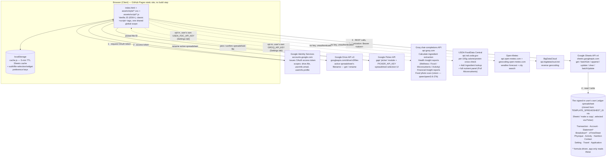

# Architecture

[← Back to README](../README.md)

## System Diagram

- Static site talking directly to Google's APIs from the browser.
- No application server in the request path, ever.

- Every Sheets call carries the user's own OAuth token, scoped by `drive.file` to the one spreadsheet they picked.
- `config.js` values (Client ID, template ID, Picker key) are visible to everyone and are **not** secrets.
- Groq/USDA are opt-in and see only typed ingredient text or the aggregated Insight summary.
- Open-Meteo/BigDataCloud are key-less and see only coordinates or a typed city name.

## Section pages

Each panel group is reachable at an address of its own — `/health/`, `/finance/`, `/other/` — showing that one group and nothing else. They are real paths, so a refresh, a bookmark or a shared link lands on the same page instead of falling back to the dashboard.

- **The markup still lives in `index.html` alone.** Each of those directories holds an identical stub (`<base href="../">`, the theme bootstrap, the stylesheet, and `section-page.js`). The loader fetches `index.html`, replays its head, its body and its scripts into the stub, then hides everything outside the group the address names. A panel added to `index.html`, or moved from one group to another, appears on the right section page with nothing to keep in sync — there is no generated copy of the dashboard anywhere.
- **The list of sections is the `<nav>` markup.** `section-page.js` matches the last path segment against each nav link's `href` and reads the group id off its `data-section`. A fourth group needs a nav link, a `<section>`, and a copy of the stub — no change to the loader, which enumerates nothing.
- **Hidden, not removed.** The other two groups stay in the DOM: `loadDashboard` renders the whole dashboard, and every renderer expects its elements to exist. The Time/Date/Azan/Weather row is hidden too, even though the home page itself shows it by default — it belongs to the dashboard as a whole, not to one wrapper — and `widgets.js` checks that row before starting anything, so a section page runs neither a ticking clock nor the forecast and prayer-time requests behind it.
- **Start-up is registered, not listened for.** `index.html`'s scripts arrive after a section page's own `load` event, so `app.js` hands its start-up step to `window.ledgerSectionPage.onBoot()` when it exists instead of waiting on `load`/`DOMContentLoaded`. The loader runs those steps once every script — including the async Google ones, which `load` would also have waited for — has arrived, so the boot order is the one `index.html` gets.
- **No address is written down.** Every URL in the markup and the loader is relative, and a section page's `canonical`/`og:url` are set from `location` at run time, so the whole thing moves with the repository.

## System Flowchart

Where the diagram above shows *who the browser talks to*, this shows *what happens, in order*. Every branch is a real code path.

```mermaid
flowchart TD
    Start(["Page load"]) --> Widgets["initWidgets()<br/>Time / Date / Azan / Weather bulbs<br/>(independent of sign-in)"]
    Start --> Shell["Dashboard shell paints immediately<br/>every block/panel, placeholder content<br/>(independent of sign-in — index.html has<br/>no [hidden] on #dashboard/#main-nav)"]
    Start --> Gate["initGate()<br/>wires sign-in button / file-gate buttons"]
    Gate --> Auth["initAuth(handleAuthChange)"]

    Auth --> TokenCheck{"Non-expired token<br/>in localStorage?"}
    TokenCheck -- yes --> HandleAuth["handleAuthChange(token)"]
    TokenCheck -- no --> Silent{"Silent requestAccessToken<br/>(prompt: none) succeeds?"}
    Silent -- yes --> HandleAuth
    Silent -- no --> SignInBtn["Sign-in banner, prepended over<br/>the still-visible dashboard shell<br/>(showSignInBanner, gate.js) —<br/>not a full-page gate"]
    SignInBtn --> Consent["Full OAuth consent prompt"] --> HandleAuth

    HandleAuth --> FileCheck{"getActiveSpreadsheetId()<br/>set in localStorage?"}
    FileCheck -- yes --> LoadDashboard
    FileCheck -- no --> FileGate["File-selection gate<br/>(the one state that still takes over<br/>the whole page — no spreadsheet<br/>to show blocks from yet)"]

    FileGate --> Template["'Get the Template'<br/>opens Sheets /copy URL<br/>(no extra scope needed)"]
    FileGate --> Pick["'Select my Ledger'<br/>pickSpreadsheet() → Google Picker"]
    Template -.-> Pick
    Pick --> StoreId["Store file ID as<br/>ledger_spreadsheet_id"] --> LoadDashboard

    subgraph LoadDashboard["Dashboard load — loadDashboard()"]
        direction TB
        Report["loadReport()<br/>cached or batchGetValues:<br/>Statement, Account,<br/>Breakdown — missingAmount computed<br/>client-side from the first two"]
        Modules["Promise.allSettled:<br/>initTransactions · initAccountManager · initTimeSheet<br/>initWellness · initActivities · initPhysique<br/>initNutrition · initContacts<br/>initSettingsPanel · initTravel · initApplications<br/>(each checks its own cache first)"]
        ProteinRot["Once Physique + Nutrition settle:<br/>renderProteinRotationChart()<br/>(protein-rotation.js)"]
        Render["The wellness/finance/timesheet/travel chart files render every canvas, lazily<br/>app.js renders summary cards<br/>each module renders its own table"]
        Report --> Render
        Modules --> ProteinRot --> Render
    end

    LoadDashboard --> Idle(["Dashboard interactive"])

    Idle --> Writes["Add / edit / delete / duplicate<br/>— any single row, any module:<br/>Transaction · Account · Timesheet · Wellness · Physique<br/>Nutrition · Contact · Setting · Travel · Application"]
    Writes --> WriteCall["appendValues / updateValues / batchUpdate"]
    WriteCall --> Refresh["Refresh that module's cache<br/>+ re-render — no page reload"]
    Refresh --> Idle

    Idle --> Bulk["Bulk select + Edit / Delete /<br/>Merge / Recalculate<br/>— Transaction · Wellness · Contact · Nutrition"]
    Bulk --> BulkCall["Per-row appendValues / updateValues,<br/>or one batchUpdate for deletes<br/>(highest row-index first)"]
    BulkCall --> Undo["Undo toast (edit/delete only) —<br/>re-appends deleted rows or restores<br/>original values on click"]
    Undo --> Idle

    Idle --> CSVFlow["CSV Import (Transactions) /<br/>Export (Transactions, Contacts)"]
    CSVFlow --> CSVWork["Import: parse + appendValues rows<br/>Export: filter in-memory list →<br/>client-built CSV → browser download<br/>(no server round trip)"] --> Idle

    Idle --> TSFlow["Time Tracker: 'Log a Work Time'"]
    TSFlow --> TSWrite["backfillMissingDates() fills any<br/>gap, then appendValues/updateValues<br/>the logged day"]
    TSWrite --> TSReminder["checkTimesheetReminder() re-evaluates<br/>the banner, scoped to whichever<br/>company was last logged on/before today"]
    TSReminder --> Idle

    Idle --> TravelFlow["Travel views<br/>(derived, no extra API call)"]
    TravelFlow --> TravelDerive["Pair each Arrival with its<br/>closing Departure (open-ended<br/>final Arrival = ongoing, to today)<br/>→ Time Spent by Country tiles +<br/>Countries Visited choropleth"] --> Idle

    Idle --> Calc["Calculate<br/>Physique day form, or bulk over selected days"]
    Calc --> CalcCategory{"handleCalculateClick():<br/>entry category?"}

    CalcCategory -- Food --> Split["splitNotesIntoSegments()<br/>deterministic, no AI — recovers<br/>each item's OWN typed name"]
    Split --> ExtractCheck{"Notes text cached?<br/>(calc-extract-v2)"}
    ExtractCheck -- hit --> Items["items[]: query (Groq's own<br/>search phrasing, never shown/<br/>stored), grams, count,<br/>kcal/protein fallback"]
    ExtractCheck -- miss --> Groq["groqExtractIngredients()<br/>→ cache the split"] --> Items
    Items --> PerItem["Per item — resolved fresh,<br/>never cached:"]
    PerItem --> NutCheck{"Match in Nutrition table,<br/>by the user's OWN typed name<br/>— never Groq's query?"}
    NutCheck -- "count or weight match" --> Trusted["Use table row directly<br/>— no USDA/Groq-name call"]
    NutCheck -- miss --> USDACall["usdaLookupKcalCandidates(query)<br/>+ pickPlausibleMacros()<br/>vs. Groq's own estimate"]
    USDACall --> Bank["Bank the result into Nutrition<br/>Facts table under the user's<br/>OWN name, not query"]
    Trusted --> Sum["Sum client-side →<br/>breakdown table (per-item Cal/Pro<br/>and source) + the hidden Calories In<br/>/ Protein In fields.<br/>Notes is never rewritten."]
    Bank --> Sum
    Sum --> Idle

    CalcCategory -- Activity --> ActBodyMass{"getLatestBodyMassKg():<br/>a Body Mass entry logged?"}
    ActBodyMass -- no --> ActBlocked["Blocked — Calculate<br/>needs a body mass to size the burn"] --> Idle
    ActBodyMass -- yes --> ActParse["parseWorkoutNoteLines()<br/>Nx / Nsec / Nmin / Nstep forms"]
    ActParse --> ActMET["Per line: EXERCISE_MET table<br/>(fallback EXERCISE_MET_DEFAULT)<br/>+ activeSecondsForNoteLine()"]
    ActMET --> ActSum["metKcal() per line, summed →<br/>activity table (per-exercise MET,<br/>minutes, kcal) + the hidden Activity<br/>Duration / Calories Out fields.<br/>No AI, no cache — pure parse+lookup."] --> Idle

    Idle --> InsightPanel["Health Insight panel<br/>(nothing computed on load)"]
    InsightPanel --> InsightMode{"Wellness / Food / Activity<br/>button clicked?"}
    InsightMode -- no --> Idle
    InsightMode -- yes --> InsightPreview["Client-side preview of that mode:<br/>shared profile block +<br/>range vs. prior-period aggregation /<br/>Classification-grouped ingredient rollup /<br/>real Micronutrients totals vs. Ideal/day<br/>(nutrient-targets.js) + coverage count /<br/>per-muscle-group reps — no API call"]
    InsightPreview --> InsightSend{"Send to AI<br/>clicked?"}
    InsightSend -- yes --> InsightReport["Groq chat-completions API<br/>renders free-text report,<br/>saved to that mode's INSIGHT_* keys"] --> Idle
    InsightSend -- no --> Idle

    Idle --> Manual["Refresh /<br/>Clear Cache"]
    Manual --> ClearCache["Clear localStorage cache<br/>— Clear Cache also clears<br/>Cache Storage/service workers,<br/>then reloads"] --> LoadDashboard
```

## Frontend Module Map

Classic `<script>` tags, no bundler, loaded in this order, one shared global scope.

| # | Module | Responsibility |
|---|---|---|
| 1 | `config.js` | `CONFIG`: Client ID, template spreadsheet ID, Picker API key, sheet tab names |
| 2 | `auth.js` | Google sign-in/out, token persistence, silent refresh, profile lookup |
| 3 | `drive.js` | Template copy link, Google Picker, active spreadsheet ID storage |
| 4 | `sheets.js` | Sheets API v4 wrapper; `USER_ENTERED` by default, `RAW` for Settings writes |
| 5 | `cache.js` | `localStorage` cache with per-call TTL, hard refresh, numeric-expression evaluator |
| 6 | `ui-helpers.js` | Shared table/modal helpers: sheet-ID lookup, confirm-delete, field errors, row buttons, sortable headers, pager, **busy-button + form-submit wiring** |
| 7 | `groq.js` | Groq chat client; tolerant JSON parsing; never rewrites the user's own Notes; vision call (`groqAnalyzeFoodImage`) for food-photo scanning via `qwen/qwen3.6-27b` |
| 8 | `usda.js` | USDA FoodData Central client; returns several candidates, not just the top hit, each carrying its full nutrient panel (vitamins/minerals included) straight from the search response |
| 9 | `nutrient-targets.js` | Ideal/day reference amounts (mostly FDA Daily Values) and gap-severity thresholds for the Micronutrients mode, overridable via a `MICRONUTRIENT_DAILY_TARGETS_JSON` Setting |
| 10 | `nutrition.js` | Nutrition table, Classification column + datalist, USDA lookup button, merge, bulk Pull Micronutrients, `findNutritionEntry`, Log/Log More into today's Physique Consumption |
| 11 | `calorie-estimator.js` | Calculate for food: deterministic split, table-first lookup, USDA fallback, breakdown table |
| 12 | `widgets.js` | The 4 dashboard bulbs; geolocation, prayer times, calendars, weather |
| 13 | `charts-base.js` | Shared chart theming, axis/legend helpers, and `upsertChart` — destroy-then-construct, lazy via `IntersectionObserver` so an off-screen/collapsed chart doesn't build until it's actually scrolled into view |
| 14 | `wellness-math.js` | Pure health/target formulas with no chart or DOM code: BMR/TEF/calorie-target math, protein/fiber/fat/carb bands, body-mass trend/plateau detection, target-date projection |
| 15 | `wellness-charts.js` | Health Indicator chart renderers (State Trend & Forecast, Body Mass, Calorie Balance, Physical Activity, Caloric/Protein/Fiber/Fat/Carb Intake, Sleep) plus the Today-glance tiles |
| 16 | `finance-charts.js` | Financial Indicator chart renderers (Cumulative Net Worth, Category Expenditure Trend, spending breakdowns, Portfolio Allocation) |
| 17 | `timesheet-charts.js` | Work Time chart renderers (arrival/departure/hours distributions, daily average, overtime summary) |
| 18 | `travel-charts.js` | Travel chart renderers, including the country choropleth |
| 19 | `transactions.js` | Transaction Log: filters, sorting, pagination, CRUD, bulk edit/delete |
| 20 | `accounts.js` | Account: balances, CRUD, sheet-formula round-trip |
| 21 | `breakdown.js` | Breakdown panel: Category/Type CRUD scoped to `A:B`, formula-preserving Add/Duplicate |
| 22 | `timesheet.js` | Work Time panel, holiday/missed detection, analytics data, reminder banner |
| 23 | `csv.js` | CSV import, advanced filter engine, download helper |
| 24 | `activities.js` | Activities catalogue: parses the sheet, rebuilds the Activity Plan tables and Instruction modal, add/edit/duplicate/delete of catalogue rows, serves category/MET/muscle-group/image lookups |
| 25 | `physique.js` | Physique table and form: one row per day, CRUD, duplicate-date guard, table rendering, form open/close, and `physiqueAsWellnessEntries()` — the adapter every chart and Insight mode reads |
| 26 | `physique-breakdown.js` | Physique's food/workout Calculate (incremental + bulk over selected days), Combine & Sort, and the Consumption autocomplete — loads right after `physique.js`, sharing its module state |
| 27 | `strength-plan.js` | Logged-today ticks, incremental Log a Workout (writes the Physique day row), Instruction modal wiring — the tables themselves come from `activities.js` |
| 28 | `activity-estimator.js` | Workout note parsing, active-seconds and per-line MET-based burn |
| 29 | `contacts.js` | Contact panel, CRUD, bulk export/delete/merge |
| 30 | `settings-panel.js` | Settings table CRUD, plus `saveSettingValues` for computed results |
| 31 | `travel.js` | Travel panel CRUD; feeds country-days and the choropleth |
| 32 | `applications.js` | Parses header+status-update rows into Ongoing/Closed cards |
| 33 | `insight.js` | Shared profile/aggregation/render helpers, plus the Wellness mode |
| 34 | `food-insight.js` | Food mode: per-ingredient rollup **grouped by Classification** |
| 35 | `micronutrient-insight.js` | Micronutrients mode: sums real, USDA-sourced nutrient totals off the Nutrition table's Micronutrients column, scaled to what was actually eaten, against `nutrient-targets.js`'s Ideal/day figures |
| 36 | `activity-insight.js` | Activity mode: consistency, rep volume, per-muscle-group breakdown |
| 37 | `protein-source-rotation-insight.js` | Protein Sources mode: target vs. actual share per tracked source, reusing `computeProteinRotationRows` |
| 38 | `plan-insight.js` | Health Plan mode: the Formula Playground's plan (identities, inputs, substituted arithmetic) plus Wellness' actuals, and the feasibility prompt |
| 39 | `insight-panel.js` | The panel itself: mode table, load buttons, Groq call, per-mode save/restore |
| 40 | `protein-rotation.js` | Protein Source Rotation bars + donut, grouped and coloured by Classification |
| 41 | `formula-fields.js` | Formula Playground's field-descriptor arrays, mutable known/pin state, mode helpers, and input reading/formatting utils |
| 42 | `formula-render.js` | Formula Playground's substituted-formula display, per-nutrient section renderers, target/weekly-loss sync, BMR/adaptation row builders, and the `renderFormulaPreview` orchestrator |
| 43 | `formula-playground.js` | Health Formula Playground's modal lifecycle: live term-by-term substitution, solve-for-any-field, the Mifflin/Katch BMR switch, the smoothed `m̄` every identity runs on, the thermic-effect and metabolic-adaptation terms, the two-way `Δm%`/`Δm` fat-loss-rate pair with its 1%/week ceiling, the lean-mass protein band, the fiber and fat bands, save back to `Setting`, and the deficit/intake and time/calorie-burn pins |
| 44 | `financial-insight.js` | Financial Insight panel: net worth/cash flow/category-spend/account snapshot, Groq call |
| 45 | `gate.js` | Pre-login flow: sign-in banner over the still-visible dashboard shell, file gate, auth-state transitions |
| 46 | `app.js` | Orchestration, report aggregation, nav, panels, dark/privacy mode, shortcuts |

`section-page.js` is deliberately **not** in that list: only the section-page stubs load it, and its whole job is to bring the 46 above into a page that has none of them (see [Section pages](#section-pages)).

## Data Flow

**Widgets** (independent of sign-in)

1. `initWidgets()` runs unconditionally on `DOMContentLoaded` (or immediately, if the document has already finished parsing) — deliberately not `window.load`, which also waits on every image and the Chart.js CDN scripts, none of which the widgets or the sign-in check have anything to do with.
2. `applySettingsToWidgets()` later lets Settings override defaults, without overriding a manual pick.

**Sign-in**

1. `initAuth(handleAuthChange)`.
2. Non-expired token in `localStorage` is used; else a silent `prompt: 'none'` attempt; else the consent button.
3. On success, an already-selected spreadsheet loads the dashboard; otherwise the file gate shows.
4. A timer renews the token ~5 min before it expires (`REFRESH_BUFFER_MS`), since the implicit GIS flow issues no refresh token and a tab left open would otherwise start 401ing.

**Token freshness before a write** — GIS tokens last ~1hr and this is a tab people leave open, so the routine failure was filling in a long form and losing it to a Google auth error on Save.

1. **Checked at the click, not at the save.** One capture-phase listener on `document` (`setupAuthGatedActions`) intercepts every button that opens a form or edits the sheet — `.panel-header-btn`, `.row-action-btn` (every ✏️/📋/🗑️, via `makeRowActionButton`), the bulk bars, Import CSV — stops the event before the button's own bubble-phase handler, awaits a token, then re-dispatches the identical click. A rebuilt table row inherits this for free; read-only actions (the Instruction modal) are exempt, since a sign-in popup to look something up is worse than the problem.
2. `ensureAccessToken()` resolves three ways, cheapest first: a stored token with more than `TOKEN_MIN_REMAINING_MS` (2 min) left is returned with **no network call and no UI**; otherwise one silent renewal (invisible when it works); and only if that fails, the visible flow. Callers arriving while a request is open — including the scheduled hourly refresh — **join** it rather than racing a second one.
3. **And a retry at the save anyway.** A 401 from `sheetsRequest` renews once in place and re-sends the identical request, so a form left open past the hour still saves instead of asking someone to re-type it. `retrying` bounds it to one extra attempt.
4. The `n` shortcut goes through the Transaction button rather than calling `openTransactionForm()` directly, so it passes the same gate a click does.

**File selection** (first run, or after sign-out)

1. "Get the Template" opens Sheets' own `/copy` URL — no extra scope.
2. "Select my Ledger" opens the Picker; picking the file is what grants `drive.file` access to it.

**Dashboard load**

1. `loadReport()` — cache or one `batchGetValues` for Statement, Account, Breakdown.
2. Entity modules init concurrently via `Promise.allSettled`, each checking its own cache.
3. The wellness/finance/timesheet/travel chart files render canvases lazily (`upsertChart`, `charts-base.js`, builds a chart only once its `.chart-box` scrolls into view); `app.js` renders summary cards; each module renders its table.

**Writes**

1. UI calls `appendValues` / `updateValues` / `batchUpdate` directly.
2. Only the affected cache entry is refreshed — no page reload.
3. The clicked button shows `…` and blocks re-clicks until the write settles.

**Health Insight**

1. Nothing is computed on load.
2. A mode click gathers that mode's data, renders the preview, restores that mode's saved report.
3. Send to AI sends the data already on screen, then saves the report to `Setting`.

**Manual refresh**

- Refresh clears the cache and re-fetches.
- Clear Cache also purges Cache Storage and service workers, then reloads.

---

